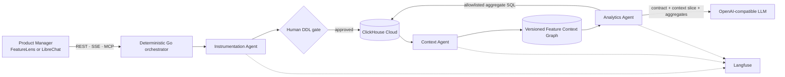

# VIEW26 — FeatureLens

## Track

**Atlys — Agents That Instrument, Analyze, and Explain**

## Project

**FeatureLens — The Agentic Context Layer for Trustworthy Product Analytics**

FeatureLens turns a feature specification and its events into safe ClickHouse instrumentation, an updated versioned business context, and evidence-backed product decisions whose schema, SQL, context version, aggregate evidence, and Langfuse trace remain inspectable.

> Ship a feature once. Instrument it safely. Teach the organization what it means. Trust every answer that follows.

## Team Members

- Ajay Emmanuel ([@ajayep26](https://github.com/ajayep26))
- Jozef N ([@jzf21](https://github.com/jzf21))
- Anjitha Joys ([@anjithajoys](https://github.com/anjithajoys))

## What it does

FeatureLens closes the gap between a feature specification and a trustworthy product decision:

1. The **Instrumentation Agent** profiles arbitrary NDJSON, proposes typed ClickHouse DDL, validates it, and stops at a human approval gate.
2. The **Context Agent** publishes an immutable Feature Context Graph that links the verified schema to entities, events, dimensions, metrics, funnels, business questions, playbooks, guardrails, and known conflicts.
3. The **Analytics Agent** resolves questions through that context, compiles allowlisted ClickHouse aggregate SQL, and returns decision bundles with KPI cards, funnels, trends, segments, ranked actions, and SQL-to-chart provenance.
4. **Langfuse** records the agent handoffs, ClickHouse queries, generations, cost, model, evaluations, and Product Manager feedback.
5. **LibreChat** can consume the same governed capabilities through seven Streamable HTTP MCP tools.

The LLM never receives raw event rows, cannot select arbitrary tables, cannot change the SQL or evidence, and cannot raise confidence above the deterministic evidence ceiling. Unsupported questions fail closed without executing SQL.

## Hosted Demo

**[Open FeatureLens](https://clickathon-2026.view26.com)**

The public deployment includes the release workflow, human schema-approval gate, decision workspace, context explorer, governed portfolio questions, dashboards, and Langfuse-enriched Trace Explorer.

## Demo Video

**[Watch the FeatureLens Agentic System Demo Overview on Loom](https://www.loom.com/share/1d4adc3b81914396b61e970b3bf421f9)**

The demo covers the instrumentation gate, versioned semantic context, the decision inbox, playbook-generated dashboards, and end-to-end Langfuse traceability.

## Architecture



The three agents are coordinated by a deterministic state machine with an explicit human approval gate. ClickHouse stores both the physical evidence and the durable semantic control plane: source events, versioned feature tables, context versions, normalized graph nodes and edges, schema registry records, diffs, conflicts, evaluations, and run history.

The Analytics Agent is not unrestricted text-to-SQL. It resolves the feature, intent, grain, metric, dimensions, and playbook from the published context before compiling allowlisted aggregate SQL. Only the resulting contract, compact context slice, aggregate evidence, limitations, and deterministic draft may reach the LLM.

Langfuse receives OpenTelemetry spans for the complete lifecycle, including instrumentation, schema execution, context evolution, queries, narrative synthesis, cost, latency, evaluations, and human feedback. LibreChat remains an optional conversational surface over the same governed MCP tools; it is not a second source of business truth.

The submitted narrative configuration uses `openai/gpt-4.1-mini` through OpenRouter because the task is constrained structured synthesis over compact aggregates, where predictable latency and cost matter. A deterministic fallback keeps the system operational when generation is disabled or invalid.

See the full 1–2 page explanation in **[submission/ARCHITECTURE.md](./submission/ARCHITECTURE.md)**.

## How we built it

- **Frontend:** React 19, TypeScript, vinext, shadcn/ui, Recharts, and Lucide.
- **Control plane:** Go 1.25 with three standalone agent modules and deterministic orchestration.
- **Evidence and durable state:** ClickHouse Cloud for the eight canonical Atlys tables, generated feature tables, context graph, schema registry, runs, diffs, conflicts, and evaluations.
- **Observability:** Langfuse Cloud through OpenTelemetry, with observation-level evaluation scores and Product Manager feedback in Trace Explorer.
- **LLM:** OpenAI-compatible structured generation using `openai/gpt-4.1-mini` through OpenRouter, with deterministic fallback.
- **Conversational OSS surface:** LibreChat connected through seven governed Streamable HTTP MCP tools.
- **Deployment:** Separate supervised frontend and Go services behind Caddy at the hosted demo URL.

## How to run it

The complete judge-facing runbook is **[RUN.md](./RUN.md)**. It covers environment variables, ClickHouse connectivity, the one-command pipeline, local UI, the sealed sixth-feature flow, standard probes, tests, LibreChat/MCP, and staging routing.

After copying `.env.example` to `.env` and supplying the required ClickHouse credentials:

```bash
./scripts/run-submission.sh
```

For local development:

```bash
set -a && source .env && set +a
(cd backend && go run ./cmd/featurelens)
npm ci
npm run dev
```

Open `http://localhost:3000`. If ClickHouse credentials are absent, the UI and workflow use explicit simulation mode; schema approval remains mandatory.

## Submission evidence snapshot

| Evidence | Verified result |
|---|---:|
| Canonical Atlys source tables inspected | 8 |
| Published feature releases | 6 |
| Retained feature events | 34,982 |
| Latest context | v6 |
| Context graph | 147 nodes · 396 edges · 4 explicit conflicts |
| Context-evolution evaluations | 54/54 passed |
| Standard PM probes | 4/4 with public Langfuse traces |
| Surprise feature | Promo / Coupon at Checkout |
| Surprise events profiled | 5,363 across 6 event types |
| Surprise insight | Coupon-marked cohort converts 6.44 percentage points below the null-marker baseline |

The autonomous eight-source-table report identifies the `application_started` → `document_uploaded` handoff as the largest observed baseline stage-volume loss at 86.8%. It explicitly treats this as a diagnostic signal, not a causal or cohort-conversion claim, until observation windows and identifier continuity are aligned.

## Langfuse evaluations and Trace Explorer

Trace Explorer preserves the local governed execution path and enriches it server-side with Langfuse observations, automated evaluation scores, annotations, generation cost, token usage, latency, model metadata, and typed product feedback. Langfuse credentials never reach the browser.

- `GET /api/traces/{trace_id}/langfuse` reads trace insights.
- `POST /api/traces/{trace_id}/feedback` writes `user_helpful` and `issue_category` scores to the final-answer observation.
- Stable `analytics.llm_synthesize` and `analytics.portfolio_conversation` observations expose governed input and output for judge evaluation.

All graded traces are listed as public share links in **[submission/evidence/traces.md](./submission/evidence/traces.md)**.

## LibreChat and MCP

The committed [`librechat.yaml`](./librechat.yaml) and [`ops/librechat/docker-compose.override.yml`](./ops/librechat/docker-compose.override.yml) configure LibreChat as an optional Product Manager conversation surface. It receives seven governed tools from the FeatureLens Streamable HTTP MCP endpoint, including multi-feature portfolio conversation.

```bash
./scripts/run-librechat-local.sh
```

Open `http://localhost:3080` and register the first local account. The upstream LibreChat checkout and runtime data remain under the ignored `.local/librechat` directory.

## Reproduce the known and unseen flows

The supplied Atlys dataset is intentionally not copied into this repository. Point the sequential runner at it:

```bash
export ATLYS_DATASET_DIR=/path/to/click-a-thon-2026/Atlys
./scripts/replay-atlys-fixtures.sh
```

For the sealed sixth feature, choose **Add another release**, upload its Markdown specification and NDJSON event file, review the generated DDL, and approve the schema. The same instrumentation → approval → context → analytics → evaluation pipeline must complete without feature-specific code or prompt changes.

Use **Reset baseline** to clear agent runs and versioned control-plane tables and republish context v0. Raw Atlys tables and generated feature tables are preserved, allowing an idempotent replay from the retained evidence.

## Submission artifacts

| Artifact | Link |
|---|---|
| Reproducible runbook | [RUN.md](./RUN.md) |
| Architecture | [submission/ARCHITECTURE.md](./submission/ARCHITECTURE.md) |
| Latest release validation | [submission/evidence/release-validation.json](./submission/evidence/release-validation.json) |
| Eight-table autonomous report | [submission/evidence/baseline-source-report.json](./submission/evidence/baseline-source-report.json) |
| Five known-feature DDLs | [submission/evidence/known-feature-schemas.sql](./submission/evidence/known-feature-schemas.sql) |
| Standard PM probes | [submission/evidence/standard-probes.md](./submission/evidence/standard-probes.md) |
| Public Langfuse trace index | [submission/evidence/traces.md](./submission/evidence/traces.md) |
| Surprise generated DDL | [submission/surprise/generated-schema.sql](./submission/surprise/generated-schema.sql) |
| Surprise product insight | [submission/surprise/insight.md](./submission/surprise/insight.md) |
| Surprise release output | [submission/surprise/release-output.json](./submission/surprise/release-output.json) |
| Context v5→v6 changelog | [submission/surprise/context-changelog.md](./submission/surprise/context-changelog.md) |
| Pitch deck | [submission/pitch-deck.pdf](./submission/pitch-deck.pdf) |
| Editable pitch deck | [submission/pitch-deck.pptx](./submission/pitch-deck.pptx) |
| Readiness checklist | [submission/CHECKLIST.md](./submission/CHECKLIST.md) |

## Verify

```bash
(cd backend && go test ./...)
npm test
(cd backend && go run ./cmd/validate-ask)
```

The Ask validator independently recomputes retained-table truth and checks numerical evidence, requested dimensions, SQL allowlists, trace and version provenance, prose percentages, ranked-answer anchors, and fail-closed boundaries. See [docs/ASK_GROUNDING_EVAL.md](./docs/ASK_GROUNDING_EVAL.md) for the test matrix and release policy.

## Safety and secrets

No credential is committed. Copy `.env.example` to `.env`; all real environment files remain ignored. Rotate any key that has appeared in a screenshot, recording, or chat before the public submission, and update hosted secrets without committing them.