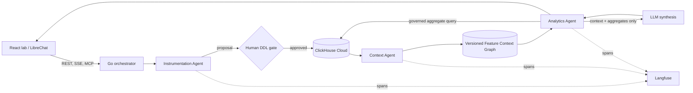

# FeatureLens PoC architecture

FeatureLens keeps the three judged agents as standalone Go modules. LibreChat is a conversational shell; it does not own orchestration or business truth.

## Boundaries

- The Instrumentation Agent profiles arbitrary NDJSON, proposes typed DDL, validates it deterministically, and writes only after approval.
- The Context Agent publishes a new immutable graph only after the physical schema and inserted rows verify. It connects features, events, tables, metrics, funnels, roles, questions, operating rules, evidence, and conflicts.
- The Analytics Agent resolves each declared question through an ontology-linked playbook. Conversion comparison, platform failure, latency, adoption, and generic completion compile into distinct evidence contracts and ClickHouse SQL. A configured LLM rewrites only the validated aggregate result into a role-aware product insight; it cannot choose arbitrary tables, execute SQL, change evidence, or raise confidence above the deterministic evidence ceiling.
- The orchestrator is a deterministic state machine. A Langfuse root span remains open across the human gate, with one child span for every agent phase.
- ClickHouse Cloud MCP is for read-only catalog exploration and operator diagnostics. Runtime DDL/inserts use scoped service credentials because MCP cannot execute writes.

## Execution modes

With `CLICKHOUSE_HOST` and credentials, the run executes DDL, inserts events, verifies row counts, aggregates results, and persists the context control plane. Without credentials, the same state machine runs in visibly labeled `simulation` mode; it never claims a physical write occurred.
