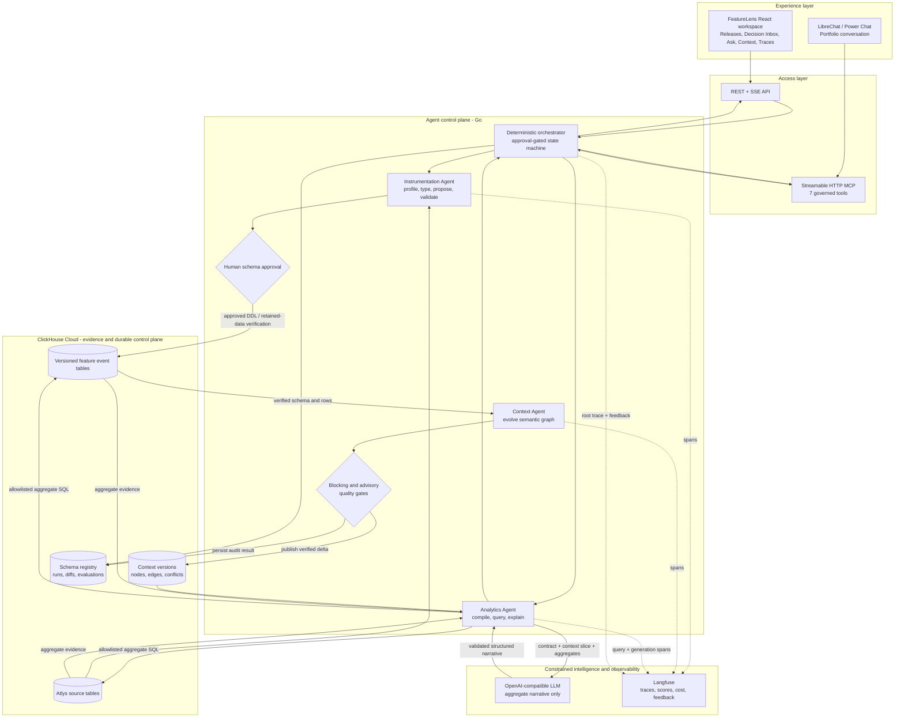
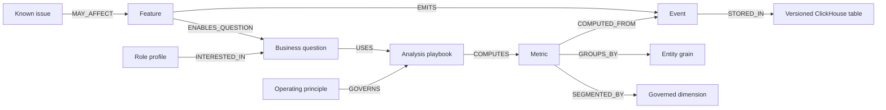
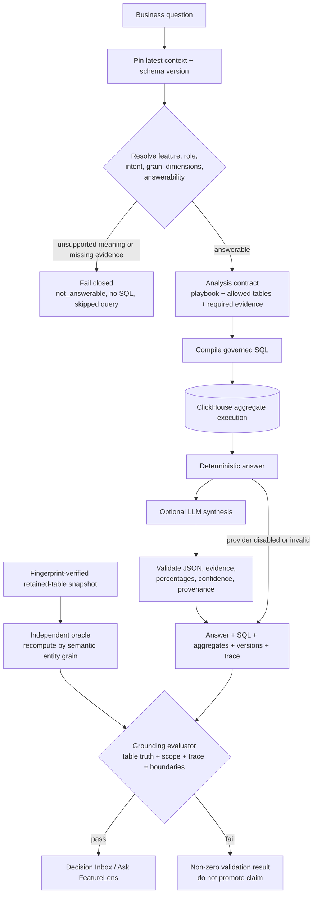

# FeatureLens

> Agentic product analytics that evolves instrumentation, semantic context, and trustworthy decisions together.

## Submission-ready fields

**Team**

VIEW26

**Problem statement**

[Atlys] Build an agentic analytics system on ClickHouse that automates the full lifecycle of feature instrumentation and insight generation.

**Project title**

FeatureLens - The Agentic Context Layer for Trustworthy Product Analytics

**One-line tagline - 12 words**

Agentic product analytics that evolves instrumentation, semantic context, and trustworthy decisions together.

**Repository**

https://bitbucket.org/view26/clickathon-2026

**Demo video**

Add Loom, YouTube, or Drive URL before submission.

**Social links**

Optional - add one link per line before submission.

## Summary / what we built

FeatureLens is a working agentic analytics system on ClickHouse that closes the gap between shipping a feature and trusting the decisions made from it. A Product Manager submits a feature specification and its events. The Instrumentation Agent profiles the data, proposes typed ClickHouse DDL, validates it, and stops at a human approval gate before any write. After the schema and rows are verified, the Context Agent publishes an immutable Feature Context Graph that connects the feature to its events, entities, tables, dimensions, metrics, funnels, business questions, playbooks, guardrails, and known issues. The Analytics Agent then compiles each question into an allowlisted ClickHouse aggregate query, produces a deterministic evidence-backed answer, and optionally uses an LLM only to improve the narrative.

The prototype includes a React product workspace, Feature Releases, a Decision Inbox, Ask FeatureLens, multi-feature portfolio chat through LibreChat, a Streamable HTTP MCP server, context and schema exploration, a pipeline console, and Langfuse trace inspection. The LLM never receives raw event rows and cannot choose arbitrary tables or alter evidence. Unsupported questions fail closed before query execution.

Six Atlys feature releases are live in the prototype across 34,982 retained events. Their evolution produced context v6 with 147 semantic nodes, 396 explicit relationships, 39 governed events, 44 governed dimensions, 12 business questions, and 12 analysis playbooks. All 54 stored context-evolution checks passed. The independent Ask validator passed 17/17 grounding and boundary checks: 8 fully table-verified questions, 1 visibly partial cross-table question, 2 correct fail-closed questions, and 6 trust-boundary checks.

## The 60-second pitch

Every feature release creates two kinds of change: physical change in the data and semantic change in what the business can safely ask. Today those changes are usually managed separately. Events get added, dashboards arrive later, definitions drift, and a plausible AI answer can still be numerically wrong because it used the wrong entity grain, stage, table, or denominator.

FeatureLens turns a release package into a governed decision system. It evolves the ClickHouse schema and the business context together, then lets agents answer only through that verified context. The result is not another text-to-SQL chatbot. It is a versioned semantic control plane with approval gates, evidence contracts, deterministic fallbacks, traceable SQL, and an independent oracle that checks every claim against retained table truth.

The product promise is simple:

> Ship a feature once. Instrument it safely. Teach the organization what it means. Trust every answer that follows.

## The problem

Product analytics breaks down at the seams between teams and systems:

1. **Instrumentation is disconnected from decisions.** Event producers know the payload, analysts know the tables, and Product Managers know the question, but no system owns the complete contract.
2. **Business meaning drifts.** A field such as `city`, `application_id`, or `share_id` can exist physically while still being the wrong dimension or entity grain for a question.
3. **Dashboards lag releases.** Every feature needs custom schema work, metric definitions, queries, charts, and review.
4. **Generic AI analytics is too permissive.** Plausible prose can hide a wrong denominator, a null identifier, an unsupported causal claim, or an unauthorized table join.
5. **Trust is difficult to demonstrate.** A screenshot is not provenance. Decision-makers need the context version, schema version, SQL, aggregate evidence, limitations, and trace that produced the claim.

FeatureLens treats these as one lifecycle rather than five separate handoffs.

## Architecture - the core of FeatureLens



### Why this architecture matters

The system deliberately separates five responsibilities:

| Layer | Owns | Does not own |
|---|---|---|
| Experience | Product workflow, review, questions, visual evidence | Business truth or SQL generation |
| Orchestrator | State transitions, approvals, agent sequencing, persistence | Feature-specific metric logic |
| Instrumentation Agent | Physical data contract and ClickHouse schema | Business interpretation |
| Context Agent | Versioned business meaning and allowable questions | Raw data mutation |
| Analytics Agent | Governed plan compilation, aggregate execution, evidence-backed answers | Arbitrary text-to-SQL or raw-data reasoning |

ClickHouse is not merely the query engine. It is the shared evidence store for feature events and the durable governance store for context versions, schema contracts, agent runs, diffs, conflicts, and evaluations. This keeps the physical and semantic history independently inspectable.

The LLM sits outside the trust boundary. It receives only the analysis contract, a compact context slice, aggregate evidence, limitations, and a deterministic draft. It cannot access raw event rows, change the SQL, select a different table, modify evidence, or raise confidence beyond the deterministic ceiling.

## Feature evolution architecture

The release lifecycle is a deterministic state machine. Agents can reason within their phase, but they cannot skip safety gates.

```mermaid
flowchart LR
  INPUT["Feature spec + NDJSON events<br/>or retained ClickHouse table"]
  PROFILE["Profile rows, fields,<br/>types, nulls, cardinality, event order"]
  DESIGN["Propose versioned ClickHouse DDL<br/>partition and sort strategy"]
  VALIDATE{"Deterministic<br/>schema validation"}
  APPROVE{"Human<br/>approval gate"}
  VERIFY["Apply or attach table<br/>verify row count + event fingerprint"]
  CANDIDATE["Build context candidate<br/>feature delta over parent version"]
  ANALYZE["Run declared analytics playbooks<br/>against candidate context"]
  GATES{"Context evolution<br/>quality gates"}
  PUBLISH["Publish immutable context version<br/>and schema registry entry"]
  BUNDLE["Decision bundle<br/>KPIs, charts, actions, evidence"]
  QUARANTINE["Quarantine candidate<br/>keep latest context unchanged"]

  INPUT --> PROFILE --> DESIGN --> VALIDATE
  VALIDATE -->|"pass"| APPROVE
  VALIDATE -->|"fail"| QUARANTINE
  APPROVE -->|"approved"| VERIFY
  VERIFY --> CANDIDATE --> ANALYZE --> GATES
  GATES -->|"all blocking gates pass"| PUBLISH --> BUNDLE
  GATES -->|"blocking gate fails"| QUARANTINE
```



### Version invariant

```text
context vN = context vN-1 + verified feature delta
```

The child context must preserve all prior nodes, add the new verified semantics, cite its physical schema version, and leave unresolved conflicts explicit. A failed candidate never becomes latest.

## Inside the Feature Context Graph



Every node and edge carries status, confidence, sources, and context version. Physical column presence alone is not enough to make a field a governed dimension. For example, an event `city` can mean observed network city without meaning residence, hometown, nationality, or destination.

## Trust architecture - how an answer becomes credible

FeatureLens uses two independent paths: a production answer path and a retained-table oracle path. They meet only at evaluation.



### What the grounding evaluator checks

- Correct distinct entity grain: application, user, group, or share instead of event-row count.
- Correct entry and outcome events for the feature's semantic funnel.
- Entrant-time dimension attribution rather than whichever later event happens to carry a value.
- Explicit null semantics and no unexpected cohorts.
- Tight numerical agreement for counts, rates, and exact quantiles.
- Every SQL `FROM` and `JOIN` target is present in `allowed_tables`.
- Every requested dimension exists in both the contract and the returned evidence.
- Every percentage in LLM prose is present in structured evidence.
- Ranked answers name the evidence-backed best or worst cohort.
- The completed query trace contains the exact SQL returned with the answer.
- Contract and insight cite matching context and schema versions.
- Unsupported questions return `not_answerable`, empty SQL, `not_executed`, and a skipped query step.
- Unknown features and unconsented stale context versions are rejected.

## The three agents

### 1. Instrumentation Agent

Input: feature Markdown, events NDJSON, or a retained ClickHouse feature table.

Responsibilities:

- Profile arbitrary event shape, types, nullability, examples, cardinality, and event order.
- Flatten nested payloads into stable ClickHouse column names.
- Propose typed, versioned DDL with partition and sorting strategy.
- Run deterministic schema validation.
- Pause at a human gate before writes.
- Apply and verify new data, or attach retained data read-only.
- Verify exact row count and event-ID fingerprint for idempotent replays.

### 2. Context Agent

Input: verified feature specification, event profile, schema, and parent context.

Responsibilities:

- Create feature, event, table, dimension, metric, question, playbook, and relationship nodes.
- Promote only fields present in the governed semantic dimension catalog.
- Bind metrics to explicit numerator, denominator, grain, stages, and dimensions.
- Carry known issues and unresolved conflicts forward.
- Produce a structured parent-to-child diff.
- Preserve every prior semantic node.
- Publish only after blocking evolution gates pass.

### 3. Analytics Agent

Input: role, question, selected feature scope, latest context, and verified schema.

Responsibilities:

- Resolve question intent and answerability through the context graph.
- Bind a feature-specific entity grain and semantic stages.
- Compile an ontology-linked query playbook.
- Restrict SQL to allowlisted ClickHouse tables.
- Execute aggregation in ClickHouse.
- Produce the deterministic evidence-backed answer.
- Optionally synthesize a clearer PM narrative from aggregate evidence only.
- Publish a feature decision bundle with KPIs, charts, ranked actions, exact SQL, and trace IDs.
- Preserve feature scope across portfolio-chat follow-ups.
- Fail closed when the requested meaning is not supported.

## What is working now

### Product surfaces

- Feature release submission with an explicit human schema-approval gate.
- Live pipeline activity over server-sent events.
- Six persistent Feature Releases with deduplication after service restart.
- Decision Inbox with one top evidence-backed recommendation per release.
- Ask FeatureLens for single-feature questions.
- Portfolio conversation across published features with follow-up scope.
- Context v0 to v6 changelog and parent-child diffs.
- Schema and live data-catalog inspection.
- Exact SQL, aggregate evidence, confidence, limitations, and trace provenance.
- Langfuse trace, generation, score, cost, token, and product-feedback enrichment.
- Streamable HTTP MCP with seven governed tools for LibreChat or another agent client.
- Deterministic operation when the LLM is unavailable.
- Read-only retained-table replay with row-count and event-fingerprint checks.
- Analytics refresh that safely corrects existing decision bundles without rebuilding schemas or mutating raw events.

### Live prototype proof

| Evidence | Current result |
|---|---:|
| Published feature releases | 6 |
| Retained feature events | 34,982 |
| Latest context version | v6 |
| Context nodes | 147 |
| Context edges | 396 |
| Governed events | 39 |
| Governed dimensions | 44 |
| Declared business questions | 12 |
| Analysis playbooks | 12 |
| Stored context-evolution gate results | 54/54 passed |
| Live grounding and boundary checks | 17/17 passed |
| Fully table-verified Ask cases | 8 |
| Intentionally partial cross-table cases | 1 |
| Correctly fail-closed declared questions | 2 |

### Evidence-backed product findings

| Feature | Verified finding | Evidence contract |
|---|---|---|
| Express Checkout | Express completion is 50.67%; it is 2.79 percentage points above the aligned standard cohort | 836 / 1,650 feature applications; comparison is observational and independently partial on the control-table side |
| Express Checkout | iOS is the weakest OTP cohort at 83.64% OTP success and 73.83% confirmation from OTP | 428 OTP entries; 316 confirmations |
| Group / Family | The largest funnel loss is traveller added to group submitted | 1,200 groups entered; 688 submitted; 512 lost |
| Group / Family | Group size 2 performs best at 69.47%; group size 6 performs worst at 31.11% | `group_id` grain with entrant-time `group_size` attribution |
| Status Sharing | Recipient CTA engagement is 22.99%, not 0% | 263 CTA-completing `share_id` values / 1,144 generated-link `share_id` values |
| Abandoned Checkout Recovery | Push has the highest observed recovery rate at 4.66% | 53 reconversions / 1,138 reminders; observational channel comparison |
| Instant Forex | INR to USD has the strongest observed adoption at 41.95% | 99 selections / 236 offered applications for the currency pair |

FeatureLens also correctly refuses two tempting but unsupported claims:

- It does not claim that Status Sharing reduces support demand because there is no support event, ticket identifier, or unshared comparison cohort.
- It does not claim recovered revenue because the recovery table has no governed revenue or transaction-amount field.

Abstention is a product feature. A trustworthy context layer must know what it does not know.

## Key engineering decisions

### Governed compilation instead of unrestricted text-to-SQL

Questions resolve to typed intents and playbooks. Each playbook declares its grain, metrics, dimensions, stages, allowed tables, required evidence, limitations, and SQL strategy. This makes query generation inspectable and testable.

### Physical and semantic versioning move together

Every published insight cites both the context version and schema version. The graph cannot publish a feature delta before the physical schema and retained rows verify.

### Human approval remains at the irreversible boundary

Agents may inspect data and design DDL autonomously, but a person approves before ClickHouse mutation. This is the narrowest useful human-in-the-loop boundary.

### ClickHouse performs all aggregation

Raw rows stay in ClickHouse. The Analytics Agent requests aggregate evidence, and only the aggregate contract reaches the LLM. This reduces data exposure and eliminates LLM arithmetic as a source of metric drift.

### Deterministic truth, generative presentation

The deterministic answer remains the fallback and evidence authority. The LLM improves clarity and actionability, but validated structured output prevents it from changing the facts.

### Unsupported semantics fail closed

If the context lacks the required meaning, the planner returns `not_answerable` with no SQL. This prevents a generic completion query from masquerading as an answer to a support, revenue, geography, or causal-impact question.

### Durable, restart-safe control plane

Context versions and feature-run payloads are persisted in ClickHouse `ReplacingMergeTree` tables. On startup, FeatureLens rehydrates the latest contexts and deduplicates retries by feature and schema version, so published releases and corrected Decision Inbox claims survive restarts.

## Why ClickHouse is central

FeatureLens uses ClickHouse for three distinct workloads:

1. **Product evidence** - high-volume source and feature event tables.
2. **Decision computation** - governed funnels, trends, cohorts, quantiles, and cross-table aggregates.
3. **Governance history** - context versions, nodes, edges, conflicts, schema registry, agent runs, evaluations, and diffs.

This produces an unusually strong property: the system of record for the metric and the system of record for how that metric became allowable are queryable in the same analytical platform, while remaining separate contracts.

## Observability and auditability

Each feature evolution opens a root trace and records child observations for:

- instrumentation profiling and schema design;
- ClickHouse DDL, inserts, retained-table reads, and verification;
- context candidate construction and diffing;
- query-plan compilation and aggregate execution;
- deterministic answer composition;
- LLM synthesis, provider, model, prompt version, tokens, and cost;
- context-evolution and grounding evaluations;
- final Product Manager feedback.

Trace Explorer enriches the local governed trace with Langfuse observations and scores without exposing Langfuse credentials to the browser.

## Extended pitch deck outline - 10-slide option

### Slide 1 - FeatureLens

**Headline:** The agentic context layer for trustworthy product analytics.

**Visual:** Product logo, 12-word tagline, and one screenshot of Decision Inbox.

**Speaker point:** FeatureLens connects feature instrumentation, business meaning, and evidence-backed decisions in one governed lifecycle.

### Slide 2 - Shipping code does not ship trusted analytics

**Headline:** Every release changes data, meaning, and decisions - but those changes are managed separately.

**Visual:** A broken handoff from Product to Engineering to Data to Dashboard to AI answer.

**Speaker point:** The system fails at the seams. A physically present field can still represent the wrong business meaning, grain, or denominator.

### Slide 3 - A plausible answer can still be wrong

**Headline:** 0% engagement looked credible. ClickHouse showed 22.99%.

**Visual:** Side-by-side comparison:

| Wrong generic claim | Governed FeatureLens claim |
|---|---|
| 1,600 creator clicks, 0 recipient completions | 1,144 generated links, 263 recipient CTA completions |
| `application_id` grain | `share_id` grain |
| `share_clicked` denominator | `link_generated` denominator |
| 0% | 22.99% |

**Speaker point:** The failure was not arithmetic. It was missing semantic context. Recipient events do not reliably carry creator-side `application_id`, so the generic query erased real outcomes.

### Slide 4 - One release package becomes a governed decision system

**Headline:** Spec + events -> verified schema -> versioned context -> trusted decisions.

**Visual:** Use the Feature Evolution Architecture diagram.

**Speaker point:** Three agents collaborate through explicit artifacts and gates. Humans approve at the data-mutation boundary; agents automate everything around it.

### Slide 5 - Architecture centerpiece

**Headline:** ClickHouse is the evidence plane; the Context Graph is the control plane.

**Visual:** Use the primary Architecture diagram full-width. Reveal it in this order:

1. Experience and access surfaces.
2. Deterministic Go orchestrator.
3. Instrumentation, Context, and Analytics agents.
4. ClickHouse evidence and governance stores.
5. Constrained LLM boundary.
6. Langfuse trace path.

**Speaker point:** The most important design choice is where authority lives. ClickHouse owns the evidence. The versioned context owns allowable meaning. The LLM owns only presentation.

### Slide 6 - Business context is executable

**Headline:** Context is not prompt text. It is a versioned graph of contracts.

**Visual:** Use the Feature Context Graph diagram with one concrete Status Sharing metric:

```text
metric: recipient CTA engagement
grain: share_id
entry: link_generated
outcome: recipient_cta_clicked
allowed table: featurelens_poc.status_sharing_events_v2
```

**Speaker point:** Every question resolves through explicit features, events, entities, dimensions, metrics, playbooks, and operating principles.

### Slide 7 - Trust is a second architecture, not a disclaimer

**Headline:** Production answers and independent table truth meet at evaluation.

**Visual:** Use the Trust Architecture diagram.

**Speaker point:** The live query path does not grade itself. A separate retained-data oracle recomputes expected values without reusing the answer SQL. Unsupported meaning fails closed before any query or synthesis.

### Slide 8 - The prototype is working

**Headline:** Six releases, 34,982 events, context v6, and a live Decision Inbox.

**Visual:** Product screenshots plus four proof numbers:

- 147 context nodes and 396 relationships.
- 54/54 context-evolution gate results passed.
- 17/17 live grounding and boundary checks passed.
- 8 fully table-verified Ask cases.

**Speaker point:** This is not a static architecture mockup. The workflow, ClickHouse execution, context evolution, Decision Inbox, Ask, portfolio chat, traces, and validators are running together.

### Slide 9 - Why FeatureLens wins

**Headline:** Faster analytics without trading away control.

**Visual:** Comparison matrix.

| Capability | Dashboard workflow | Generic AI analyst | FeatureLens |
|---|---:|---:|---:|
| Evolves physical schema | Manual | No | Yes, approval-gated |
| Versions business meaning | Inconsistently | Prompt-dependent | Yes |
| Restricts entity grain and tables | Dashboard-specific | Often implicit | Contract-enforced |
| Keeps raw rows out of the LLM | N/A | Not guaranteed | Yes |
| Fails closed on unsupported meaning | Manual judgment | Often guesses | Yes |
| Independently validates claims | Rare | Rare | Built in |
| Preserves full decision provenance | Partial | Partial | SQL, evidence, versions, trace |

**Speaker point:** FeatureLens automates the expensive handoffs while preserving the controls that make product analytics credible.

### Slide 10 - From prototype to product

**Headline:** Make the context layer the release-time contract for every product decision.

**Visual:** Roadmap from current prototype to authenticated multi-team platform, experiment-aware causal playbooks, context drift detection, and downstream action integrations.

**Speaker point:** The prototype proves the architecture. The next step is to operationalize identity, scale, independent cross-table CI, and organization-wide metric contracts.

## Demo narrative - 6 minutes

### 0:00-0:40 - Open with the trust failure

Show the old-sounding claim:

> 1,600 users shared, zero recipients completed, 0% engagement.

Then reveal the actual table truth:

- `share_clicked`: 1,600 unique share attempts.
- `link_generated`: 1,144 unique shares that produced a recipient-capable link.
- `recipient_cta_clicked`: 263 unique shares.
- Governed completion: 263 / 1,144 = 22.99%.

Explain the root cause: recipient events have `share_id` but may not have creator-side `application_id`. A generic funnel used the wrong grain and denominator. FeatureLens now binds Status Sharing to `share_id`, `link_generated`, and `recipient_cta_clicked`.

### 0:40-1:50 - Add or inspect a feature release

Open Feature Releases and select a release. Show:

- source specification;
- profiled event rows and fields;
- proposed typed schema;
- human approval boundary;
- context and schema version;
- KPI, funnel, trend, and segment evidence.

Explain that the same workflow accepts an unseen Markdown specification and NDJSON events without hard-coded feature prompts.

### 1:50-2:50 - Explain the architecture

Use the primary architecture diagram. Emphasize:

1. Three agents own separate contracts.
2. The orchestrator owns sequencing and gates.
3. ClickHouse owns raw evidence, aggregate computation, and durable governance history.
4. The LLM is downstream of deterministic truth and outside the raw-data boundary.
5. Langfuse makes each decision replayable and inspectable.

### 2:50-3:40 - Show the Context Graph evolving

Open Context and Schemas. Move from v0 to v6 and show that each feature adds a verified delta while prior semantics remain addressable. Point out explicit entity grain, metric stages, governed dimensions, playbooks, and conflicts.

### 3:40-4:35 - Ask a business question

Ask:

> Who shares and who engages?

Show the 22.99% result, 263 completions, 1,144 entrants, `share_id` grain, exact SQL, context v6, schema v2, and trace.

Then ask:

> Does sharing reduce support demand?

Show the fail-closed answer. No SQL is executed because the table cannot support that meaning.

### 4:35-5:20 - Show Decision Inbox and portfolio intelligence

Open Decision Inbox and review the six current top recommendations. Then use Power Chat to compare features or ask a contextual follow-up. Explain that each feature keeps its own event definitions and entity grain; cross-feature views do not pretend identifiers are interchangeable.

### 5:20-6:00 - Prove credibility

Open Trace Explorer and the grounding report. Close with:

- 54/54 context-evolution checks passed.
- 17/17 Ask-grounding and boundary checks passed.
- 8 fully table-verified cases.
- 1 visibly partial cross-table case.
- 2 correct fail-closed questions.

End on the product promise: FeatureLens makes business context executable, versioned, and testable.

## Suggested talk track

"Shipping a feature changes more than code. It changes the event schema, the metrics, the questions the business can ask, and the meaning of every answer. Most analytics stacks update those layers separately, which is why dashboards lag and AI answers can look right while using the wrong grain or denominator.

FeatureLens evolves those layers together. Our Instrumentation Agent turns a spec and events into a verified ClickHouse contract behind a human gate. Our Context Agent publishes an immutable semantic delta that connects features, events, entities, metrics, dimensions, and questions. Our Analytics Agent compiles those questions into allowlisted aggregate queries and produces evidence-backed decisions. Raw rows never go to the LLM; it can improve the narrative but cannot change the facts.

The important part is credibility. Every answer cites its context version, schema version, SQL, aggregate evidence, limitations, and trace. A separate oracle recomputes expected values from fingerprint-verified retained data. If the context cannot support a question, FeatureLens does not guess - it fails closed before querying.

The prototype is live across six Atlys feature releases and 34,982 events. Context v6 contains 147 nodes and 396 relationships. All 54 evolution gates pass, and all 17 live grounding and boundary checks pass. FeatureLens is not just an analytics chatbot. It is the executable context layer between shipping a feature and trusting a decision."

## Likely judge questions

### How is this different from a text-to-SQL chatbot?

A text-to-SQL chatbot starts with language and tries to discover meaning at query time. FeatureLens starts with a published semantic contract. The contract restricts the entity grain, metric stages, dimensions, tables, required evidence, and answerability before SQL exists. The LLM is a presentation layer, not the query planner or evidence authority.

### What makes the system agentic?

Three agents own distinct goals and artifacts, share state through the versioned context, and are coordinated by a deterministic orchestrator. They profile and design, evolve meaning, compile evidence, and evaluate results. Their autonomy is bounded by approvals, typed contracts, blocking gates, and durable traces.

### Why store the context graph in ClickHouse?

The context is analytical governance data: versions, typed nodes, relationships, diffs, conflicts, evaluations, and run history. ClickHouse makes that history durable and queryable next to the evidence without collapsing physical events and semantic contracts into one table.

### Can the LLM see raw customer data?

No. ClickHouse aggregates first. The model receives the analysis contract, compact semantic context, aggregate evidence, limitations, and deterministic draft.

### How do you prevent hallucinated metrics?

The LLM cannot create or modify the evidence map. Structured output is validated; percentages must be grounded in evidence; confidence is capped; malformed or unsafe output falls back to the deterministic answer. The independent oracle then compares the live answer with retained-table truth.

### What happens when the data cannot answer the question?

The contract returns `not_answerable`; SQL is empty; the trace records a skipped query; and the UI explains what is missing. The support-impact and recovered-revenue questions demonstrate this behavior.

### Can it handle a new feature?

The generic release path profiles arbitrary NDJSON, designs a schema from observed fields, creates semantic nodes from the spec and profile, and pauses for approval. The five known features are regression fixtures; the architecture does not depend on browser-side feature-specific schemas.

### Does an observed lift prove causality?

No. FeatureLens distinguishes descriptive comparisons from causal claims. Express versus standard checkout is labeled observational, and the independent oracle marks the control-table portion partial rather than pretending it was fully reconstructed from a feature-only snapshot.

### What happens when the service restarts?

Published contexts and runs are rehydrated from ClickHouse. Completed retries are deduplicated by feature and schema version, so the latest release and corrected decision bundle remain visible.

## Technology stack

| Concern | Implementation |
|---|---|
| Product UI | React 19, Next-compatible Vinext/Vite, TypeScript, Recharts |
| Agent runtime | Go |
| Orchestration | Deterministic approval-gated state machine |
| Analytical database | ClickHouse Cloud |
| Semantic control plane | Versioned graph persisted in normalized ClickHouse tables and payload snapshots |
| LLM synthesis | OpenAI-compatible structured-output adapter; current demo uses OpenRouter |
| Observability | OpenTelemetry and Langfuse |
| Conversational integration | LibreChat and Streamable HTTP MCP |
| Live run updates | Server-sent events |
| Verification | Go unit/integration tests plus independent `validate-ask` oracle |

## Honest limitations

1. The current prototype is a single-team environment. Production needs authentication, tenant isolation, and role-based controls around schema approval and context publication.
2. The six retained feature datasets, including the sealed holdout, are a strong regression suite rather than proof of every unseen event shape. Additional holdouts should be added to CI.
3. Cross-table Express-versus-standard conversion is intentionally only partially verified by the credential-free retained-feature oracle. A separate read-only ClickHouse CI oracle should validate the control cohort.
4. Observed segment and channel differences are descriptive. FeatureLens does not turn observational data into causal impact.
5. Context dimension semantics currently come from an explicit governed catalog. Production should add a reviewed workflow for proposing new semantic types and aliases.
6. The service currently executes one deployment's scoped ClickHouse credentials. Production should use per-environment secrets, least-privilege service accounts, and audited approval identities.
7. LLM quality can vary by provider, but correctness degrades safely to the deterministic answer.
8. Scale testing, query budgets, workload isolation, and materialized aggregate strategies remain future work.

## Roadmap

### Next

- Add additional sealed unseen-feature CI fixtures.
- Add a read-only independent ClickHouse oracle for cross-table comparisons.
- Add authenticated approval identity and role-based publishing controls.
- Introduce query-cost budgets and workload controls.

### Then

- Add a reviewed semantic-catalog proposal workflow.
- Add experiment and holdout entities for causal-impact playbooks.
- Add automated context-drift detection when physical schemas change outside FeatureLens.
- Add Slack, Jira, and release-management actions downstream of approved Decision Inbox recommendations.
- Add organization-level metric contracts and reusable domain packages.

## Closing

Most analytics systems store events. Most AI systems generate answers. FeatureLens connects the two with an executable context layer that can evolve, explain, abstain, and prove itself.

> FeatureLens makes every product decision traceable from release specification to ClickHouse evidence.

## Final submission checklist

- [x] Project title
- [x] 12-word tagline
- [x] Submission summary
- [x] Architecture and agent boundaries
- [x] Working prototype evidence
- [x] Known limitations
- [x] Repository URL
- [ ] Demo video URL
- [ ] Social media links, if used
- [x] Export pitch deck PDF
