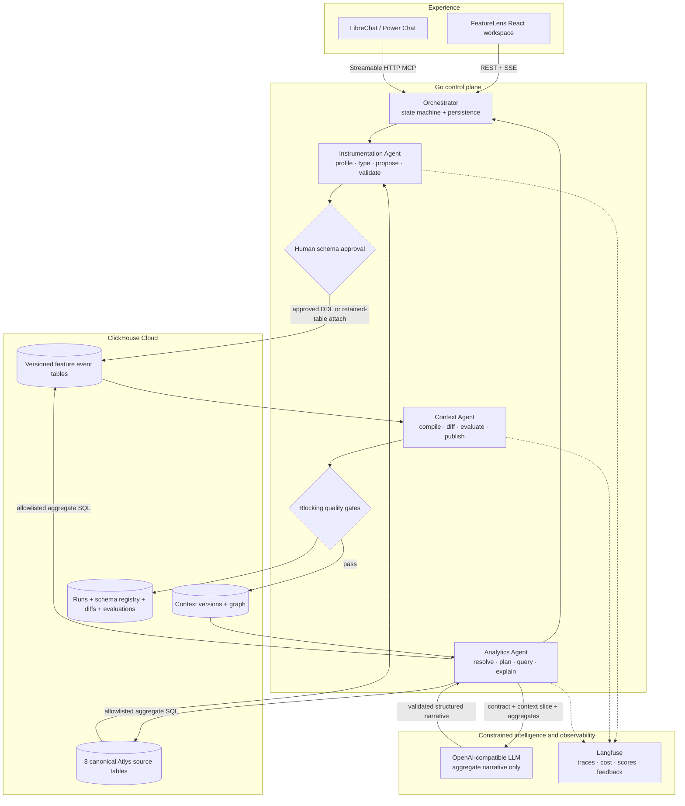

# FeatureLens submission architecture

## System boundary and agent handoffs

FeatureLens separates physical instrumentation, semantic context, and decision synthesis into three standalone Go agents coordinated by a deterministic state machine.



The handoff contract is explicit:

| From | To | Required evidence |
|---|---|---|
| Feature package | Instrumentation Agent | Markdown contract and NDJSON or retained table |
| Instrumentation Agent | Human gate | Profile, typed DDL, validation checks, proposed schema version |
| Approved schema | Context Agent | Verified physical table, row count, event fingerprint, schema version |
| Context Agent | Analytics Agent | Published context version, diff, metric/funnel bindings, allowed tables, questions, playbooks, conflicts |
| Analytics Agent | Product Manager | Aggregate evidence, exact SQL, context/schema versions, limitations, confidence, action, trace ID |

The orchestrator will not skip the approval gate. A candidate context is published only when every blocking evolution check passes. A failed or quarantined candidate leaves the latest published context unchanged.

## Context storage and why

The Feature Context Graph is an immutable, versioned semantic control plane stored in ClickHouse. Nodes represent features, tables, events, entities, dimensions, metrics, business questions, analysis playbooks, roles, operating rules, and known issues. Edges state exactly how they relate: `EMITS`, `STORED_IN`, `COMPUTED_FROM`, `SEGMENTED_BY`, `RESOLVED_BY`, `QUERIES`, and similar relations.

Each feature evolution follows this invariant:

```text
context vN = context vN-1 + verified feature delta
```

ClickHouse stores both the data plane and durable control plane: source events, feature events, context-version payloads, normalized nodes and edges, conflicts, schema registry entries, run history, context diffs, and evaluations. This makes the physical and semantic history independently inspectable and keeps recovery simple: the Go service reconstructs its in-memory state from ClickHouse at startup.

ClickHouse is a deliberate choice because the agents reason over analytical evidence and governance history in the same system. The Analytics Agent can aggregate large event tables efficiently while the Context Agent persists append-only versions and diffs. Runtime DDL and inserts use scoped service credentials; ClickHouse MCP remains a read-only operator surface for exploration and diagnostics.

## Governed analytics trust boundary

FeatureLens is not unrestricted text-to-SQL. The Analytics Agent first resolves the requested feature, intent, semantic entity grain, dimensions, metric, and playbook from the current context. The plan contains an allowlist of tables and required evidence. Only that plan can compile SQL.

ClickHouse executes the aggregate query. The deterministic answer is already complete before the LLM is invoked. The LLM receives only:

- the role and requested output contract;
- a compact versioned context slice;
- aggregate ClickHouse evidence;
- deterministic headline, limitations, and confidence ceiling.

It never receives raw event rows and cannot choose tables, write SQL, change evidence, or increase confidence. Its structured response is validated; invalid or unavailable generation falls back to the deterministic answer. Unsupported questions are `not_answerable`, have empty SQL, and record a skipped query step. The evaluator treats this governed abstention as a successful distinct plan rather than pressuring the system to fabricate an answer.

## Langfuse and LibreChat integration

OpenTelemetry spans map the full lifecycle into Langfuse: root orchestration, instrumentation profiling, schema design and execution, context evolution, ClickHouse queries, LLM generations, final composition, cost, token usage, and latency. Stable observations let Langfuse evaluators target the generated insight and final answer. Trace Explorer reads Langfuse server-side, so credentials never reach the browser, and writes typed `user_helpful` plus `issue_category` scores back to the final-answer observation.

LibreChat is an optional open-source conversational shell. Seven governed tools are exposed through Streamable HTTP MCP, including portfolio conversation. LibreChat never owns business truth or orchestration; it calls the same agents, context, and ClickHouse evidence path as the FeatureLens UI.

The submitted LLM configuration uses `openai/gpt-4.1-mini` through OpenRouter because the task is constrained structured synthesis over compact aggregates, where latency and cost matter more than unconstrained reasoning breadth. The provider is OpenAI-compatible and replaceable; the deterministic answer path makes the system operational when generation is disabled.
