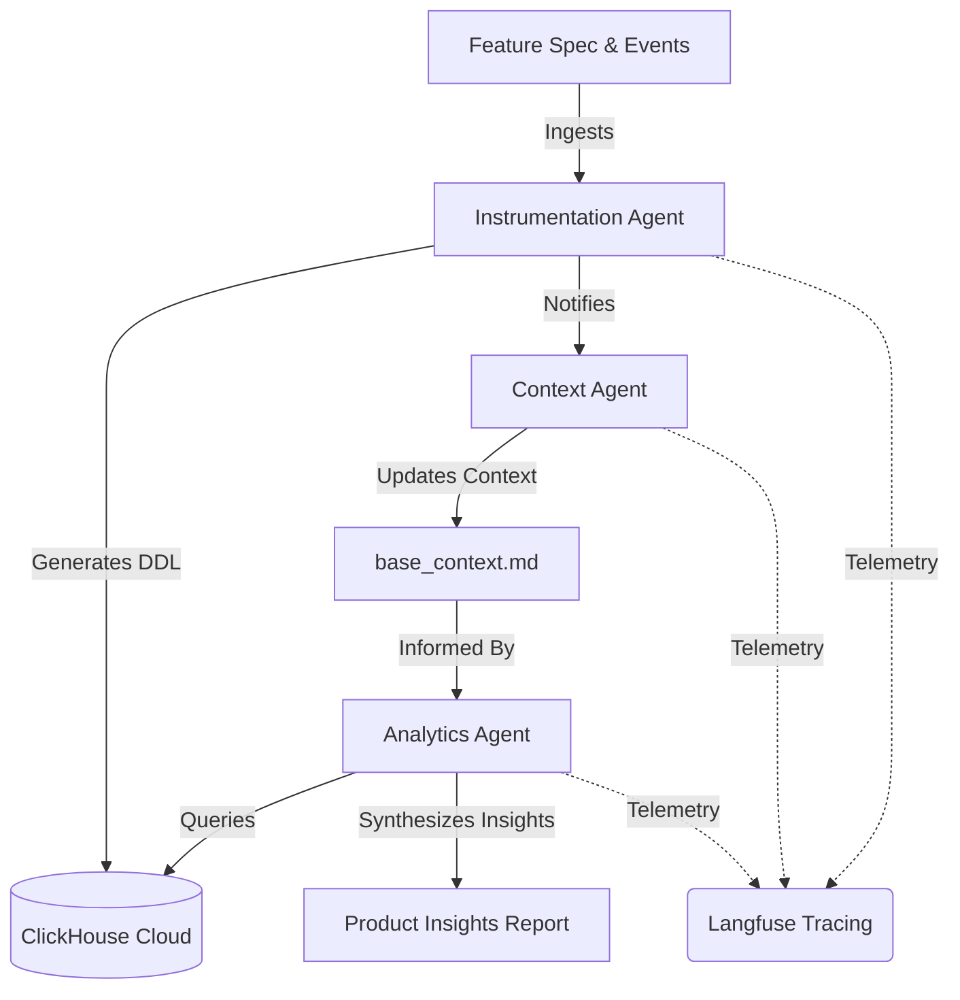
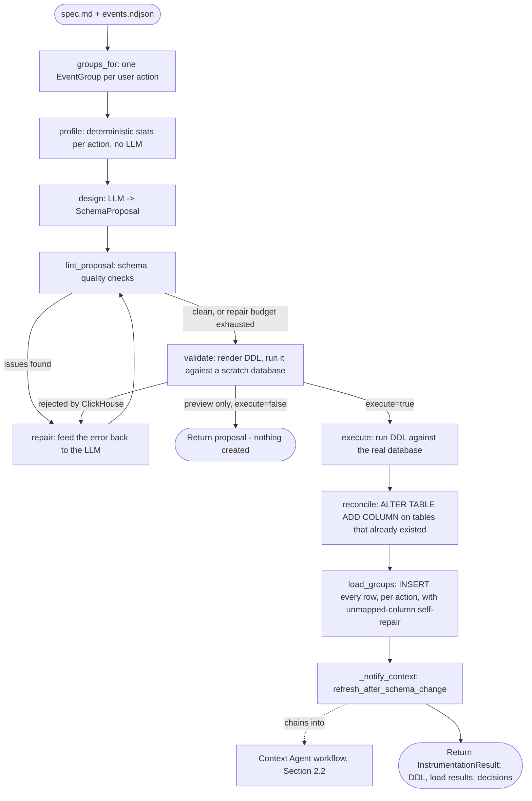
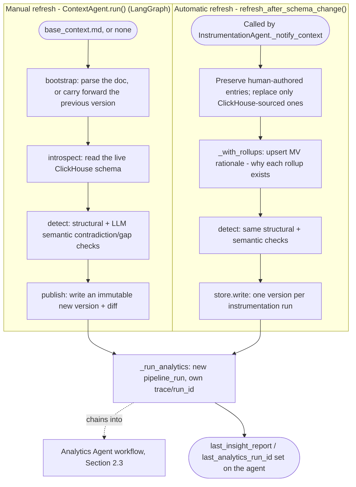
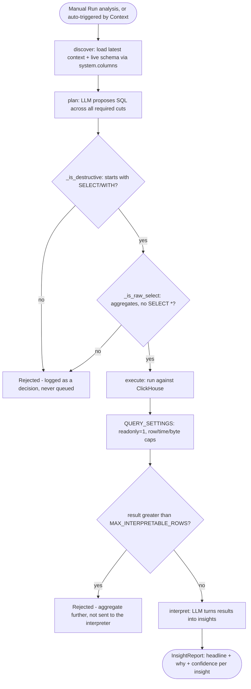

# System Architecture & Design Decisions

This document outlines the architecture, layout, and component-level details of the Atlys Agentic Analytics Platform.

---

## 1. Core Platform Architecture

The platform is designed around three cooperatively integrated AI agents that interact through a shared ClickHouse database and business context layer:

---

## 2. Agent Component Roles

### 2.1. Instrumentation Agent
* **Role**: clickhouse Database Architect.
* **Responsibilities**:
  - Digest raw feature briefs (`spec.md`) and sample NDJSON event streams.
  - Infer optimal ClickHouse data types (e.g. `LowCardinality(String)`, unsigned integer types) to maximize compression.
  - Select sorting keys (`ORDER BY`) based on common query patterns (such as geography, device, and destination) rather than default/arbitrary IDs.
  - Construct and dry-run idempotent DDL statements (`CREATE TABLE IF NOT EXISTS`).
  - Ingest the raw data files into ClickHouse.

**Workflow** (`prism_ch/agents/instrumentation.py:InstrumentationAgent.run`):

Two rules the diagram doesn't show but the code enforces everywhere: **no `drop_table` primitive exists at all** (an existing table is only ever widened via `ALTER TABLE ADD COLUMN`, never replaced), and the repair loop is bounded by `DDL_REPAIR_ATTEMPTS` — after that it raises rather than looping forever. `_notify_context` is wrapped in its own `try/except`: a failure to notify the Context Agent must never undo the tables that were just created.

### 2.2. Context Agent
* **Role**: Metadata & Business Glossary Guardian.
* **Responsibilities**:
  - Maintain the living business metadata layer (`base_context.md`).
  - Listen for schema updates from the Instrumentation Agent and update entity mappings.
  - Parse schemas to detect data anomalies or contradictions with documentation (e.g. document type mismatches).
  - Update metrics and track configuration schemas.

**Workflow** (`prism_ch/agents/context.py`) — two entry points that converge on the same downstream trigger:

`_run_analytics` is wrapped in its own `try/except`: a failed analytics run is logged and never re-raised, so a context refresh (or the instrumentation run that triggered it) always succeeds even if the downstream analysis fails. This is the literal implementation of the `ContextAgent -->|Informed By| AnalyticsAgent` edge in §1 — every context change, whichever path produced it, ends in a fresh analysis.

### 2.3. Analytics Agent
* **Role**: SQL Expert & Business Analyst.
* **Responsibilities**:
  - Read questions from Product Managers and identify target tables.
  - Generate optimized ClickHouse queries using advanced analytical functions like `windowFunnel` and `uniqCombined`.
  - Slice conversion metrics across primary dimensions (`device_type`, `os`, `geoip_country_code`, and `destination`).
  - Correlate drop-off or conversion anomalies with known business issues (e.g. iOS WebKit payment regressions).
  - Synthesize reports outlining the *why* of conversion drops rather than just dumping raw rows.

**Workflow** (`prism_ch/agents/analytics.py:AnalyticsAgent.run`), reachable manually ("Run analysis") or automatically (§2.2's `_run_analytics`):

Two guard rails run before any SQL reaches ClickHouse, and a third is enforced by the server itself:

1. **`_is_destructive`** — a whitelist, not a blacklist: the statement must start with `SELECT` or `WITH`. Rejects `DROP`/`TRUNCATE`/`DELETE`/`ALTER`/`RENAME`/`UPDATE`/`INSERT`/`CREATE`/... without having to enumerate ClickHouse's full grammar.
2. **`_is_raw_select`** — rejects `SELECT *` and anything without a `GROUP BY` or aggregate function. The model interprets a summary, never raw rows.
3. **`readonly: 1`** in `QUERY_SETTINGS` — the server-side backstop for both of the above. Even if a destructive statement somehow bypassed the client-side checks, ClickHouse itself refuses anything but `SELECT`/`SHOW`/`DESCRIBE` under `readonly=1`.

---

## 3. Communication & Integration Patterns

1. **Schema Notifications**: When the Instrumentation Agent establishes a new table schema, it sends the finalized DDL to the Context Agent.
2. **Context Injection**: Before any query generation, the Analytics Agent pulls the latest context schema from the Context Agent to ensure calculations align with active business metrics.
3. **No Raw Row Passing**: Agents must never fetch raw datasets into the LLM context. ClickHouse must handle 100% of aggregations, joins, and funnels. The LLM only processes the summarized results.

---

## 4. Storage, Tracing, and LLM Choices

**Where the context layer is stored, and why.** In ClickHouse itself — four
tables owned by the pipeline (`context_versions`, `context_entries`,
`context_issues`, `context_embeddings`; see
[`prism_ch/agents/context_store.py`](prism_ch/agents/context_store.py)),
never a file on disk and never a separate graph/vector database:

- Three of the context requirements are inherently *versioning*-shaped:
  freshness (read the newest version), a diff/changelog between two versions,
  and a trace that records which version a conclusion used. An append-only
  table makes "freshest" a `MAX(version)` and a diff a `FULL OUTER JOIN`.
  Graph and vector stores are built to be mutated in place — "what changed
  between v3 and v4" is exactly what they are worst at.
- Metric formulas are structured, not narrative prose
  (`conversion = purchases / starts`). Round-tripping that through embedding
  extraction is lossy in a way that is easy to miss until an insight is
  quietly wrong.
- The Analytics Agent already holds a live ClickHouse connection. Context
  joins to data in one query, in one datastore — no second system to
  provision, and one fewer thing that can fall out of sync or go down.

Each version stores a **full snapshot**, not a delta — at this size (low
hundreds of rows) that costs nothing and makes every diff a straight
comparison of two versions with no replay. A fifth table
(`context_embeddings`) holds per-entry vectors used only for optional
semantic retrieval when the Analytics Agent is given a focused question — it
is a search index over the ClickHouse-resident context, not an alternate
store of record.

**How Langfuse tracing is wired.** [`prism_ch/tracing.py`](prism_ch/tracing.py)
is the only module that touches the Langfuse SDK — every agent talks to its
`Run`/`Step` wrapper types instead, so an SDK version change is a one-file
fix. Self-hosted via `docker compose --profile langfuse` (`make up-obs`), with
its own ClickHouse instance (Langfuse v3 stores traces in ClickHouse too,
kept separate from the app's analytics database on purpose — see
[README.md](README.md#two-clickhouse-servers-on-purpose)). Every agent run
opens one root trace (`pipeline_run`) and one span per agent step
(`agent_step`), tagged with `as_type="agent"` so Langfuse's Agent Graph view
renders the three agents as distinct nodes rather than generic spans. Every
`step.decision()` call requires a `why` argument at the type level — an agent
cannot record a choice without recording its reasoning. `step.sql()` records
every query pushed down to ClickHouse, and every LLM generation carries
`metadata.agent`/`metadata.operation` plus token counts and computed cost.
Tracing failures never break a run: every SDK call is wrapped in `_safe()`,
so a dead collector costs one trace, not the pipeline.

**ClickStack and LibreChat.** Neither is part of this submission. LibreChat
was wired up early as an optional chat front-end over the MCP server
(`python -m prism_ch mcp`) but its bundled MCP client could not hold a
connection (a confirmed bug in LibreChat v0.8.7) — it added a second UI
surface with no working functionality, so it was removed rather than shipped
half-working. The Prism CH browser UI (Instrument / Analysis / Context /
Schema tabs) is the single front-end. ClickStack (the system-level view) was
evaluated as optional per the brief ("if you want to go further") and not
built — Langfuse alone already satisfies every tracing requirement in §3 of
the brief (T1–T7 in `REQUIREMENTS.md`).

**LLM provider(s) used, and why.** [`prism_ch/agents/llm.py`](prism_ch/agents/llm.py)
dispatches to one of three providers — Anthropic, OpenAI, or Gemini/Google —
behind a single `complete()`/`embed()` interface selected by one config
variable (`LLM_PROVIDER`), so no agent code is provider-specific. The
configured default is **Gemini 3.5 Flash Lite**: it has a free tier (no
upfront cost for a hackathon budget), is priced roughly 5–35x cheaper per
token than the Pro/Sonnet/GPT-4-class tiers this pipeline does not need
(see [`prism_ch/pricing.py`](prism_ch/pricing.py) for the exact per-model
table used to compute real cost on every trace), and is fast enough that the
Instrumentation Agent's design→validate→repair loop and the Analytics
Agent's plan→execute→interpret loop stay within a few seconds per LLM call.
Any of the three providers can be swapped in purely via `.env` — see
[SETUP.md](SETUP.md#5-create-your-env-file).

## 5. Telemetry, Tracing & Auditing

* **Langfuse**: Every execution trace is tracked. Spans are created for:
  - Agent decisions and tool invocation.
  - LLM prompt rendering and response generation.
  - SQL queries executed against ClickHouse.
* **Raw SQL Logs**: The exact SQL generated by the Analytics Agent must be stored in the trace metadata for auditability.
