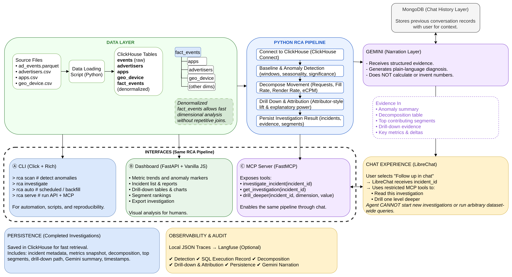

# Columnar Knights

> Source code:
>
> - [`src/implementation`](./src/implementation/)
> - [`src/docker-compose.yml`](./src/docker-compose.yml) (for `implementation`)
> - [`src/librechat`](./src/librechat/) (contains `librechat.yaml`)

> New data analysis + investigation:
>
> - [`trace/investigation--json+sql`](./trace/investigation--json+sql/)
> - [`trace/langfuse`](./trace/langfuse/)

> PPT: [`columnarknights.pdf`](./columnarknights.pdf)

## Track
InMobi

## Project
RCA-Mole: Dig into the RCA for event stream anomalies.

## Team Members
> In reverse-alphabetical order.

- M P Shri Veena (@mpshriveena)
- Pranav Gopalkrishna (@pranigopu)
- Sandesh Aithal (@sandesh-plf)
- Shivaprakash Akki (@Akkishiva)

## What it does
A short description of your project.

## Hosted Demo
[`github.com/columnarknights/rca_mole`](https://github.com/columnarknights/rca_mole)

## Demo Video
[`www.youtube.com/watch?v=xK8kHxGL1tM`](https://www.youtube.com/watch?v=xK8kHxGL1tM)

## Architecture


The anomaly `detection->attribution->narrative pipeline`, is discussed below:

```
Metric anomaly detected (z-score on Median/MAD)
        |
        v
Is the metric a composite (currently: only Revenue)?
        |                                   |
       Yes                                  No
        |                                   |
        v                                   v
LMDI decomposition                  Metric is already "atomic":
(decompose_revenue)                 skip straight to EP/Surprise/Drill-down
        |                                   |
        v                                   |
Pick the dominant factor                    |
(largest |factor_contributions[f]|)         |
        |                                   |
        +------------------+----------------+
                            |
                            v
        Explanatory Power, per dimension valid
        ... for this factor's population (dimensions_for_factor)
                            |
                            v
        Surprise / Lift, to separate localized causes
        ... from segments that just moved in proportion
                            |
                            v
        Drill-Down: recurse into the winning segment:
        - Re-scoping the dimension universe if needed
        - Until max_depth or no segment clears lift_thresh
```

## How we built it
Our implementation involved 5 broad aspects (with sub-components):

1. Algorithmic workflow
   1. Anomaly detection
      1. z-order score on MAD
      2. Baseline calculation as per trend (via linear regression) + seasonality
   2. Metric decomposition (for composite metrics)
      1. LMDI decomposition
      2. Applied only for revenue (and revenue per request)
   3. Attribution
        > Of segments/sub-metrics in terms of their contribution to the overall metric.
      1. Explanatory power (Adtributor-inspired)
      2. Surprise (renamed in our codebase as "lift") (Adtributor-inspired)
2. Core analytical codebase
   1. Implements the algorithmic workflow
   2. Runs ClicKHouse SQL wrapped in Python scripts
3. ClickHouse data layer (ClickHouse Cloud)
   1. Dimension tables
   2. Event table
   3. Fact table (pre-joining of dimension and event tables)
4. UI layer
   1. Locally-hosted HTML + JS + CSS frontend
   2. Contains dashboards, investigation overviews, drill-down trees, chat UI link
5. AI layer
   1. LibreChat for providing chat UI (hosted publicly)
   2. AI model (Gemini)
   3. Direct injection of investigation context upon startup
   4. Persistent chat history layer using (locally-hosted) MongoDB

```
End-to-End Flow

User
|
v
Frontend Dashboard
|
v
Select Incident -> Click "Follow up in Chat"
|
v
LibreChat
|
v
Gemini
|
v
Python RCA Service
|
v
ClickHouse
|
v
Python RCA generates structured JSON
|
v
Gemini converts JSON into natural language
|
v
LibreChat displays the response
|
v
User
```

Role of each component:

- Frontend -> Displays incidents and lets the user start a chat.
- LibreChat -> Chat interface for interacting with Gemini.
- Gemini ->
  - Understands the user's question.
  - Explains the RCA results in natural language.
- Python RCA -> Performs the actual investigation and generates structured JSON.
- ClickHouse -> Stores incident, metrics, and event data.
- MongoDB -> Stores chat history and user sessions.
- Langfuse -> Monitors the AI pipeline (latency, traces, tokens, errors).

> **Further information**: [`rca_mole/docs/demo-solution-approach-2.md`, @columnarknights, **github.com**](https://github.com/columnarknights/rca_mole/blob/main/docs/demo-solution-approach-2.md)

## How to run it

UI + analytics orchestration:

```
git clone https://github.com/columnarknights/rca_mole .
cd rca_mole
docker compose up -d
```