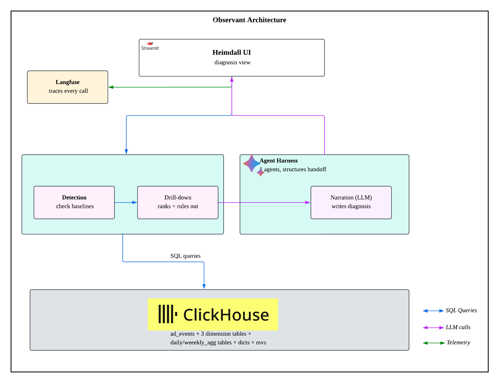

# Team Name
## Data Heimdall

## Track
InMobi

## Project
**Observant** — sees the metric move, automatically finds the exact segment responsible, and explains it in plain language with every number traced back to a query.

## Team Members
- [Kirubanandhan N] ([GitHub handle: kirubagithub])
- Senthilkumar Sukumar ([GithHub handle: senthilkumar3282])
- [Thejasekhar Reddy Gundlooru] ([GithHub handle: ThejaReddy1]) 
- [Vijayan Jaybal] ([GithHub handle: VijayanJ])

## What it does
Observant is a ClickHouse-native root-cause analyst for ad-tech metrics. It:
1. **Detects** when a key metric (requests, revenue, fill rate, CTR, eCPM) deviates from its expected baseline, using a same-weekday-median baseline (to avoid mistaking ordinary weekly seasonality for an anomaly) and a regression-residual z-score method that catches both sharp single-day spikes and borderline multi-day drifts.
2. **Localizes** the anomaly automatically across every available dimension — region, country, OS version, device model, ad format, publisher tier, app category, advertiser vertical, campaign type — ranking segments by how disproportionately they moved relative to their peers, not just by raw volume.
3. **Cross-checks confounds** before naming a culprit — e.g. confirming a fill-rate collapse localized to one OS version isn't actually a region effect wearing an OS disguise, by testing the segment's behavior independently across every other dimension.
4. **Reports in plain language**, with every claim backed by a specific computed number, and an explicit "checked and ruled out" section — not just what was found, but what was tested and cleared.

**Confirmed findings on the InMobi dataset** (validated end-to-end, every number traced to a query):
- **2026-06-21**: Global request/revenue crash (−44% to −45%), uniform across every dimension — a pure demand-side event, not a monetization problem.
- **2026-06-23 to 06-25**: Fill-rate collapse localized to `os_version='Android 15'` (0.785 → 0.433, ≈−28,400 fills) — a blended ~−4.4% move at the platform level that only reveals its true concentration once localized past ad_format.
- **2026-06-19 to 06-22**: eCPM collapse localized to `category='finance'` apps (−34.9%, ≈−$42 revenue) — confirmed via independent cross-tabs against both region and advertiser vertical, ruling out both as confounds.
- **2026-07-06 to 07-10 (new data)**: NAM-region eCPM/fill-rate collapse (−44.4% eCPM, ≈−$526 revenue; nested 2-day fill-rate crash, ≈−26,000 fills), confirmed region-driven (not OS- or device-driven) via a region×os_version cross-tab, and still unresolved as of the latest ingested data.

## Hosted Demo
[Data Heimdall](https://data-heimdall.streamlit.app/)

## Demo Video

https://youtu.be/R-_2S3q4csk

## Architecture



**Key design principle: math lives in SQL, not Python.** The Python layer issues
queries and renders results — it never computes a statistic itself. This
means every number in a report is independently reproducible by re-running
the query directly against ClickHouse, and the LLM's job is strictly
translation (verdict JSON → sentence), never analysis or invention.

**Detection method** evolved across iterations of this build: starting from
Tukey-fence outlier detection on daily residuals, extended to a same-weekday
median baseline (to defeat the "every weekend looks anomalous" failure
mode), and finalized as an OLS trend-regression residual z-score — chosen
because it surfaces borderline multi-day drifts (2–3σ) that a hard
percentage-deviation cutoff silently discards, which is how the
`category='finance'` and NAM-region incidents were actually caught.

## How we built it

**Tech stack:**
- **ClickHouse Cloud** — primary database and full compute engine (z-scores, dispersion ranking, cross-tab confound checks, all in SQL)
- **Streamlit** — interactive front end: trend charts, dispersion bar charts, gauges, incident summary cards
- **Docker / Docker Compose** — containerized deployment, environment-variable configuration (`CLICKHOUSE_HOST`, `PORT`, `USER`, `PASSWORD`, `DATABASE`, `SECURE`, `TABLE`)
- **LLM (pluggable)** — a stub interface (`llm_stub.py`) that takes a small, pre-computed verdict JSON (no raw rows) and returns plain-language narration; swappable to any provider without touching the rest of the app
- **Langfuse** — full observability: every ClickHouse query and every LLM call traced and session-grouped, satisfying the "no trace, no credit" evaluation requirement

**Interesting implementation details:**
- **Baseline discipline**: ratio metrics (fill rate, eCPM, CTR) are always computed as `sum/sum` over the group, never as an average of per-day ratios, per the metrics glossary.
- **Confound-aware localization**: a segment isn't named as the culprit just because it has the largest raw deviation — it has to move disproportionately more than the *typical* segment in the same dimension (tunable dominance ratio, default 3.0x in the sidebar), and where possible its independence is verified with a cross-tab against at least one other dimension (e.g. confirming a fill-rate anomaly is really `os_version`-driven and not a `region` effect that happens to correlate with it).
- **Multi-database routing awareness**: when new data lands in a differently-named database/table (e.g. `inmobi_cat` alongside the original `inmobi`), the pipeline was explicitly re-verified to detect and route to the freshest table rather than silently reporting "no anomaly" against stale data — a failure mode this project treats as a first-class risk, not an edge case.
- **Explicit rule-outs, not just findings**: every report states what was checked and cleared (weekly seasonality, alternate dimensions, data-quality artifacts like `advertiser_id=''` on unfilled rows) alongside what was found.

## How to run it

### With Docker Compose (recommended)
```bash
cp example.env .env
# edit .env with your ClickHouse Cloud host / user / password / database
docker compose up --build
```
Open `http://localhost:8501`, click **Scan for Anomalies** in the sidebar.

### With plain Docker
```bash
cp example.env .env
# edit .env
docker build -t inmobi-anomaly-scanner .
docker run --rm -p 8501:8501 --env-file .env inmobi-anomaly-scanner
```

### Locally without Docker
```bash
python -m venv .venv && source .venv/bin/activate
pip install -r requirements.txt
cp example.env .env   # edit it
streamlit run app.py
```

### Configuration
All connection settings come from environment variables (`.env`, or injected by Docker/Compose):

| Variable | Meaning | Default |
|---|---|---|
| `CLICKHOUSE_HOST` | ClickHouse Cloud host | `localhost` |
| `CLICKHOUSE_PORT` | HTTPS port | `8443` |
| `CLICKHOUSE_USER` | Username | `default` |
| `CLICKHOUSE_PASSWORD` | Password | *(empty)* |
| `CLICKHOUSE_DATABASE` | Database containing the agg table | `inmobi` |
| `CLICKHOUSE_SECURE` | Use TLS (`true`/`false`) | `true` |
| `CLICKHOUSE_TABLE` | Daily aggregate table name (editable in UI too) | `ad_events_daily_agg` |

Sidebar sliders (no restart needed): anomaly z-score threshold (default 2.0),
culprit dominance ratio (default 3.0x), minimum dispersion floor (default 0.02).

**Before the unseen-incident release**: confirm `CLICKHOUSE_DATABASE` /
`CLICKHOUSE_TABLE` point at wherever the fresh data actually lands — a
hardcoded pointer at a stale database will silently report "no anomaly
found" on the exact dataset being judged.
