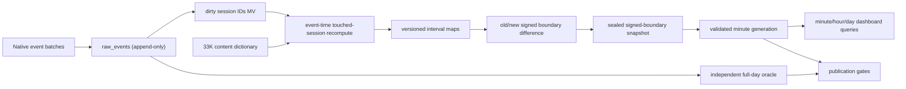

# SonyLIV foreground-only concurrency solution

## Outcome

The coherent design is a hybrid ClickHouse pipeline:

1. keep raw events append-only;
2. recompute only touched sessions in event-time order;
3. normalize truly active ranges as half-open intervals;
4. publish the **difference** between old and new interval boundaries into a
   `SummingMergeTree` point table;
5. derive immutable exact minute snapshots for dashboard peak/average queries;
6. run an independent full-day interval oracle before publishing a generation.

This makes late events and open-session heartbeats small signed corrections. It
does not rely on background `ReplacingMergeTree` merges or ask an incremental
materialized view to infer state across insert blocks.

Provenance labels used below:

- **[official]** directly follows ClickHouse documentation or a supplied contract.
- **[derived]** follows from official behavior plus measured SonyLIV data.
- **[field]** is an operational heuristic that must be measured or confirmed.

The complete measurements are in `evidence/MEASURED.md`; the machine-readable
semantic switches are in `policy.yaml`.

## Canonical time contract

**[derived]** The source transport stays byte-faithful: `event_timestamp` and
`session_start_epoch` are `Int64` Unix epoch milliseconds. At the ClickHouse
ingestion boundary they are normalized once with
`fromUnixTimestamp64Milli(..., 'UTC')` into `DateTime64(3,'UTC')`. Every stored
timestamp, service date, partition boundary, interval split, query parameter,
and published answer remains UTC. No IST-shifted timestamp or service date is
materialized.

This choice is observable rather than cosmetic. All 905,558 supplied rows have
13-digit epoch values and more than 99.9% carry non-zero millisecond precision.
Rendering the same instants in `Asia/Kolkata` changes the calendar date of 6,140
events across 34 sessions, including 24 SessionStart rows. An implicit server
timezone would therefore change daily partitions and answers. Consumers that
need India wall-clock labels convert only the result at runtime, for example
`toTimeZone(minute_start, 'Asia/Kolkata')`; filters and range bounds stay UTC.

## Workload summary

This is an append-heavy telemetry workload with millisecond event time,
cross-block session state, late/corrected events, mutable open sessions, repeated
date-and-dimension filters, and low-latency peak/average queries. The extract has
905,558 events, 10,866 sessions, 93.16% heartbeat rows, 29.26% physical-order
regressions, 4,209 excess exact duplicates, and a 43.64-hour maximum session.
Those facts rule out arrival-order processing, a start/end overlap shortcut, and
per-query raw-history reconstruction.



## Correctness contract

**[official + derived]** Every interval is UTC `[start,end)`. State is:

```text
active = started
         AND NOT first_end_seen
         AND foreground
         AND playing
         AND event_time < last_eligible_signal + heartbeat_timeout
```

Transitions:

- only the first `VideoSessionStart` starts lifecycle, initially foreground but
  not playing; later Start rows remain in raw input but are ignored by interval
  state.
- `VideoPlay` and heartbeat `resume` set playing and renew liveness when
  foreground.
- heartbeat `pause` and `VideoError` clear playing immediately. Error is
  recoverable only through a later Play/resume.
- `AppBackgrounded` clears foreground; `AppForegrounded` only sets foreground.
  It does not resume a paused player or refresh an expired lease.
- the first `VideoSessionEnd` is terminal; later rows remain in raw input but are
  ignored by interval state.
- all assignments at the same millisecond are coalesced. End wins both axes;
  Background wins the foreground axis; Error/pause win the playback axis.
- a late eligible heartbeat after lease expiry opens a new interval at its own
  event time. Heartbeats received while paused/backgrounded do not renew it.

The pause decision is not optional in the default answer: the problem statement
explicitly says paused time overstates the audience. After semantic
deduplication, first-Start/first-End clipping, and same-millisecond coalescing,
13,382 of 14,256 Foreground assignments leave playback stopped; 13,371 have
pause as the latest playback marker.

**[field]** `heartbeat_timeout_ms=120000` is deliberately configurable. Clean
telemetry has a 40.003s median gap; the dictionary says 60s; 120s is two stated
or roughly three observed periods. The 60/90/120s sensitivity changes active
hours by 5.904h across the entire file. No arrival timestamp or open-session
ground truth exists to identify a uniquely correct timeout.

The default metric is session concurrency. Distinct-user concurrency is served
as a separately named entity because 775 users own multiple sessions and 61
overlap. User intervals are unioned per dimension mask before endpoints are
created.

## Why boundary corrections

**[derived; `decision-late-arriving-upserts`,
`decision-real-time-preaggregation`]** For an active interval `[s,e)` publish
`+1@s, -1@e`. If a touched session changes, compare the complete old and new
boundary maps and publish:

```text
correction(t, dimensions) = new_boundary_map(t) - old_boundary_map(t)
```

Extending provisional expiry `[s,e_old)` to `[s,e_new)` therefore emits `+1` at
`e_old` and `-1` at `e_new`. A late pause at `p` retracts the prior tail without
an `ALTER UPDATE` or rebuild. A deterministic batch ledger plus ClickHouse insert
deduplication prevents a retry from applying the same additive correction twice.

The correction lane is executable, not a conceptual placeholder:
`11_select_touched_workset.sql` drains the append-only dirty-operation queue,
step 10 rebuilds only that workset, steps 12–13 compute old/new session and
affected-user maps, step 20 publishes the signed difference, and step 14 marks
only the successfully published dirty operations as applied. `oracle_run_id`
identifies a scoped reference calculation; `pipeline_run_id` separately binds
all correction batches, snapshots, cache rows, and manifests in one serving
lineage.

The control plane has two fail-closed completeness markers. Step 09 freezes the
initial dirty-operation seed, and step 25 refuses to seal a first snapshot until
every seed operation is checkpointed and every seed session has committed state.
A full-scan step 10 writes its source/policy/pipeline-bound oracle manifest in the
same multiquery; scoped correction runs cannot authorize publication. Snapshot
membership and point fingerprints are immutable, while steps 34 and 33 attest
the candidate independently from sealed points and raw intervals. Step 35 then
re-hashes the live candidate, both attestations, oracle manifest, batch ledger,
and point projection inside the manifest `INSERT … SELECT`.

**[production prerequisite]** `compaction_worksets` is audit/recovery metadata,
not compare-and-set locking. A linearizable Keeper/coordinator lease keyed by
`(pipeline_run_id,policy_version)`, with a monotonically increasing fencing
epoch, must be held across steps 11–20 and snapshot sealing; the control-plane
publisher must also serialize step 35 per generation key. The owner/epoch must be
authoritatively rechecked immediately before the batch-ledger commit. The
embedded verifier is intentionally single-worker and does not prove this
external coordination property.

The first snapshot also needs a bounded bootstrap cut: briefly quiesce raw
ingestion, or freeze a broker/object-store offset, from step 09 seed capture
through the first step 25 seal. The fail-closed seed check intentionally rejects
new dirty-operation membership during that window rather than publishing a
partial initial lineage. Continuous ingestion can resume after the first
snapshot; production should automate the cutoff instead of repeatedly allocating
new lineages under live traffic.

The touched-session query is bounded in the supplied raw data (p99 434 rows,
maximum 1,803) and is the only place that sorts full session history. A nightly
or on-demand full-day oracle independently reconciles every published answer.

Incremental MVs are used only for insert-local work: marking dirty IDs and
adding already-explicit correction rows. [Official incremental-MV behavior](https://clickhouse.com/docs/concepts/features/materialized-views/incremental-materialized-view)
is insert-block based, so deriving `lead`, prior foreground state, or replacing
old output directly from a raw-event MV would be incorrect. Likewise,
`ReplacingMergeTree` replacement is eventual; touched reads use `argMax` by
revision instead of broad `FINAL`.

## Representation and table layout

- **Raw:** `MergeTree`, daily session-start partitions for short-retention
  lifecycle/replay isolation, ordered by `(video_session_id,event_time,event_type,
  event,hash)`. **[derived exception]** Session ID leads despite its high
  cardinality because the only raw hot-path read is a touched-session history
  lookup. Dashboard filters never hit raw.
- **Content:** 33,464 unique keys cover all 3,357 IDs used by this extract, so a
  hashed dictionary is appropriate. Video type is resolved during session
  compaction and denormalized into boundaries; title/category remain dictionary
  metadata. Production needs an explicit content-change handler to dirty affected
  sessions because right-side changes do not trigger an MV; the checked fixture
  does not exercise that handler.
- **State:** append-only `MergeTree` revision history with compact interval
  arrays. Current reads are pipeline/policy scoped, joined to committed batch
  IDs, and reduced with `argMax`; an uncommitted higher revision is invisible.
- **Points:** `SummingMergeTree(delta)` ordered by entity, mask, date, exact
  filtered dimensions, and boundary time. Queries always `sum(delta) GROUP BY`
  the complete key because physical merges are asynchronous.
- **Minute cache:** immutable generation rows contain exact minute peak and
  `active_entity_ms`. Every row binds policy, pipeline lineage, and a sealed
  correction-ledger snapshot. A validated manifest atomically exposes a
  generation; old generations are retained for audit and lifecycle-expired
  later.

Native types are used throughout: `DateTime64(3,'UTC')`, signed `Int32` content
IDs, `FixedString(64)` observed hex IDs, signed deltas, LowCardinality categorical
strings, and explicit `__unknown__`/sentinel flags instead of blanket Nullable.
Raw event types remain strings for forward compatibility; internal closed sets
use Enum.

Daily interval splitting emits `-1` at midnight under the prior `service_date`
and `+1` under the next, keeping every daily boundary map self-contained and
balanced. Eleven first-Start-to-first-End lifecycles cross at least one UTC
midnight, and one crosses two. Under the checked 120-second policy, zero
normalized active intervals cross midnight; the splitter is an unseen-day guard,
not behavior exercised by this extract.

## Exact peak and average

Let `C(t)` be the prefix sum of all filtered point deltas at or before `t`.
For bucket `B=[b,e)`:

```text
peak(B)    = max C(t) within B
average(B) = integral_B C(t) dt / (e-b)
```

`sql/30_exact_metrics.sql` constructs constant-concurrency segments between
exact millisecond points, intersects them with minute/hour/day buckets, and
computes `active_entity_ms`. This avoids two common errors: averaging values at
irregular delta timestamps, and counting two sequential sessions in a minute as
an instantaneous peak of two. `sql/31_refresh_minute_cache.sql` persists those
exact sufficient statistics; hour/day peak is `max(minute_peak)` and average is
`sum(active_entity_ms)/duration`.

If the benchmark defines minute boundary sampling or any-overlap distinct count
instead, that is a policy adapter—not a reason to change the interval model.

Peak is always calculated after aggregating the requested dimension combination.
It is never obtained by summing per-content/platform peaks, which may occur at
different times.

`sql/60_session_independent_baseline.sql` supplies the requested comparison
path: an `uniqCombined64` minute-boundary lease estimate based only on liveness
events. It is cheaper and order-insensitive, but cannot retract foreground pause
or background time and is approximate. Its measured divergence from the exact
session curve is monitored; it is never substituted for the benchmark answer.
In the hot hour its sample peak is 3,162 versus exact 2,285, with a worst
single-boundary overcount of 938 sessions. The exact in-minute peak is separately
2,305.

## Filter strategy

`rollup_mask` identifies which of platform, country, content, and video type are
materialized. `policy.yaml` selects ten masks, including mask 0 global and mask
15 leaf. The supplied Start-anchored state has 4,317 full dimension combinations.
The exact mask set must be confirmed against the fixed benchmark query set; the
checked verifier does not prove every selected mask is required. Country is
currently constant but is retained for unseen-day correctness.

Session-static dimensions come from the first SessionStart. This avoids event-row
drift (user 120 sessions, platform 95, content one) changing attribution inside a
session. Audio, subtitle, and player values are not in the initial masks because
the data proves they are stateful; adding them requires interval-level state
semantics and a new mask, not silent Start anchoring.

## Ingestion, correction, and reconciliation

**[official; `decision-ingestion-strategy`]** Replay with deterministic Native
blocks of 10K-100K rows (50K target). If a producer cannot batch, use async
inserts with `wait_for_async_insert=1`; never fire-and-forget. Synchronous retries
must keep the same data, row order, block settings, and deduplication token.

**[derived]** Production streaming adds `ingested_at` and measures real lateness
by platform. The packaged CSV order cannot set a watermark. All events remain
correction-capable through raw retention; a hot touched-session queue is an
operational acceleration, not a correctness cutoff.

**[derived]** Refresh only affected `(service_date,entity,mask)` minute
generations from boundary points. This is a bounded serving-layer refresh, not a
raw-history rebuild. Independently rebuild each completed day from raw intervals
and compare hashes, active-milliseconds, peak results, delta balance, and query
logs before the manifest switches generation.

The checked-in fixture proves the whole correction path: one late pause dirties
one session, emits 320 unique signed rows across the ten session and ten user
masks, and leaves a zero signed row sum. Current state, the correction-backed
serving curve, and a fresh full-source oracle all converge to exactly
`6,404,143,590` active milliseconds. Reusing the batch ID or minute generation
hard-fails; a partial-minute dashboard request is rejected and routed to the
exact endpoint query. The verifier also proves that generation 1 remains
byte-stable after generation 2, identical attestation retries collapse to one
logical claim, and conflicting or post-attestation-mutated candidates cannot
produce a manifest row. An isolated boundary-swap fixture additionally proves
that an old interval ending exactly when its replacement starts retains two
distinct operation IDs and publishes the required net `+2` at that point. The
published minute path is checked end to end for
`entity=session, rollup_mask=0`; the remaining entity/mask boundary maps are
emitted but not each independently minute-parity-tested.

No scheduled `OPTIMIZE FINAL`, `ALTER UPDATE`, or `ALTER DELETE` is part of the
pipeline.

## Meaningful ClickStack integration

**[derived]** Instrument one trace across:

```text
replay.read -> raw.insert -> session.normalize -> boundary.correct
            -> minute.build -> generation.validate -> generation.publish
```

Attach `run_id`, source SHA, policy version, batch rows, touched sessions,
duplicate ratio, true ingest-lag quantiles, correction backlog, retraction rows,
open sessions, content misses, dimension drift, query ID, read rows/bytes, and
answer hash. Query `system.query_log` (and `clusterAllReplicas` in Cloud) for
duration, `read_rows`, `read_bytes`, memory, exceptions, and tables used.

Alerts are actionable:

- unapplied correction backlog or watermark lag above the confirmed SLO;
- any negative concurrency or non-zero daily delta balance;
- content dictionary misses above zero;
- generation/hash mismatch versus the independent oracle;
- ingest failures and benchmark query latency/read regressions.

Do not alert on “any late event”: 29.26% is the packaged replay baseline, and
actual lateness needs `ingested_at` evidence. The demo should inject a late pause,
show its trace and compensating endpoints in ClickStack, then rerun the exact
benchmark query through the minute serving table.

## Unseen-day runbook

1. Save raw/content bytes, SHA-256, row count, schema, UTC range, and
   `policy.yaml`; freeze the bootstrap input offset, allocate one stable
   `pipeline_run_id`, and obtain the external fenced compactor lease.
2. Run `00_schema.sql`, then load deterministic Native blocks using steps 01–02;
   retain query IDs, deduplication tokens, and input manifests.
3. Run `05_profile_loaded_data.sql`; fail on ID/type/content/contract drift, then
   freeze the new lineage seed with step 09.
4. For each correction batch, run steps 11 → 10 (scoped) → 12 → 13 → 20 → 14
   while holding the fenced lease.
   A crash retry reuses the same batch ID and tokens; a published ID is never
   recycled.
5. Seal the published adjustment-ledger cutoff with step 25, then build each
   required `(day,entity,mask)` candidate with step 31. If step 25 fails after
   writing staging rows, abandon that snapshot ID rather than retrying it. Resume
   live ingestion after this first complete lineage snapshot is committed.
6. Run a source-wide step 10 with a new oracle ID; it seals its completion
   manifest. Run the sealed-point parity gate in step 34, the independent
   raw-interval minute oracle in step 33, and general gates in step 40, including
   shuffled replay, duplicate replay, tied-boundary, and late-pause fixtures.
7. Run step 35 only after every gate passes. Serve aligned ranges with step 32;
   route partial-minute/cross-day ranges to step 30.
8. Execute fixed cold/warm queries, record deterministic answer SHA and
   ClickStack trace IDs, and capture `system.query_log` rows, bytes, memory, and
   latency. That bundle—not a laptop runtime—is the performance evidence.

Never claim dashboard latency before running on the target ClickHouse Cloud
service. A sensible field target is sub-second p95 warm, but the evidence must be
the actual query log rather than a laptop proxy.

## Contract questions to confirm

The public package explicitly leaves these choices open:

1. Is the heartbeat timeout judge-defined, and which heartbeat values qualify?
2. Is “viewer” a video session, a distinct user, or must both be returned?
3. Does minute concurrency mean exact in-minute peak/time-weighted average,
   minute-boundary sampling, or any-overlap distinct count?
4. Should `BufferStart`, ad pause, or speed-pause alter playing state?
5. Is the tie-break rule supplied for conflicting events at one millisecond?

Until clarified, `policy.yaml` is the executable answer and all output manifests
must record its version.

## Artifact map

- `policy.yaml` — explicit, versioned semantic contract.
- `COMPARISON.md` — evidence-based synthesis with the concurrent draft.
- `sql/00_schema.sql` — ClickHouse tables, MVs, dictionary, and control plane.
- `sql/01_ingest_raw_csv.sql`, `02_ingest_content_csv.sql` — deterministic load.
- `sql/05_profile_loaded_data.sql` — evidence reproduction.
- `sql/09_initialize_pipeline_lineage.sql` — immutable complete seed membership.
- `sql/10_reference_intervals.sql` — exact event-time state oracle/backfill.
- `sql/11_select_touched_workset.sql` — append-only dirty-operation drain.
- `sql/12_stage_session_candidates.sql` — includes zero-active replacements.
- `sql/13_apply_state_differences.sql` — session/user old-new interval maps.
- `sql/14_checkpoint_touched_batch.sql` — post-publication dirty checkpoint.
- `sql/20_publish_boundaries.sql` — exact endpoints and published-batch ledger.
- `sql/25_seal_delta_snapshot.sql` — immutable correction-ledger cutoff.
- `sql/30_exact_metrics.sql` — exact arbitrary bucket query.
- `sql/31_refresh_minute_cache.sql`, `32_dashboard_queries.sql` — serving cache.
- `sql/33_validate_raw_oracle_generation.sql` — raw interval-to-minute attestation.
- `sql/34_validate_candidate_generation.sql` — full per-minute snapshot parity.
- `sql/35_publish_generation.sql` — authoritative re-hash and manifest publication.
- `sql/40_validation.sql` — publication gates.
- `sql/60_session_independent_baseline.sql` — non-authoritative comparison path.
- `tools/verify_embedded.py` — hash-locked executable correctness/correction test.
- `evidence/embedded-verification.json` — compact checked-run evidence record.
- `BEST_PRACTICES.md` — all 31 skill rules and five architecture decisions.
