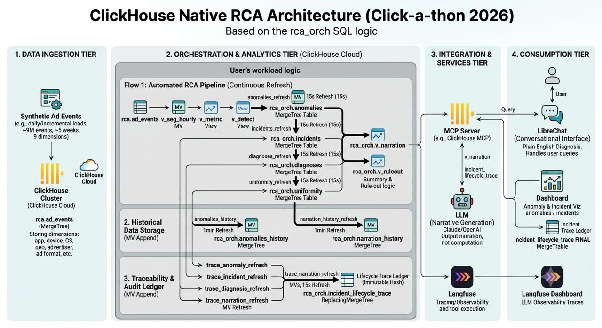
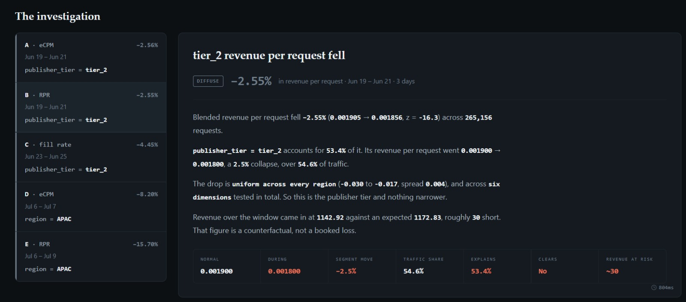
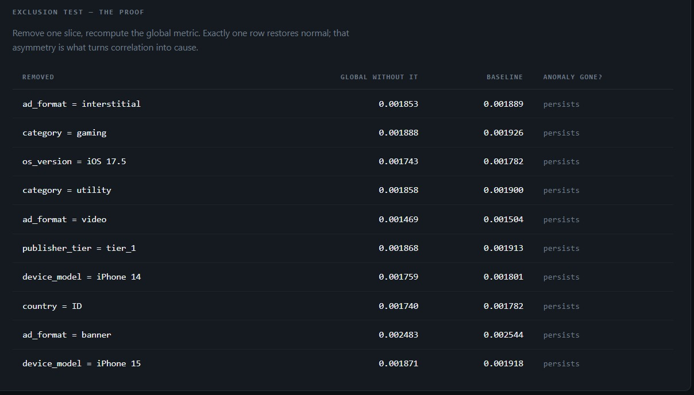
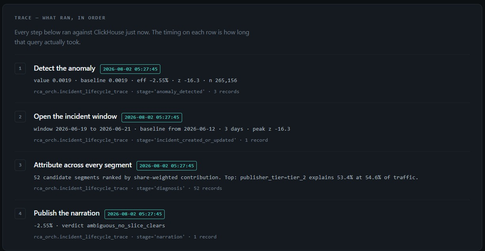
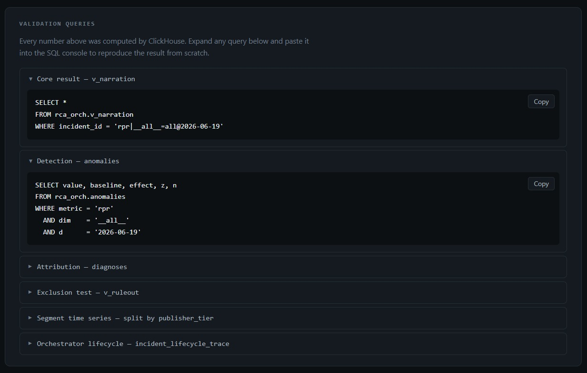

# Flux4

## Track

InMobi — *"From alert to answer: the automated root-cause analyst."*

## Project

**Auto RCA** — alert to evidence-backed answer in seconds, with a receipt for every claim.

## Team Members

- Ramyashree Shetty ([@ramyashreeshetty](https://github.com/ramyashreeshetty))
- Spoorthy VV ([@spoorthyvv](https://github.com/spoorthyvv))
- Bharateesh ([@bca18](https://github.com/bca18))
- Shanmathi ([@s-h-a-m-i](https://github.com/s-h-a-m-i))

## What it does

Our solution diagnoses why an ad-revenue metric moved, in seconds, with ClickHouse as the analytical engine. A view chain detects the deviation against a seasonality-aware baseline, decomposes it across the revenue identity in log space, localises the responsible segment by concentration, and records what it ruled out. The whole pipeline is orchestrated inside ClickHouse itself, no Airflow, no cron, just refreshable materialized views driving the run loop, with each layer on the engine that fits how it's written to, so re-runs deduplicate rather than double-count. Every claim lands in an incident ledger; the LLM reads one narration row and writes prose, never numbers. Results render on a dashboard with an AI briefing panel for follow-up questions over the same views, and Langfuse traces every query and every LLM call.

The system is also willing to answer *"no segment."* Two of the three root causes in the unseen slice came back diffuse — nothing cleared on exclusion — and it said so rather than naming a culprit.

## Hosted Demo

<https://clickhouse-flux4-apcxgtbndhatanf6.southindia-01.azurewebsites.net/>

Live against ClickHouse Cloud. The pipeline is self-refreshing, so the incident list, timelines and lifecycle trace are computed on load — not baked in. Open any incident for its attribution, exclusion test, and the copyable SQL behind every number.

## Demo Video

<https://www.youtube.com/watch?v=kqBE2HALm5I>

## Pitch Deck

[Flux4 — pitch deck](https://onedrive.live.com/:p:/g/personal/4CD2BEEE822B7D51/IQCyLLz3C1zXRL4MzPs3Cu73ARNG1taRBCqwzzILIrgB0rg?resid=4CD2BEEE822B7D51!sf7bc2cb25c0b44d7be0cccfb370aeef7&ithint=file%2Cpptx&e=jbrWzN&migratedtospo=true&redeem=aHR0cHM6Ly8xZHJ2Lm1zL3AvYy80Y2QyYmVlZTgyMmI3ZDUxL0lRQ3lMTHozQzF6WFJMNE16UHMzQ3U3M0FSTkcxdGFSQkNxd3p6SUxJcmdCMHJnP2U9amJyV3pO)

## Architecture



Full write-up: **[ARCHITECTURE.md](ARCHITECTURE.md)**

## How we built it

**Stack.** ClickHouse Cloud 26.2 as both datastore and analytical engine — two databases, 13 tables, 7 views, 11 refreshable materialized views. Narration runs on `gpt-oss-20b` via OpenRouter, traced in Langfuse. The app is FastAPI + Jinja2 with vanilla HTML/CSS/JS on the front end — no framework, no build step. The whole schema deployment is one idempotent script.

**Ingestion.** The dataset ships static, so we built a replay: a refreshable view advances a watermark every 30s and appends the next slice, joining dimensions on the way in. Downstream views are join-free, and the detector runs against arriving data rather than a finished table.

**Analysis is SQL, not application code.** Seven chained views take a metric from raw events to a finished diagnosis: unpivot each event into 10 dimension rows, carry metrics as numerator/denominator pairs, score against a de-seasonalised trailing-14-day baseline, split the move across the revenue identity, rank segments by contribution, prove it by exclusion, collapse to one narration row.

**Orchestration lives in the database.** No Airflow, no cron, no worker — eleven refreshable views drive the loop, chained with `DEPENDS ON` so stages wait rather than race. Hot path 15s, audit 15s, snapshots 60s. `MergeTree` for append-only and atomically-replaced tables, `ReplacingMergeTree` wherever a re-run re-emits the same row.

**Model choice.** A 20B open-weight model is sufficient because the model does no analysis — it renders a finished row into five sentences. If we needed a frontier model to get a correct diagnosis, that would be evidence the model was doing work that belongs in SQL.

**Numeric fidelity.** The narrator only ever sees `rca_orch.v_narration`, which contains every publishable figure and nothing else. It cannot compute, and it is forbidden from asserting cause-of-cause — the data locates *where*, never *why*. Formatting and identifier-to-English translation are fixed rules, not model judgement.

## Unseen Evidence

We pointed the system at the released slice and let it run. Nothing below was written by hand:
every figure is a column in `rca_orch.v_narration`, every step a row in
`rca_orch.incident_lifecycle_trace`.

Five incidents opened, collapsing to **three root causes** — eCPM and RPR fire as a pair when
price is the factor that moved, and reporting both would double-count one loss.

| | metric | window | global move | culprit | peak z |
| --- | --- | --- | --- | --- | --- |
| A | eCPM | 19–21 Jun | −2.56% | `publisher_tier = tier_2` | −18.9 |
| B | RPR | 19–21 Jun | −2.55% | `publisher_tier = tier_2` | −16.3 |
| C | fill rate | 23–25 Jun | −4.45% | `publisher_tier = tier_2` | −63.4 |
| D | eCPM | 6–7 Jul | −8.20% | `region = APAC` | −11.7 |
| E | RPR | 6–9 Jul | −15.70% | `region = APAC` | −4.3 |

---

### 1 · Mid-June price degradation — tier 2 publishers (A + B)

**Diagnosis.** Price softened platform-wide over 19–21 June. Tier 2 publishers were the
largest single contributor, but the drop was **not confined to them** — so the system
published it as **diffuse**, naming tier 2 as the primary drag rather than the cause.

**Numbers.** Blended RPR `0.001905 → 0.001856` (−2.55%, z = −16.3) across 265,156 requests.
`publisher_tier = tier_2` went `0.001900 → 0.001800` — a 2.5% collapse over 54.6% of traffic,
**53.4%** of the global move. On the eCPM leg, tier 2 fell 2.53% and explains 53.2%. Revenue
came in at 1142.92 against an expected 1172.83, ~30 short — a counterfactual, not a booked loss.



**Ruled out.** Uniform across every region (−0.030 to −0.017, spread 0.004) and all six
dimensions tested. The exclusion test then removed each of the ten leading slices and
recomputed: **every one persists.** Hence `clears_anomaly = 0`, verdict
`ambiguous_no_slice_clears` — a localised claim here would have been a fabrication.



**Trace.** Four stages in `rca_orch.incident_lifecycle_trace` at `2026-08-02 05:27:45` —
`anomaly_detected` (3 records) → `incident_created_or_updated` (1) → `diagnosis` (52 segments
ranked) → `narration` (1). Panel end-to-end: **804 ms**.



**Reproduce.** `incident_id = 'rpr|__all__=all@2026-06-19'` — six copyable queries behind
every figure: `v_narration`, `anomalies`, `diagnoses`, `v_ruleout`, the per-tier time series,
and the lifecycle trace.



---

### 2 · Late-June fill rate drop — tier 2 publishers (C)

**Diagnosis.** Global fill rate fell 4.45% over 23–25 June — the sharpest deviation in the
slice at z = −63.4, and a different mechanism from incident 1: a failure to *serve* requests,
not a price move. The log-additive factor split separates the two before any segment is scanned.

**Numbers.** Fill rate for `publisher_tier = tier_2` went **77.2% → 73.8%**, explaining
**53.6%** of the global decline.

**Ruled out.** `region = APAC` (38%) and `ad_format = banner` (36%) both move, but each only
because it carries tier 2 traffic.

**Trace.** Same four-stage lifecycle, under `incident_id = 'fill_rate|__all__=all@2026-06-23'`.

---

### 3 · Early-July APAC collapse (D + E)

**Diagnosis.** RPR fell **15.70%** over 6–9 July, the largest movement in the slice — almost
entirely a localised eCPM crash in APAC. The one genuinely regional incident of the three.

**Numbers.** APAC eCPM crashed **39.99%**, 2.65 → 1.59, accounting for **158.0%** of the
global RPR loss. Over 100% is not an error: APAC pulled the global average down further than
it actually moved, because other regions were simultaneously moving up and offsetting it.

**Ruled out.** That offset is logged, not absorbed — the incident reads ambiguous globally
only because APAC's drop masked inverse *positive* movement in NAM, which the system recorded
and cleared explicitly. D (eCPM, −8.20%) and E (RPR, −15.70%) are one root cause seen through
two metrics.

**Trace.** `incident_id = 'rpr|__all__=all@2026-07-06'`, same four stages and query set.

---

Two of the three came back diffuse or ambiguous, and the system said so instead of naming a
segment — *a single fabricated figure costs more than a missed anomaly.* Ranking a segment
first is correlation; removing it and watching the anomaly disappear is cause. Nothing
cleared on 1 and 3, so nothing was claimed.

## OSS Stack — Langfuse

Langfuse is the OSS tool we integrated meaningfully. Every ClickHouse fetch and every LLM
call in the request path is instrumented, so a trace is not a side-channel log — it is how the
investigation is observed.

**Wiring.** SDK v4.14.2 via OpenTelemetry, initialised in
[`dashboard/app.py`](dashboard/app.py) from `LANGFUSE_PUBLIC_KEY` / `LANGFUSE_SECRET_KEY` /
`LANGFUSE_HOST`, flushed on app shutdown. Spans wrap the ClickHouse reads
(`start_as_current_observation`), and narration is recorded as a `generation` named
`llm:narrate` with the model and token counts attached. Project: `inmobi-rca`.

**What it captured** across the graded runs — 171 traces, 356 observations
(258 spans · 60 generations · 38 retrievers):

| trace / span | count | what it covers |
| --- | --- | --- |
| `rca-run-detail` | 111 | one full investigation run |
| `clickhouse-fetch-ledger` | 93 | lifecycle-trace reads |
| `llm-diagnosis-narration` | 48 | narration generations |
| `ch:v_narration` | 38 | the narration-row query (source table in span metadata) |
| `clickhouse-fetch-run` | 18 | run-level fetches |
| `incident:ecpm\|__all__=all@2026-06-19` | 17 | per-incident drill-down |
| `cache-lookup` | 12 | view-cache hits |


Model usage is recorded per call: `gpt-oss-20b:free` at 23.65K tokens, plus `gemini-2.0-flash`
from an earlier narrator experiment. Span metadata carries `source_table`, `schema` and
`forced`, so a figure in the diagnosis can be walked back to the exact query that produced it.

**AI briefing panel.** The dashboard's follow-up chat (`POST /api/chat`) answers questions
over the same views rather than over free text, and each turn is traced. It is our own
in-app panel, not LibreChat.


## Repository layout

| path | what |
| --- | --- |
| [`rca_analyst/submission_schema.sql`](rca_analyst/submission_schema.sql) | The canonical schema — tables, views, and the 11 refreshable MVs. Runs top to bottom on a clean service. |
| [`rca_analyst/rca_pipeline.sql`](rca_analyst/rca_pipeline.sql) | The pipeline as developed, section by section. |
| [`dashboard/app.py`](dashboard/app.py) | FastAPI app — incident API, briefing chat, Langfuse instrumentation. |
| [`dashboard/templates/`](dashboard/templates/), [`dashboard/static/`](dashboard/static/) | The console UI. |
| [`dashboard/scripts/load_batch.py`](dashboard/scripts/load_batch.py) | Dataset loader. |
| [`dashboard/sql/01_setup.sql`](dashboard/sql/01_setup.sql) | Source-table setup. |
| [`ARCHITECTURE.md`](ARCHITECTURE.md) | Full architecture write-up, including known gaps. |
| [`docs/narration.md`](docs/narration.md) | The narrator contract — what it may say, what it must never assert. |
| [`docs/metric_glossary.md`](docs/metric_glossary.md) | Metric definitions, expressed once. |
| [`docs/ledger-structure.md`](docs/ledger-structure.md) | Hypothesis-ledger row schema. |
| [`unseen_evidence/`](unseen_evidence/) | Diagnosis, exclusion proof, trace and validation queries for the released slice. |
| [`langfuse/traces/`](langfuse/traces/) | Langfuse trace evidence. |
| [`dashboard/.env.example`](dashboard/.env.example) | Every environment variable, secrets redacted. |
| [`pitch-deck.pdf`](pitch-deck.pdf) | Pitch deck. |

## How to run it

The investigation needs no application server. You run one SQL file and the system begins investigating on a 15-second loop — the dashboard in step 7 is only a reader.

**1 · Open the ClickHouse Cloud SQL console.** We ran on ClickHouse Cloud 26.2.

**2 · Load the dataset** into `rca.ad_events_stage` and the three dimension tables (`apps`, `geo_device`, `advertisers`) — via the console's file upload or `INSERT`.

**3 · Run the schema.** Paste [`rca_analyst/submission_schema.sql`](rca_analyst/submission_schema.sql) and execute it top to bottom. It's idempotent and safe to re-run.

**4 · It's now running.** The replay streams events into `rca.ad_events` every 30 seconds; detection, attribution and narration run every 15. Watch it:

```sql
SELECT view, status, last_success_time, next_refresh_time
FROM system.view_refreshes
WHERE database IN ('rca', 'rca_orch');
```

**5 · Read the diagnosis:**

```sql
SELECT * FROM rca_orch.v_narration ORDER BY window_start;
```

**6 · Full audit trail for any incident:**

```sql
SELECT observed_at, stage, record_key, details
FROM rca_orch.incident_lifecycle_trace FINAL
WHERE incident_id = '<id>'
ORDER BY stage_order, observed_at;
```

**7 · Dashboard** (optional — the pipeline runs without it):

```bash
cd dashboard
python -m venv .venv && source .venv/bin/activate   # Windows: .venv\Scripts\activate
pip install -r requirements.txt
cp .env.example .env                                 # fill in CH_*, OPENROUTER_API_KEY, LANGFUSE_*
uvicorn app:app --reload --port 8000                 # → http://localhost:8000
```

If the orchestrator hasn't run yet the dashboard shows a "no rows" note — expected; it populates as the pipeline writes. `GET /api/diag` confirms which tables are reachable. See [`dashboard/README.md`](dashboard/README.md) for the full API reference.

## Known gaps

Stated rather than hidden — full table in [ARCHITECTURE.md §9](ARCHITECTURE.md#9--known-gaps).

- `n` counts hours for volume metrics in `v_detect`, so traffic-volume incidents never open.
- `incidents` filters `dim = '__all__'`, so a failure confined to one segment stays invisible if it doesn't move the blended number.
- No composite suppression: eCPM and RPR open as two incidents for one root cause — which is why the five incidents above are reported as three.
- Detection thresholds are global, not tuned per metric.
