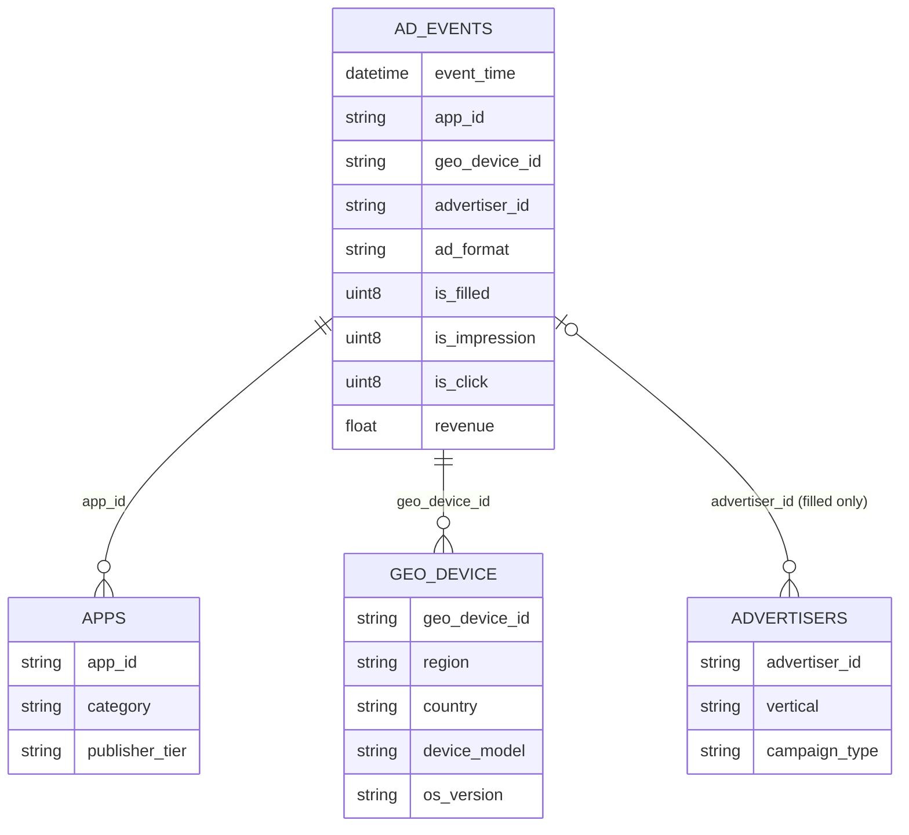
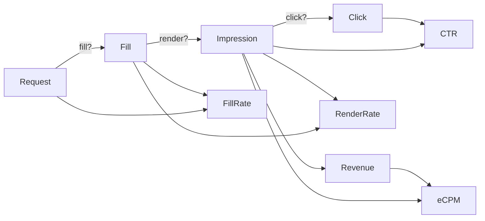
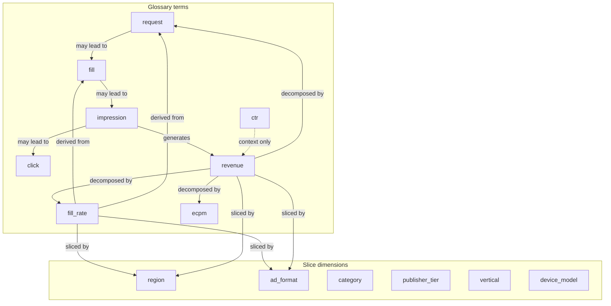
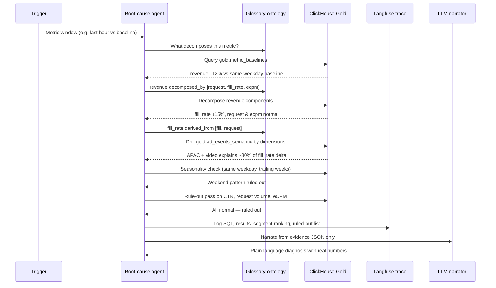

# Solution — Automated Root-Cause Analyst

**Click-a-thon 2026 · InMobi Problem**

A system that detects when a key ad metric moves abnormally, automatically drills down to the responsible segment, and returns a plain-language, evidence-backed diagnosis — with every number computed in ClickHouse and narrated by an LLM.

---

## 1. Problem alignment

| Requirement | How this solution addresses it |
|---|---|
| Detect metric deviations | Hourly baselines vs same-weekday trailing windows |
| Automatic drill-down | Dimensional contribution analysis on gold semantic layer |
| Evidence-backed explanation | LLM narrates only from ClickHouse query results |
| ClickHouse as primary engine | All ingestion, aggregation, and RCA queries run in ClickHouse |
| Localization | Segment ranking by region, format, app, device, advertiser |
| Rule out noise / seasonality | Explicit seasonality checks before alarming |
| Traceability | Langfuse / ClickStack logs every query and investigation step |
| Unseen incident readiness | Same pipeline and agent playbook on fresh data |

---

## 2. High-level architecture

```mermaid
flowchart TB
    subgraph Sources["Source systems"]
        PG[(Postgres<br/>ad_events, apps,<br/>advertisers, geo_device)]
        FILES[Hackathon bootstrap<br/>parquet + csv]
    end

    subgraph Ingestion["Ingestion"]
        CP[ClickPipes<br/>CDC / batch sync]
        BULK[One-time bulk load]
    end

    subgraph CH["ClickHouse — primary analytical engine"]
        subgraph Bronze["Bronze — raw landing"]
            B_EVT[bronze.ad_events]
            B_APP[bronze.apps]
            B_ADV[bronze.advertisers]
            B_GEO[bronze.geo_device]
        end

        subgraph Silver["Silver — cleaned + conformed"]
            S_EVT[silver.ad_events_enriched<br/>typed, deduped, funnel-validated]
            S_DIM[silver.dim_*<br/>dimension snapshots]
            S_HOURLY[silver.metrics_hourly_by_dim<br/>hour × dimensions]
        end

        subgraph Gold["Gold — semantic / business layer"]
            G_WIDE[gold.ad_events_semantic<br/>joined wide view]
            G_METRICS[gold.metric_definitions<br/>requests, fill_rate, ecpm, ...]
            G_BASELINE[gold.metric_baselines<br/>same-weekday / trailing-hour normals]
        end
    end

    subgraph AgentLayer["Agent & observability"]
        ONTO[glossary_ontology.yaml<br/>terms + relationships]
        GLOSS[metrics_glossary.md<br/>formulas + constraints]
        AGENT[Root-cause agent<br/>detect → decompose → drill-down]
        TRACE[Langfuse / ClickStack<br/>investigation trace]
        LLM[LLM narrator<br/>plain-language diagnosis]
    end

    PG --> CP
    FILES --> BULK
    CP --> Bronze
    BULK --> Bronze

    B_EVT --> S_EVT
    B_APP --> S_DIM
    B_ADV --> S_DIM
    B_GEO --> S_DIM

    S_EVT --> S_HOURLY
    S_DIM --> S_EVT
    S_EVT --> G_WIDE
    S_DIM --> G_WIDE

    G_WIDE --> G_METRICS
    S_HOURLY --> G_BASELINE
    G_METRICS --> G_BASELINE

    ONTO --> AGENT
    GLOSS --> AGENT
    G_METRICS --> AGENT
    G_BASELINE --> AGENT
    G_WIDE --> AGENT

    AGENT -->|ClickHouse SQL| CH
    AGENT -->|structured evidence| TRACE
    TRACE --> LLM
    AGENT --> LLM
```



---

## 3. Data model (star schema)

The source data follows a classic star schema: one fact table and three dimension tables.



### Ad funnel



Each row in `ad_events` is one ad request. Funnel rules enforced in silver:

- No impression without fill
- No click without impression
- No revenue without impression
- `advertiser_id` is empty on unfilled requests

---

## 4. Medallion layers

### Bronze — raw landing

**Purpose:** Immutable mirror of source data. Replayable, auditable.

| Table | Source | Grain |
|---|---|---|
| `bronze.ad_events` | Postgres / parquet | 1 row per ad request (~9M rows) |
| `bronze.apps` | Postgres / csv | 2,000 apps |
| `bronze.advertisers` | Postgres / csv | 500 advertisers |
| `bronze.geo_device` | Postgres / csv | 5,000 geo/device profiles |

**Ingestion paths:**

- **Production-like:** Postgres → ClickPipes (CDC) → bronze
- **Hackathon bootstrap:** Bulk load parquet/csv directly into bronze

Both paths land in the same schema so downstream layers are identical.

---

### Silver — cleaned and conformed

**Purpose:** Data quality, typing, enrichment, and performant dimensional aggregates.

| Object | Description |
|---|---|
| `silver.ad_events_enriched` | Row-level events with validated funnel rules, typed columns, deduped CDC replays |
| `silver.dim_apps` | Current app dimension snapshot |
| `silver.dim_advertisers` | Current advertiser dimension snapshot |
| `silver.dim_geo_device` | Current geo/device dimension snapshot |
| `silver.metrics_hourly_by_dim` | Hourly aggregates **by dimension** (not global-only) |

**Silver hourly grain (critical for localization):**

```
hour × ad_format × app_id × geo_device_id × advertiser_id
```

This preserves the ability to answer: *"fill rate dropped for video in APAC"* — a global hourly rollup alone cannot.

---

### Gold — semantic business layer

**Purpose:** Joined, business-ready views that the agent queries. All metric formulas match `metrics_glossary.md`.

| Object | Description |
|---|---|
| `gold.ad_events_semantic` | Wide materialized view: events joined to all dimensions |
| `gold.metric_definitions` | SQL views for base and derived metrics (sum/sum aggregation) |
| `gold.metric_baselines` | Precomputed normals: same weekday, trailing N weeks, by hour band |

**Core metrics (from glossary):**

| Metric | Formula |
|---|---|
| Requests | `count(*)` |
| Fills | `sum(is_filled)` |
| Fill rate | `sum(is_filled) / count(*)` |
| Impressions | `sum(is_impression)` |
| Render rate | `sum(is_impression) / sum(is_filled)` |
| Clicks | `sum(is_click)` |
| CTR | `sum(is_click) / sum(is_impression)` |
| Revenue | `sum(revenue)` |
| eCPM | `sum(revenue) / sum(is_impression) * 1000` |
| RPR | `sum(revenue) / count(*)` |

**Revenue decomposition identity:**

```
Revenue ≈ Requests × Fill rate × eCPM / 1000
```

---

## 5. Glossary ontology (agent reasoning layer)

Separate from ClickHouse tables, a `glossary_ontology.yaml` defines **terms and relationships** so the agent knows how to investigate.



**Agent uses ontology to:**

1. Know which factors decompose a moving metric (revenue → requests, fill_rate, ecpm)
2. Know which dimensions to drill into
3. Know constraints (advertiser dims only on filled rows; ratios = sum/sum)
4. Know what to rule out (CTR does not directly drive revenue in CPM model)

---

## 6. Agent investigation flow



### Investigation playbook

| Step | Action | ClickHouse target |
|---|---|---|
| 1. Detect | Compare metric vs same-weekday baseline | `gold.metric_baselines` |
| 2. Decompose | Walk revenue identity tree | `gold.metric_definitions` |
| 3. Localize | Rank segments by contribution to delta | `gold.ad_events_semantic` |
| 4. Seasonality | Compare to trailing same-DOW windows | `gold.metric_baselines` |
| 5. Rule out | Check sibling metrics that did not move | `gold.metric_definitions` |
| 6. Narrate | LLM writes diagnosis from evidence | Langfuse trace → LLM |

---

## 7. Example diagnosis output

> **Revenue fell 12.3% on Tuesday Jul 1 vs the trailing 3-Tuesday baseline.**
>
> Decomposition: request volume (+0.4%) and eCPM (−0.8%) were normal. **Fill rate fell from 78.1% to 65.4% (−16.3%)**, accounting for the revenue drop.
>
> Localization: the fill rate decline is concentrated in **video ads in APAC** (fill rate 71.2% → 54.8%, −23.0%), explaining ~82% of the total revenue impact.
>
> Ruled out: CTR was stable (1.09% vs 1.08% baseline). Weekend seasonality does not apply (Tuesday vs Tuesday comparison). NAM, EU, and banner/native formats were within normal range.

Every number above is reproducible from a ClickHouse query logged in the investigation trace.

---

## 8. Technology stack

| Component | Role |
|---|---|
| **Postgres** | Operational source of truth for ad events and dimensions |
| **ClickPipes** | CDC / batch sync from Postgres to ClickHouse bronze |
| **ClickHouse Cloud** | Primary datastore, aggregation engine, and drill-down queries |
| **Langfuse / ClickStack** | Investigation trace, query logging, observability |
| **LLM (any provider)** | Narrates diagnosis from structured evidence — does not compute metrics |
| **glossary_ontology.yaml** | Term definitions and relationships for agent reasoning |
| **metrics_glossary.md** | Authoritative metric formulas (judging reference) |

---

## 9. Key design decisions

### ClickHouse computes, LLM narrates

The LLM never invents numbers. Deterministic SQL produces structured JSON; the LLM only writes the explanation. A single hallucinated figure costs more than a missed anomaly.

### Silver stays dimensional

Hourly silver aggregates retain dimension keys (region, format, app, device) — not a single global rollup. This is required for segment localization.

### Gold includes baselines, not just joins

A joined wide table alone is insufficient. The agent needs precomputed or queryable baselines for seasonality-aware anomaly detection.

### Ontology is separate from SQL

ClickHouse holds the numbers. The ontology holds the relationships (funnel flow, decomposition tree, constraints). The agent reads both.

### Event-level gold for precision, hourly silver for speed

- **Hourly silver:** fast anomaly scans across the full date range
- **Event-level gold:** deep drill-down when a segment is suspicious

### Advertiser dimensions are sparse

`advertiser_id` is empty on unfilled requests. Advertiser-level analysis applies only to filled events. Fill-rate RCA typically slices by `ad_format`, `region`, `category` instead.

---

## 10. Deliverables mapping

| Deliverable | Artifact |
|---|---|
| GitHub repo | Full pipeline code, DDL, agent, ontology config |
| Solution summary (≤500 words) | This document (condensed) |
| Demo video (≤5 min) | Replay: metric drops → agent investigates → diagnosis |
| Pitch deck (≤15 slides) | Architecture + example incident |
| Unseen incident output | Agent diagnosis + Langfuse trace for Day 2 dataset |

---

## 11. Future extensions (out of scope for hackathon)

- Real-time alerting integrations (PagerDuty, etc.)
- Production auth and multi-tenant access
- Polished frontend dashboard
- ML-based anomaly detection (simple baselines + contribution analysis are sufficient and more explainable)

---

*See also: [`PROBLEM_STATEMENT.md`](PROBLEM_STATEMENT.md) · [`metrics_glossary.md`](metrics_glossary.md) · [`README_START_HERE.md`](README_START_HERE.md)*
