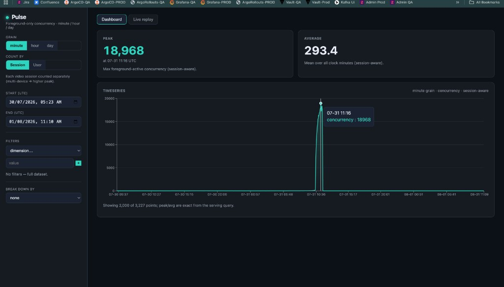
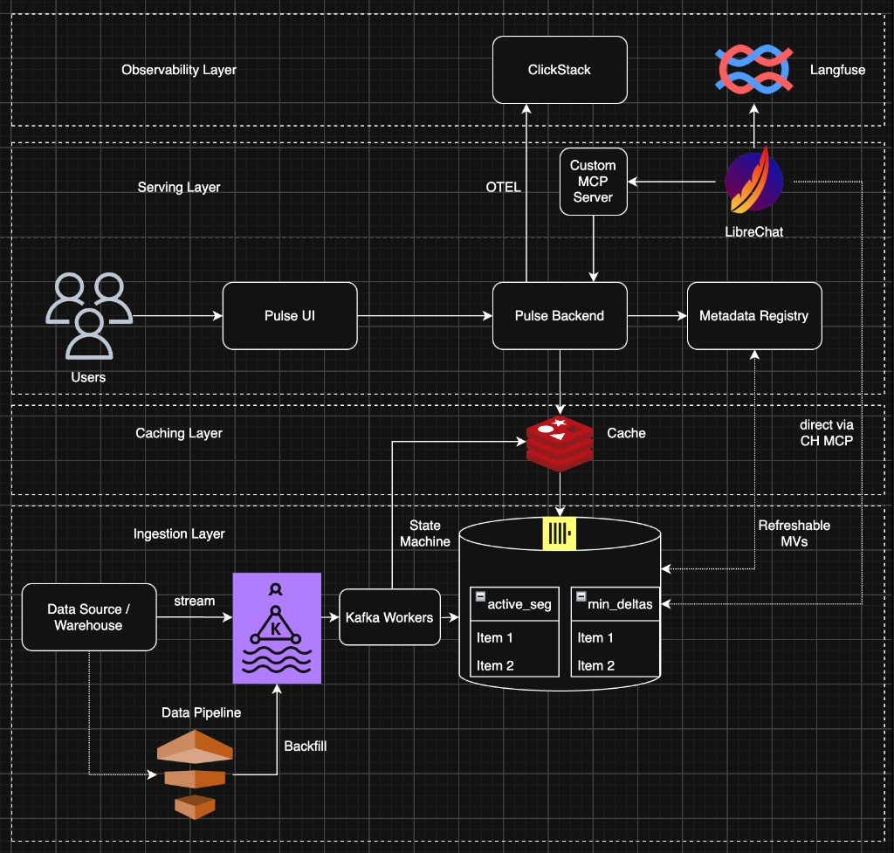
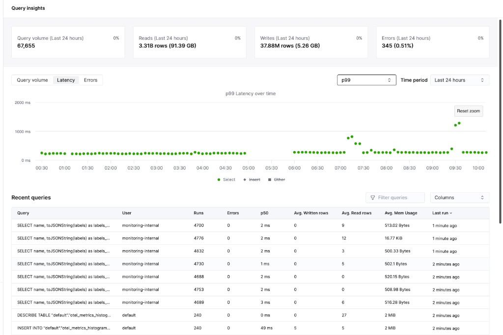
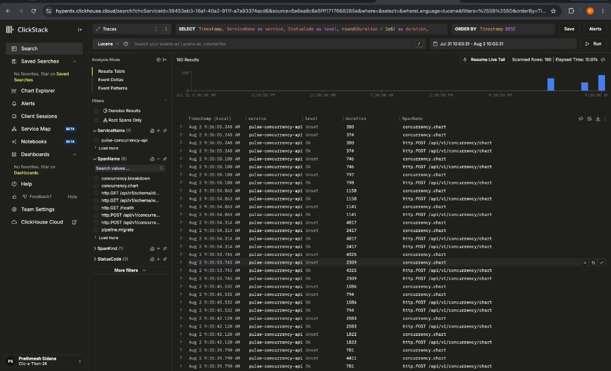
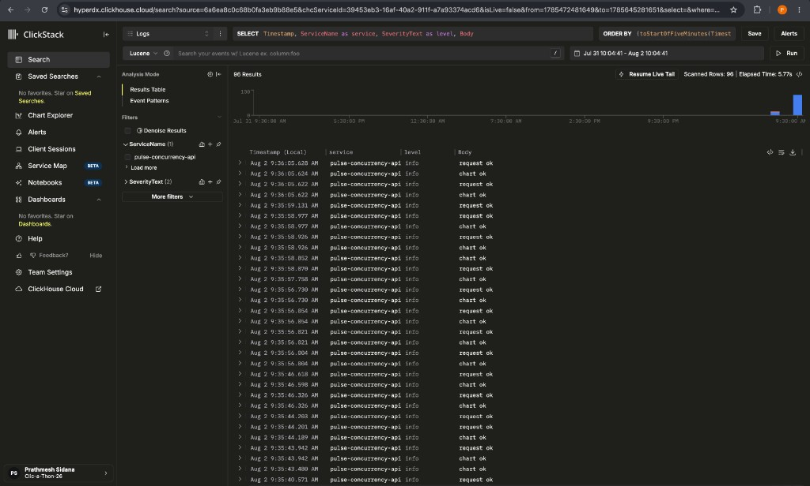
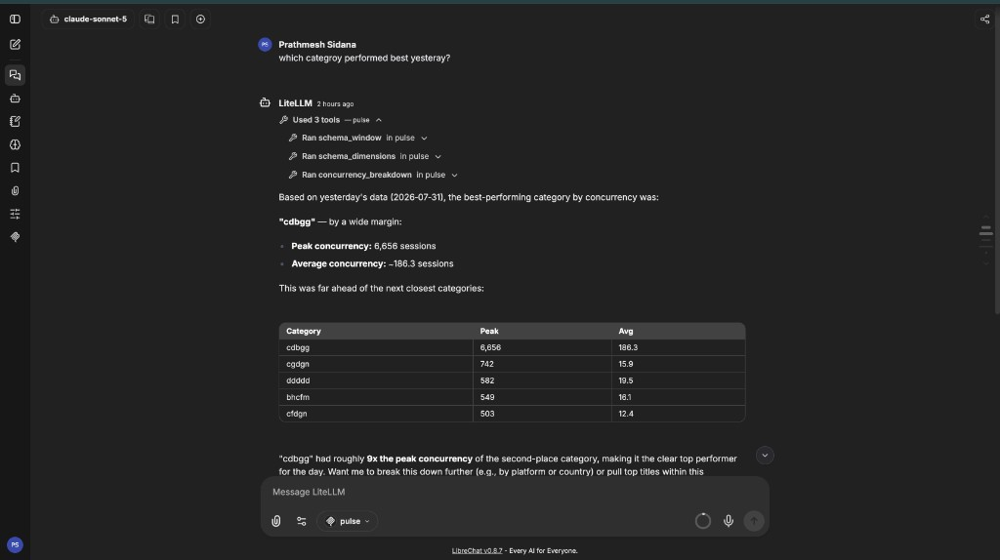

# Pulse

## Track

SonyLIV

## Project

**Pulse** — Foreground-only concurrent-viewer analytics on ClickHouse: a defensible
semantic model, minute-grain curve with filters, live replay, and a LibreChat + MCP
chat layer — fully observed with ClickStack and Langfuse.

## Team Members

- Prathmesh ([prathmeshxdev](https://github.com/prathmeshxdev))
- Mohit Agarwal (mohit.agarwal@zepto.com)

## What it does

“How many people are watching right now?” is harder than it looks: an open app is
not a watching viewer. Pulse counts only **foreground-active** playback — excluding
paused, backgrounded, and heartbeat-missing periods — and answers minute / hour /
day queries with arbitrary dimension filters.

1. **Ingest + model** — CSV → typed `raw_events` → session (and user) active segments
   + sweep-line minute deltas on ClickHouse Cloud
2. **Serve the curve** — Go query compiler (`BuildChartQuery`) + React dashboard with
   filters, breakdown, and live replay
3. **Conversational layer** — LibreChat agents call **pulse MCP** (API-backed numbers),
   plus read-only ClickHouse MCP for exploration
4. **Observability** — ClickStack OTLP (API/pipeline → Cloud `otel_*`); Langfuse traces
   LLM + tool calls via LiteLLM

At training scale every team’s queries are fast. Pulse differentiates on **defensible
semantics and reproducible correctness** — what “actively watching” means, why pause ≠
buffer, and evidence that evaluation-day answers ran through the same pipeline.
Scaling to 100× is argued analytically in the architecture deck.

All dataset content is **synthetic**. No real customer data or PII.

## Hosted Demo

**[Live dashboard](http://35.200.209.163:5173/)**



*Peak `18,968` and average `293.4` foreground-active concurrency, minute grain,
exact from the serving query — no sampling.*

The hosted demo shows:

- Full-window concurrency curve with peaks and ramps
- Dataset filters on the curve (platform, geo, content, properties, …)
- Breakdown by dimension (e.g. platform, `show_name`)

LibreChat, ClickStack, and Langfuse are demonstrated in the recorded walkthrough;
wiring is in this repository ([`docker-compose.yml`](docker-compose.yml),
[`RUN.md`](./RUN.md)).

## Demo Video

**[Demo walkthrough (2–3 min)](https://www.loom.com/share/b30476ff84394df986424f9c75e3e46e)**

Covers the live dashboard (curve + filters), ClickStack dashboards, and a Langfuse
trace of a pulse MCP analytics turn.

## Architecture



See [`Architecture.md`](./Architecture.md) for the full write-up.

Slide deck: [`presentations/pulse-by-layers/`](presentations/pulse-by-layers/) ·
deeper narrative: [`summary.md`](./summary.md).

**Pitch deck (PDF):** [`pulse-by-layers.pdf`](./pulse-by-layers.pdf) —
16 slides, exported from the Slidev deck (`npm run export` in `presentations/pulse-by-layers/`).

## How to run it

Step-by-step commands: [`RUN.md`](./RUN.md).

| Platform | Support |
|----------|---------|
| macOS, Linux | Full pipeline + Docker |
| Windows (WSL2) | Full pipeline + Docker |
| Windows (native) | Not supported |

| Tool | Role |
|------|------|
| Go 1.22+ | API, pipeline, bench |
| Node 20+ | Frontend, pulse MCP |
| ClickHouse Cloud | Primary datastore |
| Docker / Podman | Compose stack (optional) |
| Redis | Optional preflight cache (`PREFLIGHT_ENABLED=false` to skip) |

```bash
cp .env.example .env   # set CLICKHOUSE_DSN
```

---

## Dataset filters (filter → column map)

Filters apply to the concurrency curve and breakdown through
`POST /api/v1/concurrency/chart` and `/breakdown`.

| UI / API dimension | Dataset source | Storage kind | Notes |
|--------------------|----------------|--------------|-------|
| `platform` | raw event `platform` | segment column | e.g. `ANDROID_PHONE` |
| `country` | raw event `country` | segment column | |
| `content_id` | raw event `content_id` | segment column | numeric |
| `app_version` | raw event `app_version` | segment column | |
| `audio_language` | raw event `audio_language` | segment column | |
| `subtitle_language` | raw event `subtitle_language` | segment column | |
| `player_version` | raw event `player_version` | segment column | |
| `user_id` | raw event `user_id` | segment column | |
| `title` | content `title` | `content_dict` | via `dictGet` |
| `video_type` | content `video_type` | `content_dict` | |
| `category` | content `category` | `content_dict` | |
| `show_name` | content `show_name` | `content_dict` | migration `013` |
| `video_resolution` | raw event `video_resolution` | `properties` JSON | `properties_key_mappings` |
| other unknown event cols | remaining CSV columns | `properties` JSON | auto-cataloged |

Implementation: [`backend/internal/filters/filters.go`](backend/internal/filters/filters.go).
Discovery API: `GET /api/v1/schema/dimensions`, `GET /api/v1/schema/values?dimension=…`.

---

## Concurrency curve (query)

The dashboard plots the minute (or hour/day) curve from
`POST /api/v1/concurrency/chart` with `"metric":"timeseries"`.

Compiled SQL shape ([`backend/internal/concurrency/query.go`](backend/internal/concurrency/query.go)):

```sql
WITH
  sel AS ( … filtered segment ids … ),
  open_edges AS ( … ±1 for still-open sessions … ),
  opening AS ( SELECT sum(delta) … before window … ),
  net AS ( SELECT minute, sum(delta) … in window … ),
  grid AS ( SELECT … every minute in [start, end) … ),
  curve AS (
    SELECT g.minute,
           opening.c0 + sum(net) OVER (ORDER BY g.minute) AS concurrency
    FROM grid g LEFT JOIN net …
  )
SELECT minute, concurrency FROM curve ORDER BY minute;
```

Peak = `max(concurrency)`; average = `avg(concurrency)` over all clock minutes in the
window. Counting unit: `"session"` (default) or `"user"`.

### Query latencies (ClickHouse Cloud)

Same compiler as the API — benchmarked on the **7M-event unseen day**
([`evidence/unseen_day/`](evidence/unseen_day/)):

| Case | Peak | E2E (compiler + network) | Server-side (query_log) |
|------|------|--------------------------|-------------------------|
| Unfiltered minute | 18,968 | 248 ms | p50 **30 ms**, p90 **49 ms** |
| Platform = ANDROID_PHONE | 6,084 | 285 ms | up to **243K rows** read |
| Country = india (hour) | 18,968 | 343 ms | 6 bench queries total |



*Query Insights on ClickHouse Cloud: p99 select latency stable around 200–300 ms;
bench evidence in `evidence/unseen_day/query_log.json` and `answers.json`.*

---

## Integrations

### ClickStack

OTLP traces, metrics, and logs from the API and batch pipeline land in ClickHouse
Cloud `default.otel_*`.

- Collector: `docker-compose.yml` profile `observability`
- Instrumentation: [`backend/internal/otelx/otelx.go`](backend/internal/otelx/otelx.go)
- Dashboard SQL: [`clickstack/dashboards.sql`](clickstack/dashboards.sql)
- Guide: [`clickstack/README.md`](clickstack/README.md)





HyperDX search exports (CSV): [`evidence/clickstack/hyperdx_traces_2026-08-02.csv`](evidence/clickstack/hyperdx_traces_2026-08-02.csv)
· [`evidence/clickstack/hyperdx_logs_2026-08-02.csv`](evidence/clickstack/hyperdx_logs_2026-08-02.csv)

### Langfuse

LibreChat routes through LiteLLM with `success_callback: ["langfuse"]`. Traces cover
LLM generations and tool calls for analytics questions.

- Guide: [`langfuse/README.md`](langfuse/README.md)
- Configuration template: [`.env.example`](.env.example)

### LibreChat



*“Which category performed best yesterday?” → 3 pulse MCP tool calls
(`schema_window`, `schema_dimensions`, `concurrency_breakdown`) → API-parity answer.*

- Config: [`librechat/librechat.yaml`](librechat/librechat.yaml)
- Pulse MCP (chart/breakdown API): [`librechat/pulse-mcp/`](librechat/pulse-mcp/)
- Agent prompt: [`librechat/system_prompt.md`](librechat/system_prompt.md)
- Setup: [`librechat/AGENT_SETUP.md`](librechat/AGENT_SETUP.md)

---

## Evaluation-day evidence

Output from the sealed evaluation dataset pipeline:

| Artifact | Path |
|----------|------|
| Answers | [`evidence/unseen_day/answers.json`](evidence/unseen_day/answers.json) |
| Consistency | [`evidence/unseen_day/consistency.json`](evidence/unseen_day/consistency.json) |
| Invariants / sensitivity | [`evidence/unseen_day/`](evidence/unseen_day/) |
| Query log / parts | `query_log.json`, `parts.json` |
| Screenshots (dashboard, LibreChat, ClickStack, ClickHouse, HLD) | [`evidence/screenshots/`](evidence/screenshots/) |
| ClickStack traces / logs (HyperDX CSV) | [`evidence/clickstack/`](evidence/clickstack/) |
| Langfuse traces (raw export) | [`evidence/langfuse_traces.json`](evidence/langfuse_traces.json) |

Pipeline: `./clickhouse/scripts/unseen_day.sh <raw.csv> <content.csv>` ([`RUN.md`](./RUN.md)).

---

## Design FAQ

| Question | Answer |
|----------|--------|
| What counts as “actively watching”? | Four conditions — deck + `clickhouse/scripts/config.env` |
| Why exclude pause but include buffer? | Viewer-intent asymmetry; measured in `evidence/sensitivity.md` |
| Peak / average definition? | One minute curve; max / mean over clock minutes |
| Correctness without an answer key? | `cmd/validate`, invariants, delta-vs-explosion cross-check |
| Scaling? | Analytical 100× argument in deck |
| Filter → column? | [table above](#dataset-filters-filter--column-map) |

## Problem source

- [SonyLIV problem statement](https://github.com/sidagarwal04/click-a-thon-2026/blob/main/SonyLiv/PROBLEM_STATEMENT.md)
- [Dataset details](https://github.com/sidagarwal04/click-a-thon-2026/blob/main/SonyLiv/dataset_details.md)

## Repo layout

```
pulse/
├── README.md
├── Architecture.md
├── pulse-by-layers.pdf
├── RUN.md
├── summary.md
├── presentations/pulse-by-layers/
├── clickhouse/
├── backend/
├── frontend/
├── librechat/
├── clickstack/
├── langfuse/
└── evidence/
    ├── clickstack/     # HyperDX trace + log CSV exports
    ├── screenshots/
    └── unseen_day/
```

## License

MIT — see [`LICENSE`](./LICENSE).
