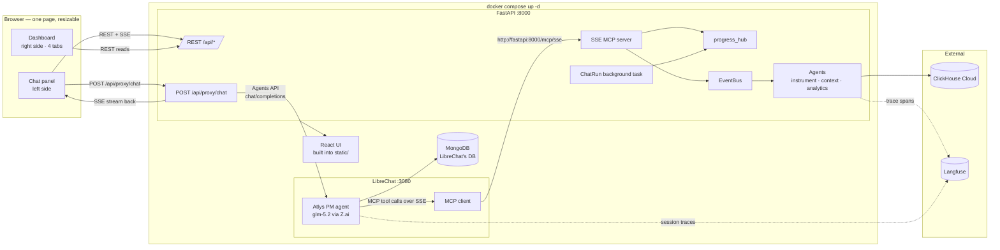
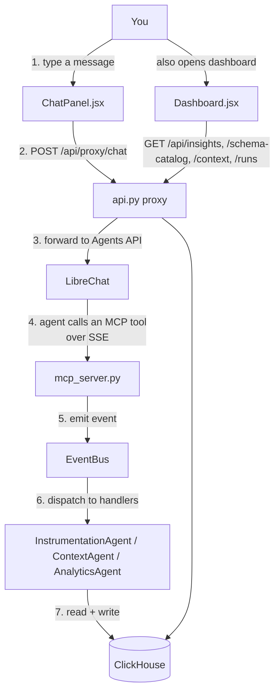
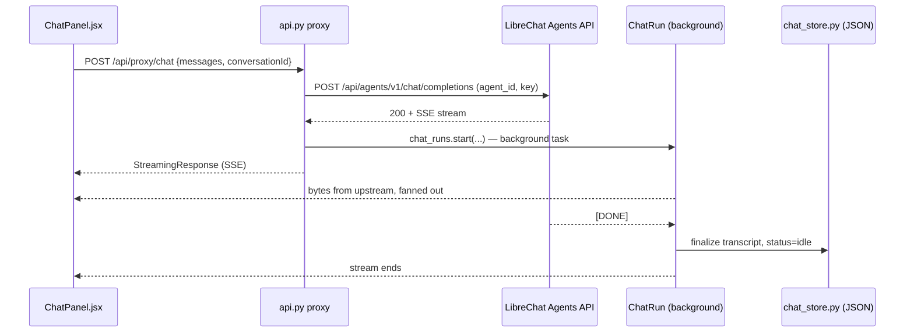
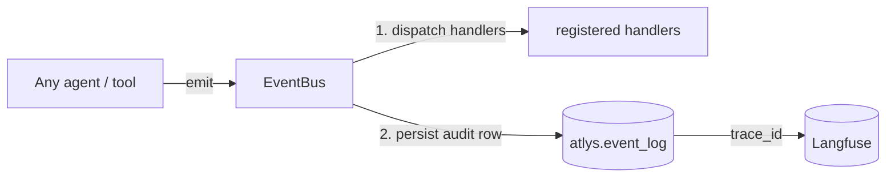
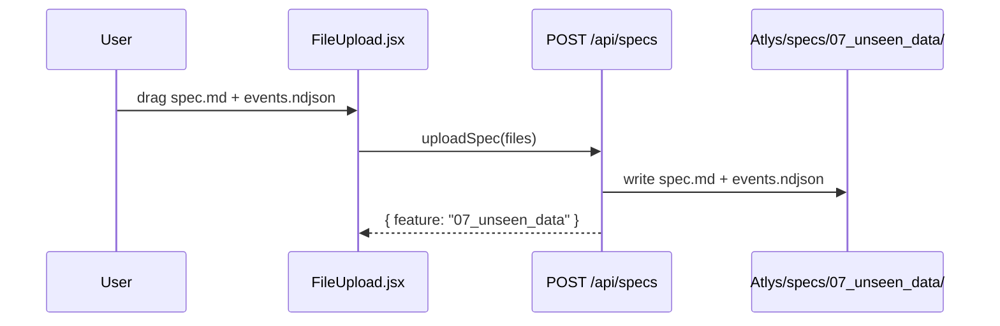
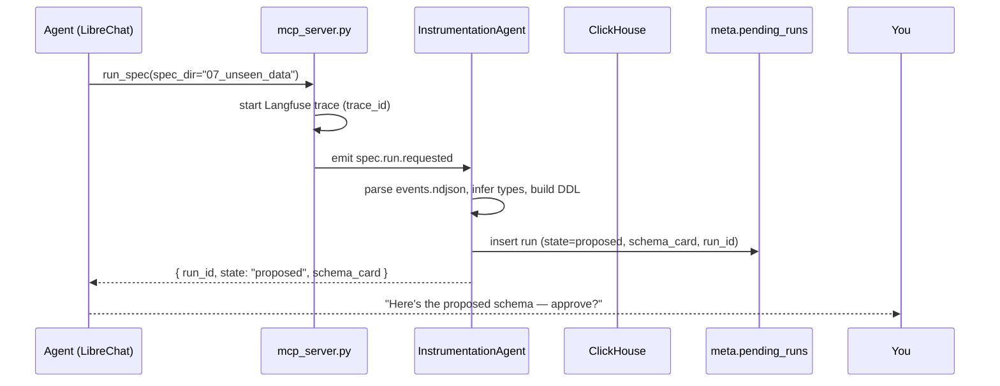
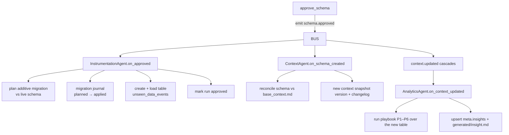
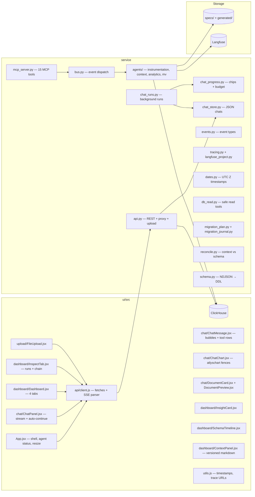

# How Atlys Copilot Works — a plain-language tour

> This doc explains the whole system: what it does, how every process fits
> together, how a chat message travels through the stack, where every piece of
> data lives, and how the four dashboard tabs on the right are fed. Read top to
> bottom — each section builds on the one before. A running example (the
> **unseen coupon spec**, `specs/07_unseen_data/`) is used throughout.

---

## 1. What Atlys Copilot is, in one breath

Atlys Copilot is a **chat-first analytics copilot**. You upload a **feature spec**
(a markdown file describing a new product feature) plus **raw event data**
(an NDJSON file of that feature's events), and Atlys produces three things:

1. A **ClickHouse schema** — tables + columns for those events,
2. A **context snapshot** — the business knowledge the pipeline reasons from,
3. A **PM-ready insight** — a human summary of what the data says.

You drive it through a **chat** on the left. A **dashboard** on the right shows
every artifact the pipeline produced, and the **Inspect** tab shows the full
event chain with a link to the Langfuse trace that proves it. **No trace, no
credit.**

Three principles shape everything:

- **One pipeline, two doors.** Chat and dashboard are two views of the same
  event-driven pipeline. The chat *writes*; the dashboard *reads back*.
- **Deterministic-first.** The FastAPI pipeline makes **zero LLM calls**. All
  schema inference, insight summaries, and reconciliation are deterministic
  code. The only LLM in the system is the chat agent (LibreChat → Z.ai GLM).
- **Human-in-the-loop.** The pipeline *pauses* at a schema-approval gate. No
  analytics table is touched until you approve.

### The big picture



**What you're actually looking at:**

- **LibreChat** (`:3080`) is the chat brain. It hosts the **"Atlys PM"** agent
  (system prompt in `agents/atlys_pm.md`), routes its replies through **Z.ai
  GLM** (the only LLM), and connects to FastAPI as an **MCP client** so the
  agent can call Atlys tools.
- **FastAPI** (`:8000`) is the orchestrator: it serves the React UI, exposes
  the REST + chat-proxy + MCP-SSE surfaces, and runs the agents. One process,
  three hats.
- **MongoDB** is bundled purely because **LibreChat needs it** (sessions,
  users, agent definitions). Atlys Copilot itself stores everything in
  ClickHouse + JSON files on disk.
- **ClickHouse Cloud** is the only datastore for pipeline state.
- **Langfuse** is optional observability: one trace per run, `trace_id` on
  every row. With no keys, a `NullTracer` logs the same spans to stdout.

---

## 2. Deployment topology (what `docker compose up -d` starts)

`docker-compose.yml` runs three services on one box:

| Service | Image / build | Port | Depends on | Job |
|---|---|---|---|---|
| `mongo` | `mongo:7` | — (internal) | — | LibreChat's database |
| `librechat` | `ghcr.io/danny-avila/librechat` (≥ v0.7.6) | `3080` | mongo healthy | chat backend: agent + LLM routing + MCP client |
| `fastapi` | `Dockerfile.service` (multi-stage: Node builds React → Python runs uvicorn) | `8000` | librechat healthy | API + UI + MCP server + agents |

The `Dockerfile.service` first stage builds the React UI with `npm ci && npm
run build`, the second stage copies it into `service/static/` where FastAPI's
`StaticFiles` mount serves it at `/`. `.env` is passed via `env_file` to the
LibreChat and fastapi services (mongo needs none); `specs/`, `generated/`,
`service/`, `scripts/`, and `agents/` are bind-mounted so chat transcripts and
spec uploads survive restarts.

**Networking that matters:**

- Browser → `http://localhost:8000` for everything (UI, API, chat proxy).
- LibreChat's **MCP client reaches FastAPI over the Docker-internal URL**
  `http://fastapi:8000/mcp/sse` (`librechat.yaml` →
  `mcpServers.atlys-orchestrator.url`) — **no external tunnel** when both run
  in compose. If FastAPI runs on the host, you point that URL at a
  cloudflared/ngrok tunnel instead (`SETUP.md §2.2`).
- The MCP client sends `X-Atlys-Conversation-Id:
  {{LIBRECHAT_BODY_CONVERSATIONID}}` on every tool call so progress chips and
  tool budgets are scoped per chat conversation.

### Cold-start bootstrap

On first boot, FastAPI's lifespan hook:

1. Ensures the `meta.*` tables + `atlys.event_log` exist (bootstrap DDL in
   `service/app.py`), seeds context v0, and creates the flagship funnel MV.
2. Kicks off `scripts/provision_agent.py` **in the background**: it waits for
   LibreChat's `/health`, logs in as the admin (`LIBRECHAT_ADMIN_EMAIL` /
   `_PASSWORD` — auto-registers the account if missing), finds or creates the
   **"Atlys PM"** agent (15 MCP tools bound as `<name>_mcp_atlys-orchestrator`,
   model `glm-5.2`, provider `ZAI`, system prompt from `agents/atlys_pm.md`),
   and creates an **Agents API key**. It persists `agent_id` →
   `generated/.atlys_agent_id` and the key → `generated/.atlys_librechat_api_key`.

Without `LIBRECHAT_ADMIN_*` set, provisioning is skipped and the chat proxy
returns 503 until you provision manually (`python scripts/provision_agent.py`).

---

## 3. The layers, and who talks to whom

| Layer | Files | Job |
|---|---|---|
| **Browser UI** | `ui/src/` | Chat + dashboard; React app served by FastAPI |
| **REST surface** | `service/api.py` | Dashboard reads, spec upload, chat proxy, conversations, documents |
| **MCP surface** | `service/mcp_server.py` | 15 tools the chat agent can call (over SSE) |
| **Chat runtime** | `service/chat_runs.py`, `service/chat_progress.py`, `service/chat_store.py` | Background upstream runs, tool chips, JSON transcripts |
| **Brain** | `service/bus.py`, `service/agents/*`, `service/events.py` | Event bus + the agents that do the real work |
| **Storage** | ClickHouse (`meta.*`, `atlys.*`) + `specs/` + `generated/` | Everything that outlives a request |
| **External** | LibreChat (+ Mongo), Langfuse | AI agent host; trace/observability |

### The two entry points into the backend



The **left panel** is the interactive path (chat → proxy → LibreChat agent →
MCP → bus → agents → ClickHouse). The **right panel** is a pure read path
(REST → ClickHouse). That's why the right panel updates after a chat finishes:
the chat *wrote* to ClickHouse, and the dashboard *reads* it back.

> The browser **never** calls MCP directly. MCP is a server-to-server bridge:
> LibreChat's agent loop is the MCP *client*; FastAPI's `mcp_server.py` is the
> MCP *server*, reachable only at `/mcp/sse`.

---

## 4. Chat: how a message travels

### 4.1 The proxy + background run

The React chat does **not** call LibreChat directly — it goes through
`POST /api/proxy/chat` in `api.py`, which:

1. Injects the provisioned `agent_id` and the **Agents API key** (login JWTs
   are rejected by LibreChat's `/api/agents/v1/chat/completions`).
2. Opens the upstream SSE request **before** returning, so 4xx/5xx surface as
   HTTP errors, not a broken stream.
3. Hands the live upstream to a **`ChatRun` background task** and returns a
   `StreamingResponse` that fans out that task's queue to the browser.



**Why a background task?** If you reload mid-generation the browser's SSE
connection dies — but the agent must keep running. The `ChatRun` keeps pumping
upstream and periodically persists the transcript to the JSON store, so the UI
simply **polls** `GET /api/conversations/{id}/messages` (every 1.2s) to
reconnect. Your message is never lost to a reload. Hitting **Stop** cancels
the upstream and the run (`POST /api/conversations/{id}/stop`).

### 4.2 Tool chips (the progress side-channel)

LibreChat often buffers its whole agent loop (tool calls + final text) and
sends nothing for 30–40s. To avoid a blank chat, MCP tool calls publish
progress events into **`progress_hub`** (`chat_progress.py`) the moment a tool
starts. The `ChatRun` polls the hub every ≤0.4s and injects `atlys_progress`
frames into the SSE stream, so you see **"🔧 running db_schema…" chips** while
the agent is still quiet. When the buffered reply finally arrives, `api/client.js`
dedupes it against the chips (tool fingerprints) so nothing renders twice.

`progress_hub` is also the **tool budget**: each user-initiated chat turn gets
a capped number of MCP tool calls (default 50, `ATLYS_MAX_TOOL_CALLS_PER_SERIES`).
Silent UI auto-continues share the same series (`extendSeries`); a fresh user
message ("continue") resets it. Over budget → the tool returns `TOOL_LIMIT` and
the agent must stop and ask.

### 4.3 The JSON store

Each conversation is a single file: `generated/chats/<uuid>.json`, owned by
`chat_store.py` (atomic temp-file + rename writes).

```json
{
  "id": "0b2f…-uuid",
  "title": "Coupon funnel analysis",
  "createdAt": "2026-08-02T10:00:00Z",
  "updatedAt": "2026-08-02T10:05:12Z",
  "status": "idle",
  "messages": [ { "role": "user|assistant|tool", "content": "…",
                 "toolName": "db_schema", "args": "…", "status": "done", "toolPhase": "call" } ]
}
```

Status is a single source of truth: `idle` → `running` while a `ChatRun` is
active → back to `idle`, or `interrupted` if the service restarted mid-run
(persisted `running` with no live run — never soft-locks the chat).

---

## 5. The MCP tool surface (what the agent can do)

`mcp_server.py` exposes 15 tools over SSE. Pipeline tools (`interrogate_spec`,
`run_spec`, `approve_schema`, `reject_schema`) drive the feature pipeline;
read-only exploration tools (`db_schema`, `table_stats`, `aggregate`,
`sample_rows`) answer ad-hoc PM questions safely; the rest read/write Atlys
Copilot artifacts. `ingest_events` exists in code but is **disabled** on the demo
surface.

| Tool | What it does | Writes? |
|---|---|---|
| `interrogate_spec` | Deterministic gaps/questions for a spec — no LLM, no DB writes | no |
| `run_spec` | Propose a schema for a spec → ⏸ waits for approval | `meta.pending_runs` (state=proposed) |
| `approve_schema` | Approve a pending run → migrate + load + analytics cascade | yes (the D10 gate) |
| `reject_schema` | Abort a pending run | pending_runs state |
| `get_insight` / `list_insights` | Read insight card(s) | no |
| `get_changelog` | Context / schema changelog or event log | no |
| `get_context` | Latest (or versioned) context snapshot | no |
| `propose_context_update` | Human-proposed context edit (changelog entry) | changelog |
| `reconcile` | Schema-vs-context reconciliation findings | no |
| `db_schema` | List tables / describe columns (batch) | no |
| `table_stats` | Row counts / sizes (approximate) | no |
| `aggregate` | Constrained single-table aggregates (count/uniq/sum/avg/min/max/p50/p90, group_by, filters) | no |
| `sample_rows` | Tiny row preview (≤20 rows) | no |
| `save_document` | Write a report/export into `generated/` (downloadable) | yes — files only |

**Safe reads:** `aggregate`/`sample_rows` are built server-side from validated
JSON args — no free-form SQL from the LLM. Queries run with `readonly=1`,
a 15s timeout, hard caps (limit ≤ 100, ≤ 8 metrics, ≤ 4 group_by, ≤ 8 filters,
≤ 2 MiB results), single-table only, and identifier sanitization. The agent
prompt (`agents/atlys_pm.md`) also forbids inventing table/column names — it
must call `db_schema` first.

Each tool call is wrapped in a Langfuse span, emits a `tool.called` audit
event (never with an empty `trace_id`), and read-only tools outside a run get
their own `explore:*` trace so PM Q&A is replayable in Langfuse.

---

## 6. The event bus: how the pipeline actually runs

`service/bus.py` is the heart. Every agent speaks a shared event envelope
(`events.py`): `event_type`, `aggregate_id`, `actor`, `payload`, `trace_id`,
`version`, `event_id`, `created_at`.

Handlers register per event type; `bus.emit(event)` runs them **depth-first on
the same thread** (handlers can emit more events, which unwind before the
current one returns), then persists the row to `atlys.event_log`.



Registered wiring (`app.py`):

| Event | Handler |
|---|---|
| `spec.run.requested` | InstrumentationAgent.on_run_requested → propose schema |
| `schema.approved` | InstrumentationAgent.on_approved → migrate + load |
| `schema.rejected` | InstrumentationAgent.on_rejected → abort run |
| `schema.created` | ContextAgent.on_schema_created → reconcile + snapshot |
| `context.updated` | AnalyticsAgent.on_context_updated → playbook + insight |

Other event types include `spec.ingested`, `schema.proposed`, `context.checked`,
`insight.created`, `tool.called`, `context.update.proposed`, and `run.aborted`.
A **flood guard** caps persisted events per run (default 200,
`ATLYS_MAX_EVENTS_PER_RUN`); past the cap the run is aborted (a `run.aborted`
row explains why) and further events are persisted but not dispatched.

---

## 7. The four dashboard tabs: where each one's data lives

Everything on the right comes from ClickHouse tables created at startup
(`service/app.py` bootstrap DDL). The **`meta` database** holds operational
tables; **`atlys.event_log`** is the audit trail; **`atlys.<feature>_events`**
are the feature tables the pipeline creates.

```mermaid
flowchart TB
    subgraph CH["ClickHouse"]
        INS[(meta.insights)]
        SCL[(meta.schema_changelog)]
        CTX[(meta.context_snapshots)]
        PR[(meta.pending_runs)]
        LOG[(atlys.event_log)]
    end

    subgraph UI[Right panel]
        T1[Insights tab]
        T2[Schema tab]
        T3[Context tab]
        T4[Inspect tab]
    end

    INS -->|GET /api/insights| T1
    SCL -->|GET /api/changelog?scope=schema| T2
    CTX -->|GET /api/context + /context-versions| T3
    PR -->|GET /api/pending-runs| T4
    LOG -->|GET /api/runs, /runs/{id}, /tool-calls, /event-log| T4
```

| Tab | Shows | Table(s) | Written by |
|---|---|---|---|
| **Insights** | Insight cards (title, summary, confidence, evidence) | `meta.insights` | AnalyticsAgent after approval |
| **Schema** | Every schema change with DDL diffs + rationale | `meta.schema_changelog` | InstrumentationAgent |
| **Context** | Versioned feature-context markdown + diff vs previous | `meta.context_snapshots`, `meta.context_changelog` | ContextAgent |
| **Inspect** | Runs, event chain, tool calls, approval queue | `meta.pending_runs`, `atlys.event_log` | everything (the audit trail) |

> **Inspect is the trace-timeline.** Every pipeline event is appended to
> `atlys.event_log` with a `trace_id`. Selecting a run loads its chain via
> `GET /api/runs/{run_id}`; every row deep-links to the Langfuse trace
> (`{base}/project/{projectId}/traces/{traceId}` — the project id is resolved
> from `LANGFUSE_PROJECT_ID` or discovered from `GET /api/public/projects`).
> The tab polls while a run is in-flight (10s) and shows the approval queue
> from `meta.pending_runs`.

### Full table inventory

| Table | Purpose |
|---|---|
| `meta.schema_catalog` | Every feature table the pipeline created: DDL, columns, event order, row count, rationale |
| `meta.schema_changelog` | Versioned DDL-change log (create / add column / widen / rebuild / noop) |
| `meta.context_snapshots` | Versioned context markdown + `content_hash` + diff-from-prev |
| `meta.context_changelog` | Per-object context change log (+ human-proposed updates) |
| `meta.insights` | Insight cards keyed by spec + title |
| `meta.known_issues` | K1–K7 parsed from `base_context.md` §5 |
| `meta.pending_runs` | The approval state machine (`proposed → running → approved/rejected/failed/aborted`) |
| `meta.migration_journal` | Append-only migration lifecycle (`planned → approved → applied/skipped/failed`) |
| `atlys.event_log` | The audit trail — every event, with `trace_id` (TTL 90 days) |
| `atlys.<feature>_events` | One table per feature, created from the spec's NDJSON (TTL 180 days) |
| `atlys.mv_funnel_daily` | Daily per-segment funnel rollup (created at bootstrap) so analytics skips rescanning millions of raw rows |

**Resilience details worth knowing:** schema changes are **additive** — the
migration planner emits `ADD COLUMN` / widen-type steps and only rebuilds a
table when types are truly incompatible (never a silent DROP on mild drift).
The migration journal + `runner_token` compare-and-swap make double-approves
safe across threads/workers, and data loads are idempotent via an events-file
content hash. `atlys.event_log` has a 90-day TTL, `pending_runs` 180 days.

---

## 8. The end-to-end flow — the unseen coupon spec

Let's follow the real example in `specs/07_unseen_data/` — **"Promo / Coupon at
Checkout"**: 5,364 raw events (`coupon_field_shown`, `coupon_entered`,
`coupon_applied`, `coupon_rejected`, `discount_shown`, `checkout_with_coupon`).

### Step 0 — Upload



Nothing is "ingested" yet — the files just land on disk (with hard caps: 1 MiB
spec, 10 MiB events, 100k lines). The chat references the folder path; event
bodies never enter the LLM.

### Step 1 — "Run this spec" (chat)

You type *"analyze the coupon spec"*. The message goes
`ChatPanel.jsx → /api/proxy/chat → LibreChat Agents API`. The Atlys PM agent's
system prompt (`agents/atlys_pm.md`) makes it call MCP tools in a fixed order.

### Step 2 — Interrogate

The agent calls `interrogate_spec` first — a deterministic list of gaps and
questions about the spec **without touching the database**.

### Step 3 — `run_spec`: schema proposed



The feature slug comes from the folder name: `_slug("07_unseen_data")` →
`unseen_data`, so the table is **`unseen_data_events`** (not a hand-picked
name). **The approval gate:** the pipeline intentionally pauses at `proposed`;
nothing touches the analytics tables until you approve.

### Step 4 — Approve

You say *"approved"*. The agent calls `approve_schema(run_id)`, which emits
`schema.approved`; the following cascade unwinds on one event:



The playbook is **built from the spec's event order**, never hardcoded:
funnel step-through, event overview, segment skew (os / device / geo /
destination), timings/amounts p50–p90, cross-funnel conversion to
`purchase_completed`, per-user timing (capped at 50), plus the daily MV rollup.
Every query result becomes **evidence**; a failing query is recorded, never
fatal.

### Step 5 — Insight card appears

The Insights tab polls `GET /api/insights` and the card appears — title,
deterministic summary, confidence (based on the last funnel step's sample
size), evidence, and a trace link. Every step carried the same `trace_id`, so
the whole run is one Langfuse trace: **no trace, no credit**.

---

## 9. Component map (quick reference)



Also handy: `service/cli.py` runs the whole pipeline from the terminal
(`python -m service.cli run <spec> --approve`), and `ATLYS_DRY_RUN=1` swaps
ClickHouse for an in-memory `DryRunStore` so the full pipeline runs with zero
credentials.

---

## 10. Ten facts worth remembering

1. **Chat = write path; dashboard = read path.** One pipeline, two doors.
2. **LibreChat hosts the agent** (glm-5.2, `agents/atlys_pm.md`); FastAPI's
   pipeline makes zero LLM calls.
3. **The browser never talks to MCP.** LibreChat is the MCP client; FastAPI is
   the MCP server, over SSE at `/mcp/sse`.
4. **Chats are JSON files** (`generated/chats/`), not ClickHouse rows.
5. **`meta.pending_runs`** is the approval state machine (`proposed` → …).
6. **`atlys.event_log`** is the audit trail; every row carries a `trace_id`.
7. **Nothing touches analytics tables until you approve.**
8. **Tool chips** come from a progress side-channel + per-turn tool budget,
   not from LibreChat's buffered stream.
9. **Reloads are safe** — runs continue in the background; the UI polls the
   JSON store.
10. **Trace links** deep-link to `/project/{id}/traces/{traceId}` in Langfuse;
    timestamps are UTC (`Z`) end to end.

---

*Sibling docs: `../README.md` (project overview), `../SETUP.md` (how to run
it), `../../ENGINEERING.md` (detailed plans per module, repo root), the
`../../docs/` plan files (per-feature design docs), and `../tests/` (how each
behavior is verified).*
