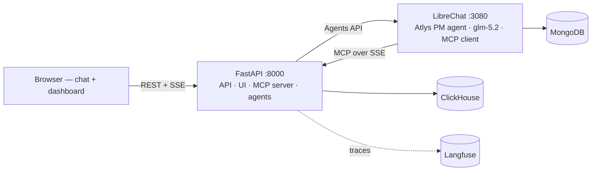

# Atlys Copilot

**Feature spec → ClickHouse schema → PM insight — driven by chat, fully traced.**

> 🚀 **Live demo:** [https://gpthost.in](https://gpthost.in) — try it right now in your browser.
> 🔗 **Langfuse traces:** [https://us.cloud.langfuse.com/project/cmsahdrz01qh7ad0db3diay35/traces](https://us.cloud.langfuse.com/project/cmsahdrz01qh7ad0db3diay35/traces) — live pipeline traces from our runs.
> 📂 **Demo assets:** [Google Drive folder](https://drive.google.com/drive/folders/1xOxJ60yuBGm5341PvUiicRSG1OVBLX4f?usp=sharing) — demo video, screenshots, and submission materials.

Atlys Copilot is a chat-first analytics copilot built for the ClickHouse
Click-a-thon 2026 ("agents that instrument, analyze, and explain"). Upload a
feature spec plus its raw event data, talk to the agent in plain language, and
it proposes a ClickHouse schema, keeps a living business-context layer fresh,
and writes PM-ready insight cards — with your approval at the schema gate and a
Langfuse trace proving every step. **No trace, no credit.**

```text
spec.md + events.ndjson  →  [LibreChat agent ⇄ Atlys MCP tools]  →  ClickHouse
                                                                   meta.* tables
                                                                   feature tables
                                                                   insight cards + trace
```

---

## Highlights

- **Chat-first.** The left panel is the front door: a LibreChat-hosted "Atlys
  PM" agent (Z.ai GLM) that calls Atlys MCP tools over SSE. The right panel is
  a read-only dashboard mirroring everything the pipeline wrote.
- **Three deterministic agents.** Instrumentation (spec → schema → DDL),
  Context (living business-context snapshots + reconciliation), Analytics
  (playbook → evidence → insight). The FastAPI pipeline makes **zero LLM
  calls** — the chat agent is the only LLM.
- **Human approval gate.** The pipeline pauses at a proposed schema and does
  not touch analytics tables until you approve (or reject).
- **Traceable end to end.** One Langfuse trace per run; every `meta.*` and
  `atlys.event_log` row carries the `trace_id`; the dashboard deep-links to
  it.
- **Safe ad-hoc analysis.** Structured read-only tools (`db_schema`,
  `table_stats`, `aggregate`, `sample_rows`) — no free-form SQL from the
  model.
- **Reload-proof chat.** Generations run in a background task; transcripts
  persist to JSON and the UI reconnects by polling — never lose a message to a
  refresh.

## Architecture at a glance



One FastAPI process serves the React UI, the REST + chat-proxy APIs, the SSE
MCP server, and the agents. LibreChat hosts the agent and is the MCP *client*;
FastAPI is the MCP *server*. MongoDB is bundled purely because LibreChat needs
it — Atlys Copilot's own state lives in ClickHouse plus `specs/` and
`generated/` on disk.

## Quick start (demo on one box)

> Prefer the hosted demo? Open **https://gpthost.in** — no setup needed.

```bash
cd Atlys
cp .env.example .env          # fill CH_HOST, CH_PASSWORD, ZAI_API_KEY, LibreChat keys
docker compose up -d          # mongo + librechat + fastapi (builds React UI)
# open http://localhost:8000 — upload a spec, then chat
```

Cold start auto-provisions the "Atlys PM" agent (background task), seeds
context v0, and creates the operational tables — no manual agent setup.

### Local (no Docker)

```bash
python3 -m venv .venv && source .venv/bin/activate
pip install -r service/requirements.txt
pip install pyarrow                               # data loader only — see SETUP.md §1.1
python data/load_python.py                        # load the 8 funnel tables (once)
PYTHONPATH=. uvicorn service.app:app --port 8000  # API + UI (needs ui build or Vite dev)
cd ui && npm ci && npm run dev                    # Vite dev server on :5173
```

Full step-by-step (local, Docker, hybrid tunnel, troubleshooting) lives in
[`SETUP.md`](SETUP.md).

## Project layout

```
Atlys/
├── agents/atlys_pm.md        # "Atlys PM" agent system prompt (chat front door)
├── base_context.md           # business context the Context Agent maintains
├── data/                     # 8 raw event tables (parquet) + ddl.sql + loaders
├── docs/HOW_IT_WORKS.md      # ← how the whole system works (plain language)
├── scripts/provision_agent.py# auto-creates the agent + Agents API key in LibreChat
├── service/                  # FastAPI: api.py, mcp_server.py, chat_runs.py,
│                             # bus.py, agents/*, migration_plan.py, db_read.py, …
├── specs/                    # feature specs (spec.md + events.ndjson); the
│                             # sealed 6th spec lands here on Day 2
├── tests/                    # unit + e2e suites (pytest)
└── ui/                       # React + Vite front end
```

Generated artifacts land in `Atlys/generated/`: per-feature `ddl.sql`,
`schema_card.json`, `insight.md`, saved documents under `generated/reports/`,
and chat transcripts under `generated/chats/`.

## Documentation

| Doc | What it covers |
|---|---|
| [`README.md`](README.md) | This overview |
| [`SETUP.md`](SETUP.md) | Install, configure, run (local + Docker + hybrid) |
| [`docs/HOW_IT_WORKS.md`](docs/HOW_IT_WORKS.md) | Full plain-language architecture tour |
| [`README_START_HERE.md`](README_START_HERE.md) | The hackathon problem package |
| [`PROBLEM_STATEMENT.md`](PROBLEM_STATEMENT.md) | The challenge, rules, judging |
| [`ENGINEERING.md`](../ENGINEERING.md) | Detailed plans per module (repo root) |
| [`../docs/`](../docs/) plan files | Per-feature design docs (inspect tab, chat history, resilience, …) — repo root |

## Tests

```bash
# unit tests (no external services; e2e auto-skips without .env)
PYTHONPATH=. python -m pytest tests/ -q --ignore=tests/test_e2e.py

# e2e — requires .env + live ClickHouse
PYTHONPATH=. python -m pytest tests/test_e2e.py -q
```

Also handy: `PYTHONPATH=. python -m service.cli run 01_express_checkout --approve`
runs a full spec through the pipeline from the terminal, and `ATLYS_DRY_RUN=1`
runs everything in memory with zero credentials.
