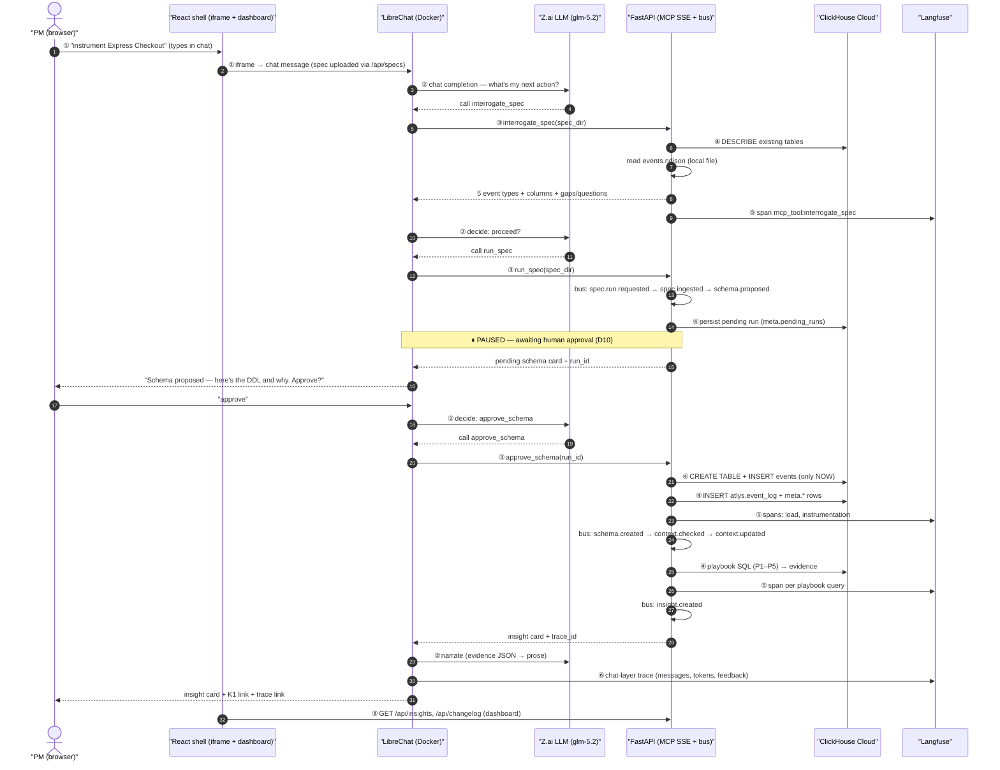

# ENGINEERING.md — Atlys Copilot: PRD, Architecture & Implementation Plan

> **Status.** This is the **single source of truth** for the Atlys Copilot build. It **supersedes and
> replaces** the previous `ARCHITECTURE.md`, `DESIGN.md`, `ENGINEERING.md` (v1/v2), and
> `USER_FLOW.md` — all of which have been removed. Everything below is the *current* plan: PRD,
> event-driven architecture, ClickHouse data model, code architecture (classes/models), component
> specs, integration layer, phase-wise development, a worked example, testing, and the Day-2
> unseen-spec runbook.
>
> **Locked decisions (D1–D14)** — settled in team discussion; do not reopen without a trace-worthy
> reason:
>
> | # | Decision |
> |---|---|
> | D1 | **LibreChat is the chat front door** (self-hosted via **Docker**, pinned ≥ v0.7.6, D13), embedded in a **thin React shell** (D12). |
> | D2 | **Langfuse for all tracing** — dual: LibreChat env-var tracing (chat layer) + FastAPI SDK tracing (pipeline layer), one project, cross-linked via **`session_id = run_id`** (§6.2). |
> | D3 | **ClickHouse Cloud is the ONLY datastore for pipeline data** — funnel tables, spec events, `<feature>_events`, `meta.*`, `atlys.event_log`, all in one service. (LibreChat's bundled MongoDB is operational infra, not analytics data — D13.) |
> | D4 | **Event-driven orchestration**: agents are event handlers; `atlys.event_log` is the durable backbone. |
> | D5 | **Lightweight in-process event bus** (not Kafka); persistence + idempotency live in ClickHouse. |
> | D6 | **Deterministic-first**: the pipeline is 100% Python + ClickHouse — schema decisions, numbers, confidence, known-issue matches, and the stored insight summary (deterministic template). **All LLM prose happens in LibreChat** (the chat agent narrates); FastAPI makes zero LLM calls. |
> | D7 | **One FastAPI service** = MCP server (SSE) + event-loop host + thin REST API for the dashboard. |
> | D8 | **ClickStack is a bonus**, not core (M7, cut if behind). |
> | D9 | **No repo-editing / code-instrumentation agent.** |
> | D10 | **Human approval REQUIRED** before schema execution (the `approve_schema` gate in chat). |
> | D11 | **LLM provider = Z.ai (GLM)**, OpenAI-compatible (`https://api.z.ai/api/paas/v4`), configured as a **LibreChat custom endpoint** — the **only LLM in the system** (②). |
> | D12 | **Thin React shell**: iframe-embed LibreChat chat + a small dashboard (insights, schema timeline, context diffs) reading FastAPI REST. |
> | D13 | **Hosting**: LibreChat runs in **Docker** (official image; **MongoDB is an internal bundled component** — no separate provisioning); FastAPI runs **locally** for the demo with a **tunnel** (e.g. `cloudflared`) so the LibreChat backend can reach the MCP SSE URL. Fallback: FastAPI also in Docker using internal networking. |
> | D14 | Langfuse env var is **`LANGFUSE_BASE_URL`** (LibreChat's actual var; older docs said `LANGFUSE_HOST`). |

---

# PART 0 — WHAT THIS SYSTEM IS (60-SECOND SUMMARY)

**Atlys Copilot** — an event-driven, three-agent analytics system on ClickHouse Cloud that turns a
new feature spec (a markdown brief + a sample event stream) into three deliverables:

1. **A production ClickHouse schema** — designed from the spec's own events (column types, ordering
   key, partitioning, TTL), executed **after human approval**, and loaded.
2. **A fresh business context** — the shared context layer is versioned and reconciled against the
   real schema; every change lands in a **delta/changelog** with a diff and a trace id.
3. **A PM-readable insight** — numbers computed by ClickHouse SQL, summarized by a deterministic
   template, and narrated to the PM by the LibreChat chat agent, with every claim linked to the
   query that produced it.

A PM drives everything from a chat: type *"implement Express Checkout"* → the agent asks sharp
questions, designs the schema, **waits for your approval**, then instruments → reconciles context →
analyzes → returns an insight card. Every step is recorded twice: as an **event** in the durable
ClickHouse `atlys.event_log` and as a **span** in a Langfuse trace — the proof that the output came
from the pipeline ("no trace, no credit").

**Stack in one line:** ClickHouse Cloud (the only datastore) · Python/FastAPI orchestration service
exposed as an **MCP server (SSE)** + thin REST API · **LibreChat** (chat front door, embedded in a
React shell, in Docker) with **Z.ai GLM** — the system's **only LLM** · **Langfuse** (visibility) ·
ClickStack (optional pipeline health).

---

# PART 1 — PRD (PRODUCT REQUIREMENTS)

## 1.1 Problem statement

Atlys ships product changes constantly (Express Checkout, Group applications, Instant forex, Status
sharing, Abandoned-checkout recovery…). Every new feature needs instrumentation, schema design, and
analysis — today that loop is manual, slow, and loses context across handoffs. **We collapse the
loop:** deploy agents that handle instrumentation, analysis, and insight generation automatically,
fully traced.

## 1.2 Users & personas

| Persona | What they do | What they need |
|---|---|---|
| **PM** | Types a feature request in chat, answers the agent's questions, approves the schema | A schema that exists, an insight they'd act on, zero manual SQL |
| **Data/analytics engineer** | Reviews generated DDL and context diffs | Defensible schema decisions, full audit trail |
| **Judge (Day 2)** | Runs the unseen spec, opens the trace | Every step evidenced, trace ↔ event_log linkage, no hand-written anything |

## 1.3 Goals & non-goals

**Goals**
1. Spec in → schema + context + insight out, all traced, for **any** spec (the unseen one included).
2. Every number in an insight traceable to a stored ClickHouse query.
3. Context stays fresh: analytics reasons from the latest context after every schema change.
4. Human-in-the-loop approval gate before any DDL executes.

**Non-goals** (per problem statement): authentication, production deployment, streaming ingestion,
polished frontends, editing the app codebase, ClickStack-as-core.

## 1.4 Judged criteria → requirements traceability

| Criterion | What judges check | Requirement it lands on |
|---|---|---|
| Schema quality | Ordering key, partitioning, types, MVs that "earn their keep" | §3.2 schema-decision rules, §3.5 MVs, §5.1 Instrumentation |
| Insight quality | PM would act on it; carries the *why* | §5.2 Analytics playbook + evidence format |
| Context freshness | Analytics reasons with updated context after a new table lands | §5.3 Context agent, `meta.context_snapshots` latest-read |
| Traceability | Open the trace, follow the full reasoning chain | §6.2 Langfuse dual-trace, trace_id on every `meta.*` row |
| **Unseen spec** | Robust, generic pipeline; no per-spec hardcoding | §11 war-room runbook; content-driven pipeline |

## 1.5 User stories

- **US1 — Run a spec:** As a PM, I upload a feature spec + events (dashboard drag-drop, §6.3), so the system designs and creates
  the table, analyzes it, and returns an insight — after I approve the schema.
- **US2 — Interrogate first:** As a PM, I want the agent to surface gaps in my spec (nested
  objects, envelope drift, undefined metrics) *before* creating anything.
- **US3 — Know the why:** As a PM, I want every claim in the insight backed by a number and its SQL.
- **US4 — Context stays fresh:** As a PM, when a new table lands, the next analysis must reflect it.
- **US5 — Audit everything:** As a judge, I want to open one trace and replay the whole run.
- **US6 — Survive the unseen:** As a PM, Day 2's spec must run through the same chat flow unchanged.

## 1.6 Acceptance criteria (overall)

- The pipeline processes **any** spec with zero per-spec hardcoding (grep gate: no feature names in `service/`).
- The pipeline (FastAPI) makes **zero LLM calls** — schema + evidence + template insight are produced with no LLM keys anywhere (deterministic-first, §5.2.6); only the LibreChat chat layer needs an LLM key.
- Every insight number appears in stored evidence with its SQL.
- One Langfuse trace per run; `meta.*` rows and `atlys.event_log` rows carry the trace_id.
- The Day-2 unseen spec completes via chat with a trace in < 5 minutes.

---

# PART 2 — ARCHITECTURE: THE EVENT-DRIVEN CORE

## 2.1 The system in one picture (detailed, call-by-call)

> Every numbered arrow is one call. The call table in §2.1.1 explains each: from → to, protocol,
> and payload. This is the map the rest of the doc walks through.

```
┌──────────────────────────────────────────────────────────────────────────┐
│  USER — the PM (demo) / the Judge (Day 2)                                │
│  browser at localhost:5173 (React shell)                                 │
└───────┬────────────────────────────────────────────┬─────────────────────┘
        │ ① types: "instrument Express Checkout"      │ opens the dashboard
        ▼                                            ▼
┌────────────────────────────────┐   ┌──────────────────────────────────────┐
│  REACT SHELL  (Vite, thin)     │   │  DASHBOARD (same React app)          │
│  ┌──────────────────────────┐  │   │  · insight cards + confidence        │
│  │ ① iframe → LibreChat UI  │  │   │  · schema timeline (changelog)       │
│  │   (the chat front door)  │  │   │  · context snapshot diffs            │
│  └───────────┬──────────────┘  │   │  · event-log feed                    │
└──────────────┼─────────────────┘   └───────────────┬───────────────────────┘
               │ ① iframe (HTTPS)                    │ ⑧ GET /api/...
               ▼                                    ▼
┌──────────────────────────────────────────────────────────────────────────┐
│  LIBRECHAT  (Docker, :3000)  — the chat front door                        │
│  Manages the conversation context window, function calling, and which    │
│  MCP tool to call next.                                                  │
│  · backend (Node/Express)    · MongoDB bundled (internal)                │
│  · "Atlys PM" agent — tools: interrogate_spec · run_spec · approve_schema│
│    reject_schema · get_insight · list_insights · get_changelog ·         │
│    get_context · propose_context_update · reconcile · ingest_events      │
│                                                                          │
│  ② chat completion +        ③ MCP client (server-side) dials the        │
│  function-call decisions    SSE URL via tunnel → tool call               │
└───────┬──────────────────────────────┬───────────────────────────────────┘
        │ ② OpenAI-compatible          │ ③ tool calls over SSE
        ▼                              ▼
┌────────────────────────────┐   ┌──────────────────────────────────────────────┐
│  Z.AI LLM  (glm-5.2)       │   │  FASTAPI ORCHESTRATION SERVICE (local :8000)  │
│  · chat + function calling │   │  · MCP server (SSE) at /mcp/sse               │
│  (the ONLY LLM — ②, in     │   │  · event bus + agents: instrumentation ·     │
│   LibreChat)               │   │    context · analytics · correlation          │
└────────────────────────────┘   │  · fully deterministic — makes NO LLM calls;  │
                                 │    insight summary = deterministic template;  │
                                 │    the chat agent narrates to the PM          │
                                 │  · REST API at /api/*                         │
                                 │  · every step → Langfuse + atlys.event_log     │
                                 │  ┌────────────────────────────────────────┐  │
                                 │  │ event chain (one spec run):            │  │
                                 │  │ spec.run.requested → spec.ingested →   │  │
                                 │  │ schema.proposed ⏸ (approval, ③ again)  │  │
                                 │  │ → schema.approved → schema.created →   │  │
                                 │  │ context.checked → context.updated →    │  │
                                 │  │ insight.created → responder → chat     │  │
                                 │  └────────────────────────────────────────┘  │
                                 └───────┬─────────────────────────────┬─────────┘
                                         │ ④ SQL / DDL / atlys.event_log │ ⑤ Langfuse
                                         ▼                             ▼   spans
                            ┌──────────────────────────┐   ┌──────────────────────────────┐
                            │  CLICKHOUSE CLOUD        │   │  LANGFUSE (Cloud)            │
                            │  (the ONLY datastore)    │   │  trace: spec:<feature>       │
                            │  · atlys.*   8 funnel    │   │  ├─ instrumentation          │
                            │    tables (load.sh)      │   │  ├─ load (DDL + rows)        │
                            │  · <feature>_events      │   │  ├─ context (reconcile diff) │
                            │  · meta.*   7 context/   │   │  ├─ per playbook SQL         │
                            │    changelog/insight     │   │  └─ mcp_tool:<name>          │
                            │    tables                │   └─────────────┬────────────────┘
                            │  · atlys.event_log       │                 ▲ ⑥ chat-layer
                            │  · mv_funnel_daily       │                 │    traces
                            └──────────────────────────┘                 │
                                        ▼ ⑦ OTLP from FastAPI           │
                                        │                                │
                              ┌─────────┴─────────────┐   ┌───────────────┴────────────────┐
                              │  CLICKSTACK (bonus)   │   │  LibreChat → Langfuse (env):  │
                              │  ingestion lag · MV    │   │  messages · generations ·    │
                              │  freshness · latency   │   │  token counts · feedback     │
                              └───────────────────────┘   └────────────────────────────────┘
```

### 2.1.1 The call table (every numbered arrow)

| # | Call | From → To | Protocol | Payload / purpose |
|---|---|---|---|---|
| ① | Chat message | PM → React shell → LibreChat UI (via iframe) | HTTPS | PM's message; spec files arrive via dashboard drag-drop (`POST /api/specs`, §6.3) — chat references the path only |
| ② | LLM chat completion | LibreChat backend → Z.ai | OpenAI-compatible | model decides the *next action*: reply, ask a question, or call a tool (`glm-5.2`, 1M context) |
| ③ | MCP tool call | LibreChat (MCP client) → FastAPI MCP server | SSE over tunnel | `interrogate_spec` · `run_spec` · `approve_schema` · `get_insight` … — the model's chosen tool; **server-side** (LibreChat backend dials the URL; CORS irrelevant) |
| ④ | Data / DDL / log access | FastAPI → ClickHouse Cloud | `clickhouse-connect` | `DESCRIBE`, `CREATE TABLE` (after approval), `INSERT` (events + `atlys.event_log`), playbook SQL, `meta.*` reads/writes |
| ⑤ | Pipeline tracing | FastAPI → Langfuse | Langfuse SDK | one trace per run + spans per agent, per playbook query, per MCP tool call; trace_id written to every `meta.*` and `atlys.event_log` row |
| ⑥ | Chat-layer tracing | LibreChat → Langfuse | env vars | messages, LLM generations, token counts, feedback (complements ⑤ in the same Langfuse project) |
| ⑦ | Pipeline health (bonus) | FastAPI → ClickStack | OTLP | ingestion lag, MV freshness, per-query latency from `system.query_log` |
| ⑧ | Dashboard reads | React dashboard → FastAPI REST | HTTPS | `GET /api/insights`, `/api/changelog`, `/api/context`, `/api/event-log` — the visualization layer |

**The approval gate is a special ③ sub-flow:** `run_spec` returns a *pending* schema + `run_id` and the event chain **⏸ pauses**; the pending run is persisted to **`meta.pending_runs`** (durable — survives reconnects, §3.3); the PM approves in chat → the model calls `approve_schema(run_id)` (another ③ call) → only then does FastAPI execute the DDL (④, FastAPI → ClickHouse). Nothing touches ClickHouse before approval.

### 2.1.2 The happy-path sequence (Mermaid — Express Checkout run)

> Same calls ①–⑧ as §2.1.1, now in **time order**. The ⏸ pause at `schema.proposed` is the
> human approval gate (D10) — nothing touches ClickHouse (④) until `approve_schema`.



> `autonumber` in the diagram numbers the *messages*; the ①–⑧ tags inside the message text map
> them to the §2.1.1 call table. Steps ①–⑧ of the call table appear in order: ① message, ② LLM
> decision, ③ MCP tool call, ④ ClickHouse, ⑤ Langfuse spans, ⑥ chat trace, ⑧ dashboard. (⑦
> ClickStack is out-of-band monitoring, not part of the happy path.)

## 2.2 The event model

Every thing that happens is an **event**: a small JSON record with a fixed envelope, the contract
every agent speaks.

| Field | Example | Meaning |
|---|---|---|
| `event_id` | `UUID` | unique id (dedup key) |
| `event_type` | `spec.ingested` | type — see registry below |
| `aggregate_id` | `spec/01_express_checkout` | which thing this event is about |
| `version` | `3` | aggregate version after this event |
| `actor` | `instrumentation` · `context` · `analytics` · `mcp` · `user` | who produced it |
| `payload` | `{"event_names": [...], "columns": [...]}` | JSON body |
| `trace_id` | Langfuse trace id | links event ↔ trace |
| `created_at` | `DateTime64(3)` | when |

## 2.3 Event-type registry

| Event type | Emitted by | Meaning | Downstream trigger |
|---|---|---|---|
| `spec.run.requested` | MCP tool / user | a spec run was asked for | starts a new trace + run |
| `spec.ingested` | instrumentation | events read, envelope parsed, types inferred | → schema design |
| `schema.proposed` | instrumentation | DDL designed with rationale | **⏸ pauses for human approval** |
| `schema.approved` | user (via chat) | human confirmed the DDL | → execution (`schema.created`) |
| `schema.created` | instrumentation | table created + rows loaded | → context agent |
| `context.checked` | context | reconcile ran; findings list | → context update if needed |
| `context.updated` | context | snapshot bumped + changelog written | → analytics |
| `insight.created` | analytics | playbook done; evidence + insight card | → UI / chat response |
| `tool.called` | mcp | any MCP tool invoked (name, args) | → observability |
| `context.update.proposed` | mcp / user | human-proposed context edit | → changelog pending state |

## 2.4 The event bus (`service/bus.py`)

- **What:** a small `EventBus` class — a registry of `event_type → [handlers]`. `emit(event)`
  synchronously calls each handler in registration order, then **persists the event to
  `atlys.event_log`**. Handlers may emit new events (queued, dispatched depth-first).
- **Where:** inside the FastAPI service process; one bus per instance.
- **Why not Kafka?** Documented trade-off: our durability comes from the ClickHouse event log, our
  ordering is single-process, scale is thousands of events. At 100x, swap the dispatcher for a
  ClickHouse-`KafkaEngine`-backed stream; handlers don't change.

**The flow for one spec run:**

```
run_spec(spec) ──► emit spec.run.requested ─────────────┐
   (MCP tool)                                           ▼
                                                     EventBus
spec.run.requested ──► [Instrumentation handler]
                          emit spec.ingested      (read NDJSON, infer)
                          emit schema.proposed    (DDL + rationale)
                                  │
                                  ▼  ⏸ RUN PAUSES — approval requested in chat
                        [Human approves via approve_schema tool]
schema.approved   ──► emit schema.created     (CREATE + LOAD + card)
schema.created   ──► [Context handler]
                          emit context.checked    (reconcile vs base_context)
                          emit context.updated    (snapshot + changelog + diff)
context.updated   ──► [Analytics handler]
                          emit insight.created    (playbook SQL → evidence → card)
insight.created   ──► [Responder handler]  ──► return card + trace_id to chat
```

**Idempotency (critical):** handlers must be safe to run twice. The event log is append-only
(at-least-once; duplicate events on re-runs are harmless). Idempotency lives in the **state
tables**: DDL uses `CREATE TABLE IF NOT EXISTS` + additive `ALTER` (§3.4); the schema card upserts
on `table_name` (skipped if DDL + row count unchanged); context snapshots key on `content_hash`;
insights upsert on `(spec, title)`.

**Approval-gate durability:** `run_spec` persists the pending run (run_id → state `proposed`,
schema card, trace_id) to **`meta.pending_runs`** before returning; `approve_schema(run_id)` reads
it back and flips state to `approved`. No in-memory state is trusted — the gate survives SSE
reconnects, tunnel blips, and FastAPI restarts.

**Event lifecycle (one spec run, with the approval gate):**

```
spec.run.requested ──▶ spec.ingested ──▶ schema.proposed ──⏸──▶ schema.approved ──▶ schema.created
     (mcp/user)          (instrumentation)   (instrumentation)  (user via chat)     (instrumentation)
                                                        │
                                                        └─▶ reject_schema ──▶ (run aborted, no state change)

schema.created ──▶ context.checked ──▶ context.updated ──▶ insight.created ──▶ responder → chat
 (instrumentation)   (context agent)     (context agent)    (analytics agent)    (card + trace_id)

Cross-cutting, emitted on every step:   tool.called (mcp, each MCP invocation)
Optional human-in-the-loop:             context.update.proposed (mcp/user) → changelog pending state
Persistence rule:                       every event row → atlys.event_log with trace_id
```

---

# PART 3 — CLICKHOUSE DATA MODEL

## 3.1 Existing tables (loaded once, unchanged)

`Atlys/data/load.sh` → 8 tables in database `atlys` (default): `destination_card_clicked`,
`application_started`, `document_uploaded`, `purchase_completed` (funnel) + `search_typed`,
`landing_page_scrolled`, `auth_completed`, `pay_now_clicked` (supporting). Legacy template
`ORDER BY (id, timestamp, user_id)` — a deliberately bad sort key we work around, never rewrite.
All data (existing tables, spec events, generated tables, `meta.*`, `atlys.event_log`) lives in
the **same** ClickHouse Cloud service. The repo's `.parquet`/`.ndjson` files are inputs.

## 3.2 Generated feature tables — schema decision rules

| Decision | Rule | Why |
|---|---|---|
| One table per feature | `<feature>_events` + `event` discriminator | mini-funnel in one table; `windowFunnel`/`sequenceMatch` work |
| Event discriminator | `event LowCardinality(String)` | constant filter; cheap comparisons |
| Sort key | `ORDER BY (event, timestamp, user_id)` | dominant query is event + time range |
| Partitioning | `PARTITION BY toYYYYMM(timestamp)` | matches existing tables; month pruning |
| Types | bool→`UInt8`; small int→`UInt8/16/32`; float/money→`Float64`; strings→`String` | columnar-friendly; money stays `Float64` for consistency |
| Enums | `LowCardinality(Nullable(String))` on `event`, `device_type`, `os`, `geoip_country_code`, `destination` | compress well; `os` genuinely NULL on some Android rows |
| Nullability | `Nullable` **only where nulls actually occur** | stay honest to the data |
| IDs | spec `id` is 32-hex → `String` (not `UUID`) | the sample events prove it |
| Nested JSON | flattened: `payment.amount` → `payment_amount` | ClickHouse prefers flat columns |
| Retention | `TTL timestamp + INTERVAL 180 DAY` | production default |

**DDL template** (what `schema.py::build_ddl` emits):

```sql
CREATE TABLE IF NOT EXISTS <feature>_events
(
    id String,
    timestamp DateTime,
    event LowCardinality(String),
    user_id String,
    application_id Nullable(String),
    os LowCardinality(Nullable(String)),
    device_type LowCardinality(Nullable(String)),
    geoip_country_code LowCardinality(Nullable(String)),
    destination LowCardinality(Nullable(String)),
    -- …inferred feature columns…
    shown_amount Nullable(Float64),
    otp_success Nullable(UInt8),
    payment_latency_ms Nullable(UInt16)
)
ENGINE = MergeTree
PARTITION BY toYYYYMM(timestamp)
ORDER BY (event, timestamp, user_id)
TTL timestamp + INTERVAL 180 DAY;
```

## 3.3 `meta.*` tables (exact DDL)

```sql
CREATE TABLE IF NOT EXISTS meta.schema_catalog (
    table_name String, ddl String, rationale String, source_spec String,
    event_order String, columns String, row_count UInt64, trace_id String,
    created_at DateTime DEFAULT now()
) ENGINE = MergeTree ORDER BY (table_name, created_at);

CREATE TABLE IF NOT EXISTS meta.schema_changelog (
    version UInt64, agent LowCardinality(String),
    action LowCardinality(String),  -- create_table|add_column|alter_type|add_event
    object String, diff String, rationale String, trace_id String,
    created_at DateTime DEFAULT now()
) ENGINE = MergeTree ORDER BY (version, object);

CREATE TABLE IF NOT EXISTS meta.context_snapshots (
    version UInt64, content String, content_hash String,
    diff_from_prev String, trace_id String, created_at DateTime DEFAULT now()
) ENGINE = MergeTree ORDER BY version;

CREATE TABLE IF NOT EXISTS meta.context_changelog (
    version UInt64, agent LowCardinality(String),
    action LowCardinality(String),  -- create|update|append|retire|reconciliation_finding
    object String, diff String, rationale String, trace_id String,
    created_at DateTime DEFAULT now()
) ENGINE = MergeTree ORDER BY (version, created_at);

CREATE TABLE IF NOT EXISTS meta.insights (
    spec String, title String, summary String, confidence String,
    evidence String, trace_id String, created_at DateTime DEFAULT now()
) ENGINE = MergeTree ORDER BY (created_at);

CREATE TABLE IF NOT EXISTS meta.known_issues (
    issue_id String, title String, evidence String, status String,
    updated_at DateTime DEFAULT now()
) ENGINE = MergeTree ORDER BY issue_id;

CREATE TABLE IF NOT EXISTS meta.pending_runs (
    run_id String, state LowCardinality(String),  -- proposed|approved|rejected|aborted
    spec_dir String, schema_card String, trace_id String,
    created_at DateTime DEFAULT now()
) ENGINE = MergeTree ORDER BY run_id;
```

**Versioning strategy:** Analytics always reads the **latest** snapshot
(`ORDER BY version DESC LIMIT 1`); every old snapshot is kept (cheap), so "context as of vN" is one
query away. `diff_from_prev` is computed at write time; `meta.context_changelog` holds per-object
deltas. Latest is a point lookup, history is a scan.

## 3.4 Schema evolution on re-runs

First run `CREATE TABLE`s. A re-run (spec edited, events changed) compares inferred columns vs
`system.columns` / `meta.schema_catalog` and emits **additive-only** `ALTER TABLE ... ADD COLUMN`
(`add_column`/`alter_type`), where `alter_type` is non-destructive widening only
(`UInt8→UInt16/32`, `Float32→Float64`). Drops/renames/narrowing never happen. Uses
`ADD COLUMN IF NOT EXISTS` / `MODIFY COLUMN` so double-execution stays idempotent. Every mutation
passes `schema.proposed` → approval → execution.

## 3.5 Materialized views

- **`mv_funnel_daily`** — daily per-segment funnel rollup over the existing funnel
  (`uniqState`/`countState`, read with `uniqMerge`/`countMerge`). The MV that "earns its keep" —
  analytics stops rescanning ~2.5M rows.
- **Per-feature daily event rollup** — templated per feature table, only when the spec shape
  justifies it (funnel-like specs get funnel MVs; additive specs get event-rollup MVs). Each gets a
  rationale row in the trace.

```sql
CREATE MATERIALIZED VIEW mv_funnel_daily
ENGINE = AggregatingMergeTree
PARTITION BY toYYYYMM(day) ORDER BY (day, os, geoip_country_code, destination)
AS SELECT toDate(timestamp) AS day, os, geoip_country_code, destination,
          uniqState(user_id) AS users_at_step, countState() AS events
   FROM document_uploaded GROUP BY day, os, geoip_country_code, destination;
```

---

# PART 4 — CODE ARCHITECTURE: MODULES & CLASSES

## 4.1 Repository layout (final tree)

```
Atlys/
  service/                         # the orchestration service (the ONLY code we build)
    __init__.py
    app.py                         # FastAPI app; mounts MCP server + REST routes
    settings.py                    # env config → Settings dataclass
    tracing.py                     # Langfuse wrapper; NullTracer fallback
    store.py                       # ClickHouse access (clickhouse-connect, retries)
    bus.py                         # EventBus + Event dataclass + handler registry
    events.py                      # event-type constants + envelope helpers
    schema.py                      # NDJSON → typed columns → DDL (inference rules)
    reconcile.py                   # system.columns vs base_context vs spec diffing
    agents/
      __init__.py
      instrumentation.py           # Agent 1: spec → schema card → DDL → load
      context.py                   # Agent 3: meta.* store, versioning, contradictions
      analytics.py                 # Agent 2: playbook SQL → evidence → insight card
      correlation.py               # evidence ↔ known-issues K1–K7 matching
      mv.py                        # MV DDL generation + execution
    mcp_server.py                  # MCP tool definitions (SSE transport)
    api.py                         # REST endpoints for the React dashboard
    requirements.txt               # fastapi, uvicorn, mcp, clickhouse-connect, langfuse
  generated/                       # pipeline outputs, one dir per feature
    <feature>/
      ddl.sql                      # generated CREATE TABLE
      schema_card.json             # columns, rationale, event order, row count
      insight.md                   # PM-facing insight
  tests/                           # pytest suite (see Part 9)
    test_schema.py · test_context.py · test_reconcile.py
    test_analytics.py · test_correlation.py · test_bus.py · test_e2e.py
    golden/                        # snapshot insight cards for the 5 specs
    fixtures/fake_spec/            # our own "6th spec" for hardening
```

## 4.2 Class & module specs (what / where / how)

### `service/settings.py` — `Settings` (dataclass)

| Field | Env var | Default |
|---|---|---|
| `ch_host`, `ch_user`, `ch_password`, `ch_secure` | `CH_HOST`, `CH_USER`, `CH_PASSWORD`, `CH_SECURE` | — |
| `atlys_db` | `ATLYS_DB` | `atlys` |
| `langfuse_pk`, `langfuse_sk`, `langfuse_base_url` | `LANGFUSE_PUBLIC_KEY`, `LANGFUSE_SECRET_KEY`, `LANGFUSE_BASE_URL` | — (null → NullTracer) |
| *(no LLM config — FastAPI makes zero LLM calls; Z.ai lives in LibreChat)* | — | — |

### `service/tracing.py` — `Tracer` (protocol) / `LangfuseTracer` / `NullTracer`

- `trace(name, **meta)` → context manager yielding a span; `span(name, **meta)`; `set_trace_id(id)`.
- `NullTracer` logs spans to stdout when Langfuse keys are absent (deterministic-first: pipeline
  works with no keys). One trace per spec run; spans per agent, per playbook query, per MCP tool
  call. **Gotcha:** Langfuse has no built-in MCP middleware — wrap each MCP tool handler in a span
  manually.

### `service/store.py` — `ClickHouseStore`

- Wraps `clickhouse-connect` with retries/backoff. Methods: `query(sql, params)`, `insert(table,
  columns, rows)`, `command(sql)` (DDL), `columns(table)` (→ `system.columns`),
  `table_exists(table)`, `row_count(table)`.
- `Nullable`/`DateTime` conversions handled here once, so agents stay clean.

### `service/bus.py` — `Event` (dataclass) + `EventBus`

- `Event(event_type, aggregate_id, actor, payload, trace_id, version=0, event_id=None)`.
- `EventBus.register(event_type, handler)` / `emit(event)` → calls handlers, then persists to
  `atlys.event_log` via `store.insert`; queues newly-emitted events (depth-first).

### `service/schema.py` — inference + DDL builder

- `load_events(path)` → stream NDJSON lines; flatten nested objects with `_` prefix
  (`payment.amount` → `payment_amount`).
- `infer_type(values)` → bool→`UInt8`, int→`UInt8/16/32` by max, float→`Float64`, else `String`;
  tracks real nulls. Coalesce across **all** rows, not the first.
- `build_ddl(feature, columns, event_order)` → DDL per §3.2 template.
- `schema_rationale(...)` → one paragraph per choice (why ORDER BY, why Nullable here, why TTL…).

### `service/agents/instrumentation.py` — `InstrumentationAgent`

Handles `spec.run.requested` → emits `spec.ingested` → `schema.proposed` (⏸) → (on
`schema.approved`) executes CREATE + LOAD → emits `schema.created` → persists schema card to
`meta.schema_catalog` + diff to `meta.schema_changelog`.

### `service/agents/context.py` — `ContextAgent`

- `seed_if_empty()` — v0 snapshot of `base_context.md`; parse K1–K7 into `meta.known_issues`.
- `next_version()` — `max(version)+1` from changelog.
- `log_changelog(...)`, `add_schema_card(...)`, `add_insight(...)`.
- Handles `schema.created` → `context.checked` (reconcile) → `context.updated` (snapshot + diff +
  changelog).

### `service/reconcile.py` — schema-vs-context reconciliation

Systematically diffs documented context vs actual schema with evidence (see §5.3 step 4):

1. Parse documented column lists + metric formulas + entity definitions from `base_context.md`.
2. Read actual schema: `SELECT table, name, type FROM system.columns WHERE database = currentDatabase()`.
3. Diff → findings: `undocumented_column`, `phantom_column`, `definition_gap` (metric references a
   missing column), `known_issue_column_gap` (K2→`scan_mode`, K6→`coupon_name`/`discount_amount`).
4. Also run `detect_contradictions` (text heuristic) for prose-level drift (T8:
   `visa_issuance_eta_days` vs `eta_shown`) and merge both finding sets.
5. Persist each finding to `meta.context_changelog` with action `reconciliation_finding`, diff,
   rationale, trace_id; bump version.

### `service/agents/analytics.py` — `AnalyticsAgent`

- `playbook(feature, table, event_order)` → builds P1–P6 queries from the **spec's** event order and
  PM questions (never hardcoded).
- `run_playbook(...)` → executes each query, records `{label, kind, sql, rows|error}` evidence.
- `synthesize(evidence, ...)` → deterministic template summary (§5.2.5) — no LLM.
- `confidence(...)` → sample-size heuristic (§5.2.3).
- Handles `context.updated` → emits `insight.created` → upserts `meta.insights`.

### `service/agents/correlation.py` — known-issue correlation

Deterministic rule engine matching evidence against `meta.known_issues` (K1–K7 trigger table in
§5.2.4). Output: `matched_known_issues` list with triggering evidence.

### `service/mcp_server.py` — MCP tool definitions (SSE)

Tools (each wrapped in a Langfuse span, each emitting `tool.called`):

| Tool | Input | Output | Notes |
|---|---|---|---|
| `run_spec` | `spec_dir` | pending schema + `run_id` → (after approval) insight card + trace_id | the one command for the unseen spec; pauses at `schema.proposed` |
| `interrogate_spec` | `spec_dir` | gaps/questions list | deterministic; no LLM needed |
| `get_insight` | `feature` | latest insight card | follow-ups |
| `list_insights` | — | all insight cards | dashboard-ish |
| `get_changelog` | `scope`, `limit` | changelog entries with diffs | UI feed |
| `get_context` | `version?` | snapshot(s) + diff | "what changed?" |
| `propose_context_update` | `change` (JSON) | pending changelog entry | human-in-the-loop |
| `reconcile` | — | reconcile findings | one-click contradiction surfacing |
| `approve_schema` / `reject_schema` | `run_id`, `note?` | proceeds / aborts | **required** human gate (D10); reads/writes `meta.pending_runs` |
| `ingest_events` | `table`, `rows` | inserted count | demo app / simulate.py |

### `service/app.py` + `service/api.py` — FastAPI

- `app.py` mounts: MCP server (SSE at `/mcp/sse`), REST routes (`/api/insights`,
  `/api/changelog`, `/api/context`, `/api/event-log`, `/api/specs`), health at `/healthz`.
- `api.py` is the dashboard's read path — thin SELECTs over `meta.*` + `atlys.event_log`.
- CORS enabled for the React shell's dashboard origin.

## 4.3 Core data models (JSON contracts)

**Schema card** (`meta.schema_catalog.columns` + `generated/<feature>/schema_card.json`):

```json
{
  "table": "express_checkout_events",
  "ddl": "CREATE TABLE ...",
  "rationale": { "order_by": "...", "partition": "...", "ttl": "...", "nullable": "..." },
  "event_order": ["express_checkout_shown", "express_checkout_selected", "saved_method_used", "otp_entered", "express_payment_confirmed"],
  "columns": { "otp_success": "Nullable(UInt8)", "payment_latency_ms": "Nullable(UInt16)" },
  "row_count": 5507,
  "trace_id": "..."
}
```

**Insight card** (`meta.insights.evidence` + `generated/<feature>/insight.md`):

```json
{
  "feature": "express_checkout",
  "title": "Express Checkout feature health",
  "confidence": "high",
  "summary": "PM-facing text with real numbers…",
  "evidence": [ { "label": "funnel step-through", "kind": "funnel", "sql": "SELECT …", "rows": [[…]] } ],
  "event_order": ["…"],
  "matched_known_issues": ["K1"],
  "trace_id": "…"
}
```

---

# PART 5 — COMPONENT SPECS (WHAT / WHERE / HOW)

## 5.1 Instrumentation Agent

| Step | What | Where | How |
|---|---|---|---|
| 1 | Event extraction | `schema.py::load_events` | stream NDJSON; distinct `event` values in first-seen order |
| 2 | Type inference | `schema.py::infer_type` | coalesce across all rows; bool/int/float/string → CH types |
| 3 | DDL | `schema.py::build_ddl` | §3.2 rules |
| 4 | Rationale | `schema.py::schema_rationale` | one paragraph per choice |
| 5 | Execute + load | `agents/instrumentation.py` | **gated by human approval (D10)**; `CREATE TABLE` → bulk insert |
| 6 | Persist | `agents/instrumentation.py` / `store.py` | schema card → `meta.schema_catalog`; diff → `meta.schema_changelog`; DDL → `generated/` |

**Error handling:** empty NDJSON → loud error with trace; unknown types → `String` fallback;
missing connection → clear message or `--dry-run`. **Unseen-spec edges:** a spec with no
`user_id` → bucket under `''` with an evidence note; `run_id` is a UUID (no collisions); a
single-event spec → P1/P3 degrade gracefully (P2/P4 still run).

## 5.2 Analytics Agent

**Rule:** ClickHouse computes; the insight summary is a deterministic template. Raw rows never
enter any LLM — the only LLM (LibreChat's chat agent, ②) sees aggregate evidence, never raw data.

### 5.2.1 Playbook (query templates)

| # | Archetype | SQL template |
|---|---|---|
| P1 | Funnel step-through | `SELECT uniqIf(user_id, event='<e0>') AS u0, …, uniqIf(user_id, event='<en>') AS un FROM <t>;` |
| P2 | Event overview | `SELECT event, count() AS events, uniqExact(user_id) AS users FROM <t> GROUP BY event;` |
| P3 | Segment skew | `SELECT <key> AS seg, uniqIf(user_id, event='<first>') AS a, uniqIf(user_id, event='<last>') AS b FROM <t> GROUP BY seg ORDER BY a DESC LIMIT 10;` for `os`, `device_type`, `geoip_country_code`, `destination` |
| P4 | Timings/amounts | `SELECT quantile(0.5)(<col>) AS p50, quantile(0.9)(<col>) AS p90, count() AS n FROM <t> WHERE event='<last>' AND <col> IS NOT NULL;` |
| P5 | Cross-funnel conversion | `SELECT uniqExact(p.user_id) AS converted, (SELECT uniqExact(user_id) FROM <t> WHERE event='<last>') AS users FROM purchase_completed p WHERE p.user_id IN (SELECT user_id FROM <t> WHERE event='<last>');` |
| P6 | Funnel timing (stretch) | `SELECT user_id, minIf(timestamp, event='<a>') AS t0, maxIf(timestamp, event='<b>') AS t1 FROM <t> GROUP BY user_id;` |

### 5.2.2 Evidence format

Every query result becomes `{label, kind, sql, rows}` or `{label, kind, sql, error}` — a failing
query is recorded, never crashes the run. The evidence list **is** the anti-hallucination
guarantee and the trace content.

### 5.2.3 Confidence scoring

Funnel confidence from last-step sample size: `≥1000 → high`, `≥200 → medium`, else `low`.
Segment anomalies (M6 refinement): segment rate vs baseline ratio + minimum-sample guard — flag
only when effect **and** sample are big enough (no crying wolf).

### 5.2.4 Known-issue correlation (trigger table)

| Issue | Trigger pattern in evidence |
|---|---|
| K1 iOS OTP autofill | `otp_entered` evidence; iOS otp_success clearly below Android; geo ∈ {AE, SA, KW, QA, BH, OM} |
| K2 Android passport scan | `document_uploaded`; android capture/retry/threshold up |
| K3 MRZ OCR non-Latin | high `retry_count` by destination/citizenship |
| K4 Schengen summer scarcity | destination ∈ Schengen + seasonal timing |
| K5 WhatsApp re-engagement | abandoned-checkout reminders via whatsapp reconverting |
| K6 SUMMER20 coupon | `coupon_applied` / `coupon_name = SUMMER20` in purchase evidence |
| K7 App 7.45 rollout | `app_version` = 7.45.x funnel-timing shifts |

Flagship demo: Express Checkout → **K1**.

### 5.2.5 Insight summary — deterministic template

`synthesize` builds the stored summary from evidence numbers alone (no LLM): template prose such as
*"Express lifts checkout→success to ~84%…"* using only figures present in the evidence. The
LibreChat chat agent (②) narrates to the PM conversationally; the stored `meta.insights.summary`
is always the template version.

### 5.2.6 Deterministic-first policy

The pipeline must produce a complete deliverable (schema + evidence + template insight) with **no
LLM and no service other than ClickHouse** — FastAPI makes **zero LLM calls**; the only LLM in the
system is LibreChat's chat agent (②), which narrates to the PM. CI asserts the full pipeline passes
with `ZAI_API_KEY` unset.

## 5.3 Context Agent

| Step | What | How |
|---|---|---|
| Seed | v0 snapshot of `base_context.md`; parse K1–K7 | `seed_if_empty` (idempotent) |
| Version | `max(version)+1` | `next_version` |
| Changelog | every mutation → row with diff + trace_id | `log_changelog` |
| Schema catalog | after instrumentation: card upsert | `add_schema_card` |
| Insights | after analytics: card upsert | `add_insight` |
| Reconcile | documented context vs actual schema → findings | `reconcile.py` + `detect_contradictions` |

**The planted traps (T1–T8)** — the base context is deliberately imperfect; each surfaced trap is a
demo datapoint for the "context freshness" criterion:

| # | Trap | Inconsistency |
|---|---|---|
| T1 | Three conversion denominators | §1 implies ÷ `destination_card_clicked`; §4 headline ÷ sessions; §4 note ÷ `application_started` |
| T2 | "Sessions" undefined | no sessions table; `app_session_id` is Nullable |
| T3 | Context omits K2 columns | `scan_mode` + `failed_attempt_threshold` in DDL, absent from context |
| T4 | Context omits K6 columns | `coupon_name`, `discount_amount` in DDL, absent from context |
| T5 | K5 ↔ spec 04 overlap | WhatsApp nudge "already live" vs abandoned-recovery spec launching WhatsApp |
| T6 | Envelope drift | spec events carry `city`/`client_lib`, omit `latitude`/`longitude`/`locale`/`language`/`funnel_type`; `id` is String vs legacy UUID |
| T7 | Out-of-scope metric | "on-time delivery rate" declared *not computable from funnel tables* |
| T8 | Naming drift | context `visa_issuance_eta_days` vs DDL `eta_shown` |

**Freshness loop:** Analytics reads context from `meta.*` → after a run the new table is in the
catalog → next analysis already sees it. This is the judged behavior.

## 5.4 Orchestrator + trace structure

One Langfuse trace per spec run:

```
trace: "spec:express_checkout"  (id = trace_id, on every meta.* row + atlys.event_log row)
 ├─ span instrumentation   (spec parsed → schema card + rationale)
 ├─ span load              (DDL executed, rows inserted, MV created)
 ├─ span context           (reconcile findings, snapshot diff, changelog)
 ├─ span per playbook SQL  (query text + row count + latency)   ← judges' favourite
 └─ span mcp_tool:<name>   (per MCP tool call, incl. args + result summary)
```

---

# PART 6 — INTEGRATION LAYER

## 6.1 LibreChat — chat front door (MCP over SSE, not webhooks)

- **Hosting (D13):** LibreChat runs in **Docker** (official image + `docker-compose`, pinned ≥
  v0.7.6); **MongoDB is an internal component** of the LibreChat stack (bundled `mongo` service —
  nothing to provision or manage). FastAPI runs **locally** for the demo; a tunnel (`cloudflared` /
  `ngrok`) exposes its MCP SSE endpoint publicly so the LibreChat backend can dial it. Fallback:
  FastAPI also in Docker, same host, internal networking.
- **Why MCP-SSE, not webhook (researched):** LibreChat's MCP client is **server-side** — the
  LibreChat *backend* connects to the MCP server URL, not the browser. So the SSE URL just needs to
  be reachable from the LibreChat backend; **CORS is irrelevant** for MCP. Webhooks are a non-fit
  (LibreChat emits no pipeline events to webhooks). The "FastAPI → LibreChat" direction (Agents
  API at `/api/agents/v1/chat/completions`) is **not needed** — FastAPI makes **no LLM calls at
  all**; the only LLM is LibreChat's chat agent (②).
- **Config** (`librechat.yaml` mounted as a volume):

```yaml
version: '1.0.8'
cache: true
endpoints:
  custom:                              # Z.ai (GLM) — OpenAI-compatible
    - name: "ZAI"
      apiKey: "${ZAI_API_KEY}"
      baseURL: "https://api.z.ai/api/paas/v4"
      models: { default: ["glm-5.2", "glm-4.7-flash"], fetch: false }
      titleModel: "glm-4.7-flash"
      modelDisplayLabel: "Z.ai GLM"
      tokenConfig:
        glm-5.2: { prompt: 1.4, completion: 4.4, context: 1000000, cacheRead: 0.26 }
        glm-4.7-flash: { prompt: 0, completion: 0, context: 200000, cacheRead: 0 }
mcpServers:
  atlys-orchestrator:
    type: sse
    url: https://<tunnel-url>/mcp/sse
```

- **Agent:** "Atlys PM" custom agent (LibreChat Agents panel) with exactly the Atlys tools enabled
  and the system prompt below (interrogate first → run_spec → ask approval → narrate with real
  numbers only → link trace).

**"Atlys PM" — LibreChat chat agent (the front door):**
> You are Atlys Copilot, the analytics copilot for Atlys's data team. You help product managers
> turn a feature spec into a ClickHouse schema, fresh business context, and a PM-readable insight.
> Tools: `interrogate_spec`, `run_spec`, `approve_schema`, `reject_schema`, `get_insight`,
> `list_insights`, `get_changelog`, `get_context`, `propose_context_update`, `reconcile`,
> `ingest_events`.
> Workflow: (1) on a new spec, call `interrogate_spec` first and surface the gaps/questions before
> running anything; (2) call `run_spec` (it always pauses at `schema.proposed`); (3) when a pending
> schema + `run_id` comes back, present the DDL and rationale and ask the user to approve or
> reject; (4) after approval, summarize the returned insight card.
> Rules: quote numbers exactly as returned; never invent figures, SQL, columns, or trace ids; if
> evidence is missing or low-confidence, say so; always include the Langfuse trace id when given;
> keep it PM-friendly — no jargon without a one-line explanation.
- **Mandatory env (else crash):** `CREDS_KEY` (64 hex), `CREDS_IV` (32 hex), `JWT_SECRET`,
  `JWT_REFRESH_SECRET`, `DOMAIN_CLIENT`/`DOMAIN_SERVER` (= public URL), `TRUST_PROXY=1`,
  `MONGO_URI` (points at the bundled `mongo` service — no external Mongo), `ZAI_API_KEY`,
  `LANGFUSE_*`.
- **Resources:** LibreChat (Mongo bundled) + FastAPI = 2 stacks; a single docker-compose demo
  box (LibreChat + FastAPI + tunnel) avoids platform limits entirely.
- **SSE auth (do not skip):** LibreChat's MCP client sends no auth header by default — expose the
  tunnel URL as a throwaway random subdomain (ngrok / cloudflared quick tunnel), keep it private,
  and rotate it between demos. An open MCP endpoint lets anyone run specs against your ClickHouse.

## 6.2 Langfuse — dual trace (D2, D14)

- **Chat layer:** LibreChat natively traces to Langfuse via **env vars**
  (`LANGFUSE_PUBLIC_KEY`, `LANGFUSE_SECRET_KEY`, `LANGFUSE_BASE_URL`) — messages, LLM generations,
  tokens, feedback. Not via `librechat.yaml`.
- **Pipeline layer (judge-critical):** FastAPI's own Langfuse SDK (`tracing.py`) — spans per agent,
  per playbook query, per MCP tool call; trace_id on every `meta.*` row and `atlys.event_log` row.
- **Correlation (`session_id = run_id`):** the FastAPI pipeline trace sets **`session_id = run_id`**
  (Langfuse SDK supports sessions); the Atlys PM reply echoes the `run_id` in chat, so a Langfuse
  search by `run_id` finds both trees. Honest caveat: LibreChat's env-var tracing generates its own
  trace ids and may not accept an injected one — the durable cross-link is the shared `run_id`
  string (FastAPI `session_id` + chat echo), not a shared trace id. Judge can go event → trace or
  trace → event.
- **Self-hosted Langfuse on ClickHouse?** Not standard (self-host uses Postgres+Redis). Use Langfuse
  Cloud — don't burn hackathon hours.

## 6.3 React thin shell (D12)

- **Chat:** `<iframe src="https://<librechat-railway-url>" />` — LibreChat as-is, embedded.
  Watch: browser third-party cookie blocking can break the iframe session; mitigate by
  `DOMAIN_CLIENT`/`DOMAIN_SERVER` matching and SameSite handling, or accept manual login in demo.
  Alternative: `@librechat/client` npm package (verify it exists/works at M0 — weakly sourced).
- **Dashboard:** React pages reading **FastAPI REST** (`/api/insights`, `/api/changelog`,
  `/api/context`, `/api/event-log`): insight cards with confidence, schema timeline, context diffs,
  event-log feed. This is the primary "visualization layer" deliverable.
- **Spec delivery:** dashboard drag-drop of `spec.md` + `events.ndjson` → `POST /api/specs` →
  FastAPI writes `Atlys/specs/<feature>/`; chat only references the path (`run specs/06_…`). Never
  paste spec bodies into chat — keeps the LLM context small, and the Day-2 spec arrives as files.
- **CORS:** FastAPI allows the shell's origin.

## 6.4 Hosting topology summary

| Component | Runs | Reachable from |
|---|---|---|
| ClickHouse Cloud | cloud | FastAPI (local or in Docker) |
| FastAPI service | local (demo) | LibreChat backend via tunnel; React dashboard via CORS |
| LibreChat (Docker; MongoDB bundled internal) | Docker host | browser (React iframe) |
| React shell | local / Vercel | browser |
| Langfuse | Langfuse Cloud | LibreChat (env) + FastAPI (SDK) |

**Deployment picture (D13):**

```
┌─────────────────────────────────────────────────────────────────────────┐
│  BROWSER (demo laptop)                                                  │
│  · React shell :5173  ├── iframe ──▶ LibreChat UI  ──┐                  │
│                      └── dashboard ──▶ FastAPI REST  │                  │
└───────────────────────────┬──────────────────────────┼──────────────────┘
                            │ ① HTTPS (iframe)         │ ⑧ REST (CORS)
                            ▼                          ▼
┌──────────────────────────────────────┐   ┌────────────────────────────────────┐
│  DOCKER HOST (LibreChat)             │   │  LOCAL  (demo machine)             │
│  · LibreChat :3000  (pinned ≥0.7.6)  │   │  · FastAPI :8000                   │
│  · MongoDB (bundled, internal)       │   │    ├─ MCP server (SSE) /mcp/sse    │
│  · env: CREDS_KEY/IV, JWT_*,         │   │    ├─ event bus + 3 agents         │
│    DOMAIN_CLIENT/SERVER, TRUST_PROXY │   │    └─ REST /api/*                  │
│  · outbound: Z.ai API (②, via       │   │                                     │
│    endpoints.custom)                │   │                                     │
└──────────────┬───────────────────────┘   └───────┬────────────────────────────┘
               │ ③ MCP client (server-side)        │ ④ SQL / DDL / atlys.event_log
               │ dials SSE URL via TUNNEL          │ ⑤ Langfuse SDK spans
               ▼ (cloudflared / ngrok)             ▼
   ┌────────────────────────────────────────┐  ┌──────────────────────────────┐
   │  CLICKHOUSE CLOUD  (the ONLY datastore)│  │  LANGFUSE (Cloud)            │
   │  atlys.* · <feature>_events · meta.* · │  │  pipeline traces (FastAPI)   │
   │  atlys.event_log · mv_funnel_daily     │  │  + chat traces (LibreChat)   │
   └────────────────────────────────────────┘  └──────────────────────────────┘
```

> Fallback (D13): run FastAPI in Docker too and point the MCP URL at
> `http://fastapi:8000/mcp/sse` (compose internal network, no tunnel). The tunnel is a demo-time
> convenience, not an architectural dependency.

## 6.5 ClickStack (bonus, M7)

`clickhouse/clickstack-all-in-one:latest`; point at ClickHouse Cloud; FastAPI exports OTLP metrics
(ingestion lag, MV freshness, per-query latency from `system.query_log`). One demo slide at most.

---

# PART 7 — PHASE-WISE DEVELOPMENT (M0–M9)

| # | Hours | What | Where | How | Acceptance |
|---|---|---|---|---|---|
| **M0** | 0–1.5 | Infra | Cloud console, Docker, tunnel | ClickHouse Cloud up; `load.sh` loads 8 tables (verify `purchase_completed` count); Langfuse + Z.ai keys; LibreChat in Docker pinned ≥ v0.7.6; FastAPI skeleton runs locally | tables load; LibreChat login page up |
| **M1** | 1.5–4 | Event bus + Instrumentation | `service/bus.py`, `agents/instrumentation.py` | NDJSON → infer (§3.2) → schema card → `CREATE TABLE` → bulk insert; every step emits events | Spec 01 table with correct ORDER BY; 5 event types in `atlys.event_log`; rerun is idempotent (schema card upserts on `table_name` — no duplicate rows) |
| **M2** | 4–6 | Context agent + delta/changelog | `agents/context.py`, `reconcile.py`, `meta.*` | Seed v0; reconcile (system.columns vs context vs spec) → findings; snapshot + changelog on any change | T1/T8 surfaced by `reconcile`; `meta.context_changelog` has ≥1 entry with diff |
| **M3** | 6–8.5 | Analytics agent | `agents/analytics.py` | Playbook P1–P5, evidence, confidence, deterministic summary, K1 correlation | Insight card for spec 01 shows iOS OTP drop + K1; every claim has a number + SQL |
| **M4** | 8.5–10.5 | MCP + LibreChat wiring | `mcp_server.py`, `librechat.yaml`, "Atlys PM" agent | Expose tools over SSE; register in LibreChat via tunnel; agent prompt enforces interrogate→run→approve→narrate | Chat message "run express checkout spec" drives the full pipeline; **approval gate works in chat**; trace_id returned |
| **M5** | 10.5–12 | Langfuse end-to-end + React shell | `tracing.py`, React app | Trace + spans per agent/query/tool; trace_id on meta.*; iframe chat + REST dashboard | One trace per run; span tree matches event log; dashboard shows insights + timeline + diffs |
| **M6** | 12–15 | All 5 specs + changelog UX | specs 02–05, `api.py`, dashboard | Run all five; fix per-spec seams; changelog read path surfaced in chat + dashboard | 5 insight cards; changelog query works; no per-spec hardcoding (grep gate) |
| **M7** | 15–18 | ClickStack + MV pass | docker, OTLP exporter, `agents/mv.py` | `mv_funnel_daily` live; OTLP metrics → ClickStack; quality pass on schema cards | MV query uses uniqMerge; ClickStack shows pipeline health |
| **M8** | 18–21 | Fake 6th-spec dry run + hardening | `tests/fixtures/fake_spec/` | Invent awkward spec (array field, nested object, nulls); run exact Day-2 sequence in chat | Fake spec completes with no code change; deterministic output identical; < 5 min |
| **M9** | 21–24 | Demo, README, video | repo root | 5-minute script (Part 11), pointers, record | Rehearsed end-to-end twice; video saved |

---

# PART 8 — WORKED EXAMPLE: EXPRESS CHECKOUT END-TO-END

> This is the **full trace of one spec through every component** — the "consider what happens with
> all components" walkthrough. Feature: `Atlys/specs/01_express_checkout`.

**The spec says:** one-tap checkout for returning travellers; saved method + OTP only; goal to cut
time-to-pay and lift checkout→success. Raw events: `express_checkout_shown` (with `shown_amount`,
`currency`), `express_checkout_selected` (`saved_method_type`), `saved_method_used`,
`otp_entered` (`otp_attempts`, `otp_success`), `express_payment_confirmed` (**nested** `payment`:
`amount`, `currency`, `latency_ms`).

### 8.1 PM opens the React shell → embedded LibreChat chat

The PM drag-drops `spec.md` + `events.ndjson` on the dashboard (`POST /api/specs` →
`Atlys/specs/01_express_checkout/`), then types: *"We're launching Express Checkout — instrument
it and tell me if it's working."* The Atlys PM agent (LLM in LibreChat, model `glm-5.2`)
receives it.

### 8.2 Interrogation (deterministic)

Agent calls **`interrogate_spec("specs/01_express_checkout")`** over MCP SSE. FastAPI reads
`events.ndjson`, infers the 5 event types + columns, and returns gaps/questions:

- *"`express_payment_confirmed` has a nested `payment` object — I'll flatten to
  `payment_amount`, `payment_currency`, `payment_latency_ms`. OK?"*
- *"Your events carry `os`, but the base context notes `os = NULL` on Android rows — expected?"*
- *"`otp_success` looks boolean — I'll type it `UInt8`."*

Each tool call emits `tool.called` → `atlys.event_log` and a Langfuse `mcp_tool:interrogate_spec`
span. PM answers in chat.

### 8.3 run_spec → schema proposed (⏸ pause)

PM says *"proceed"* → agent calls **`run_spec`**. Event bus: `spec.run.requested` →
`spec.ingested` → `schema.proposed`. The agent renders the schema card (DDL + rationale) and asks:
*"Approve?"* **Pipeline is paused — nothing has touched ClickHouse yet.**

### 8.4 Approval gate → schema created

PM types *"approve"* → agent calls **`approve_schema(run_id)`** → `schema.approved` →
`schema.created`. FastAPI executes:

```sql
CREATE TABLE express_checkout_events (
    id String, timestamp DateTime, event LowCardinality(String),
    user_id String, application_id Nullable(String),
    os LowCardinality(Nullable(String)),
    device_type LowCardinality(Nullable(String)),
    geoip_country_code LowCardinality(Nullable(String)),
    destination LowCardinality(Nullable(String)),
    saved_method_type Nullable(String), otp_attempts Nullable(UInt8),
    otp_success Nullable(UInt8), shown_amount Nullable(Float64),
    payment_amount Nullable(Float64), payment_currency Nullable(String),
    payment_latency_ms Nullable(UInt16)
) ENGINE = MergeTree
  PARTITION BY toYYYYMM(timestamp)
  ORDER BY (event, timestamp, user_id)
  TTL timestamp + INTERVAL 180 DAY;
```

Rows load (~5,507). Schema card → `meta.schema_catalog`; `create_table` diff →
`meta.schema_changelog`; DDL → `generated/express_checkout/ddl.sql`.

### 8.5 Context agent reconciles

`schema.created` → Context handler → `context.checked`: `reconcile.py` diffs documented context vs
the new table + existing tables. Findings (with evidence) written to
`meta.context_changelog` as `reconciliation_finding`:

- **T8 surfaced:** context says `visa_issuance_eta_days`, DDL says `eta_shown` on
  `application_started`.
- **T6 surfaced:** spec envelope carries `city`/`client_lib`, omits `latitude`/`longitude`.

`context.updated`: snapshot v1 = v0 + ExpressCheckout entity + new metrics; `diff_from_prev`
recorded; version bumped.

### 8.6 Analytics computes the insight

`context.updated` → Analytics handler. Playbook (P1–P5) runs against `express_checkout_events` +
`purchase_completed`:

- **P1** step-through: shown 5,507 → selected 4,318 → saved_used 4,021 → otp_entered 3,712 →
  confirmed 3,105 → **checkout→success 83.6%** (vs ~62% baseline standard checkout, per
  cross-funnel P5 comparison on `purchase_completed`).
- **P3** segment skew: `otp_success` by os × geo — **iOS 91% vs Android 98.2%**, worst in Gulf
  countries (AE/SA/KW).
- **P4** `quantile(0.9)(payment_latency_ms)` — Express is ~40% faster than the standard form.

Evidence rows (each with SQL) → `correlation.py` matches the iOS OTP signal → **K1** (iOS WebKit
OTP autofill; payment-heavy Gulf users most exposed). `insight.created` → card upserted to
`meta.insights`, confidence `high` (last-step n = 3,105).

### 8.7 Return, narrate, trace

The responder returns the insight card + trace_id to chat. The agent narrates (LLM restates only
evidence numbers): *"Express lifts checkout→success to ~84%, and is ~40% faster — but OTP success
on iOS is 7 points below Android and worst for Gulf users. This matches known issue K1."* Evidence
renders as a markdown table in the chat. Langfuse trace `spec:express_checkout` holds every span;
`atlys.event_log` and `meta.*` rows all carry the trace_id.

### 8.8 Follow-ups (context freshness demo)

- *"How much faster is Express?"* → `get_insight` + targeted P4 query → narration.
- *"SUMMER20 coupon is live now"* → `propose_context_update` → context bump → rerun → insight
  changes. Analytics reads the **latest** context snapshot — freshness proven.

### 8.9 The Day-2 unseen spec

Same flow — upload `specs/06_*/` via the dashboard, reference it in chat; zero code changes.
Export trace URL + insight card + DDL. **No manual SQL, no hand-written insight** — the chat
output *is* the trace evidence.

---

# PART 9 — TESTING & VALIDATION

| Suite | Scope | Where |
|---|---|---|
| Unit — schema | type inference (bool/int/float/string/nested/null/mixed/empty); DDL rules (LowCardinality, ORDER BY, TTL, partition) | `tests/test_schema.py` |
| Unit — context | `parse_known_issues`, `_clean_title`, `detect_contradictions` | `tests/test_context.py` |
| Unit — reconcile | documented-vs-actual column diff; undocumented/phantom columns; definition gaps | `tests/test_reconcile.py` |
| Unit — analytics | `synthesize` with fake evidence incl. error rows; confidence thresholds; digest strips SQL | `tests/test_analytics.py` |
| Unit — correlation | K1 trigger on synthetic otp evidence | `tests/test_correlation.py` |
| Unit — bus | event ordering, depth-first dispatch, at-least-once persistence | `tests/test_bus.py` |
| Integration | live ClickHouse (or local `clickhouse-server`): all 5 specs; row counts == NDJSON line counts; meta rows written; trace_id present | `tests/test_e2e.py` |
| Golden | snapshot insight cards for 5 specs; re-run and diff | `tests/golden/` |
| Determinism | full pipeline with `ZAI_API_KEY` unset and Langfuse keys unset passes | CI |
| Dry-run regression | `--dry-run` succeeds for all specs with no ClickHouse | CI |

---

# PART 10 — RISKS & MITIGATIONS

| Risk | Impact | Mitigation |
|---|---|---|
| LibreChat↔MCP wiring fights us (tunnel, SSE, version) | M4 slips | Pinned version; REST fallback already built (`/api/*`); FastAPI-in-Docker internal URL as plan B |
| Docker host too small for LibreChat + bundled Mongo | M0 slips | Single docker-compose demo box; ≥2 GB RAM |
| Langfuse rate-limit / outage | No traces | NullTracer fallback; `atlys.event_log` is the independent audit trail |
| ClickHouse Cloud latency on joins | Slow evidence | MVs (`mv_funnel_daily`); evidence stays aggregate-level |
| iframe third-party cookies break chat session | Demo glitch | `DOMAIN_CLIENT`/`DOMAIN_SERVER` correct; SameSite handling; manual login fallback |
| Unseen spec has weird shapes (arrays, unknown events, no user_id) | Pipeline breaks Day 2 | Generic inference; arrays → `String` fallback; empty NDJSON → loud traced error; no `user_id` → `''` bucket; single-event specs degrade P1/P3; fake-6th-spec dry run (M8) |
| Messy data (`os` NULL, duplicates, backfills) | Wrong numbers | `Nullable` where real; analytics excludes `duplicate_id`/`is_back_filled` |
| Over-scoping (ClickStack, dashboard polish) | Time overrun | M1–M5 frozen must-haves; M7 bonus-only, cut if behind |

---

# PART 11 — THE UNSEEN SPEC: RUNBOOK & DEMO SCRIPT

## 11.1 Day-2 war-room runbook

1. Upload `specs/06_*/` via the dashboard drag-drop (`POST /api/specs` → `Atlys/specs/06_*/`).
2. Open LibreChat → Atlys PM. Reference the spec by name ("run specs/06_…") → agent runs
   `interrogate_spec` → `run_spec` → **approve the schema when asked** (one click; the DDL is
   still pipeline-generated, so the trace holds).
3. Export the Langfuse trace URL. Copy the insight card + generated DDL into the submission.
4. **No manual SQL, no hand-written insight** — the chat output *is* the trace evidence.

## 11.2 5-minute demo script

1. **(30 s) Pitch.** "Feature spec → schema → insight, fully traced. Three agents on ClickHouse,
   every number computed by SQL."
2. **(1 min) React shell.** Show the iframe chat + dashboard (schema timeline, insight cards with
   confidence, context diffs).
3. **(2 min) Live run.** In chat: *"run the Express Checkout spec"* → interrogation questions →
   schema proposed → **approve** → insight card with real numbers + K1 match. Point at the ORDER
   BY/partition/TTL in the generated DDL.
4. **(1 min) Trace.** Open Langfuse: instrumentation span (DDL rationale), per-query spans,
   context diff span. Cross-link to `atlys.event_log`.
5. **(30 s) Close.** "Content-driven pipeline — it will process the unseen spec the same way. This
   trace is our proof."

---

*Plan complete. Next concrete action: start M0 (ClickHouse Cloud + load data + LibreChat in Docker +
FastAPI skeleton), then M1 (event bus + Instrumentation).*
