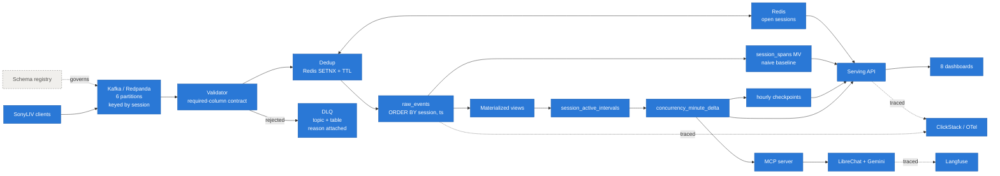
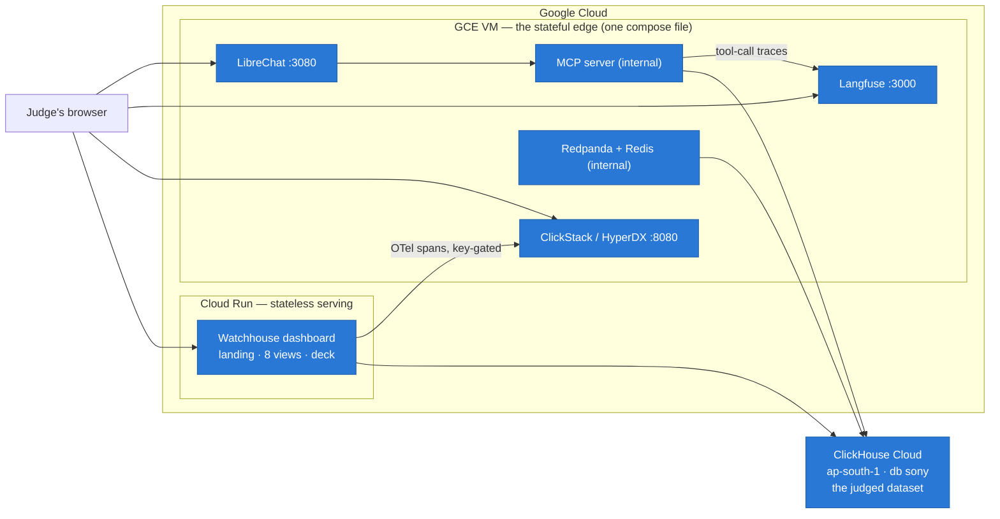

# Team Nirad

## Track
SonyLIV

## Project
**Watchhouse** — foreground-only concurrency at streaming scale. An open app is not a viewer.

## Team Members
- Preetham (preethamresearch)
- BhagyaChandra Rao

## What it does
Counts who is *actually watching* — `active = intent_playing AND client_alive` — instead of who merely has a session open. On the judged (unseen-day) dataset that difference is **24,087 reported vs 18,936 real at peak: a 21.4% phantom audience**. Every number is verified against an independently written oracle (149,500 of 149,500 intervals exact), served from a minute-delta serving layer, filterable by platform/country/video-type/category, and askable in chat through MCP tools that cannot invent SQL.

## Hosted Demo
**https://watchhouse-1045532154243.asia-south1.run.app/app** (Cloud Run, reading ClickHouse Cloud live)
— concurrency curve with instant filters, query playground with the real SQL, judged results, pipeline runner.
Companion services on the demo VM: HyperDX `http://8.231.76.83:8080` · Langfuse `http://8.231.76.83:3000` · LibreChat `http://8.231.76.83:3080`.
**LibreChat test login for judges:** `preethamshyam123@gmail.com` / `clickhouse$Nirad26` — pick the **"Gemini · traced"** endpoint, enable the `watchhouse` MCP chip, and ask *"what was peak concurrency on ANDROID_PHONE?"* (expect 6,046).

## Demo Video
**https://vimeo.com/1214920822** (2–3 min, Orus voiceover, live cloud walkthrough: dashboard → filters → architecture → pipeline provenance → deck → HyperDX → Langfuse → LibreChat)

## Architecture
Two diagrams in [the full README below](#architecture): the pipeline (Kafka → validate → dedup → ClickHouse → oracle-gated derive → delta serving → dashboards/chat) and the deployment (browser → Cloud Run → ClickHouse Cloud; one GCE VM runs ClickStack + Langfuse + LibreChat + LiteLLM + MCP from `infra/edge-compose.yml`). Tool roles, per the evidence requirements:
- **ClickStack** — every ClickHouse query and pipeline stage is an OTel span from `scripts/otel.py` (config committed; collector writes to the all-in-one's embedded ClickHouse `otel_traces`; ingest is key-gated). Live in the demo video.
- **LibreChat** — `infra/librechat.yaml` committed (keys via env): MCP server wiring, SSRF exemptions, LiteLLM custom endpoint. The chat flow is the brief's optional step, grounded: tools wrap the same verified queries the dashboard runs.
- **Langfuse** — headless-bootstrapped (`infra/edge-compose.yml`); every MCP tool call and every Gemini generation (via LiteLLM, with real token usage/cost) is traced. **Judges need no login:** exports in [`results/evidence/langfuse_traces.json`](results/evidence/langfuse_traces.json).

## How we built it
ClickHouse Cloud (SharedMergeTree) as the only datastore and engine; delta-model serving tables + hourly checkpoints + incremental MVs; Redpanda/Redis streaming ingest with DLQ and idempotent sink; an independent Python oracle as the correctness gate; stdlib-only OTel and Langfuse exporters; Cloud Run + one GCE VM. Full story, including seven post-mortems of our own bugs, below.

## How to run it
```bash
python scripts/run_sealed.py --raw <dataset.csv> --content <content.csv>   # load + verify, one command
python scripts/dashboard.py                                               # http://localhost:877
docker compose --env-file .env.edge -f infra/edge-compose.yml up -d       # the OSS stack (see infra/.env.edge.example)
python scripts/sanity_cloud.py                                            # 23 linkage checks on the hosted surfaces
```

---

*The full project README follows.*

---

# Watchhouse

**Foreground-only concurrency at streaming scale** · Team Nirad · Click-a-thon 2026 · SonyLIV track

> **In one line:** counting a session from its first event to its last over-reports peak
> concurrent viewers — on the judged dataset by **21.4%**: 5,151 "viewers" who were
> paused, backgrounded, or already gone.

**On the judged (unseen-day) dataset — 7,000,000 events, one command, zero code changes:**

| | |
|---|---|
| **Reported peak** (session overlap) | 24,087 |
| **Actually watching** (`intent ∧ alive`) | **18,936** |
| **Phantom audience** | **5,151 — 21.4%** |
| Verified against an independent oracle | 149,500 intervals, **0 divergent** |
| Load → verify, end to end | **526 s** (1.82 GB, 44k rows/s in) |
| Minute-grain curve with filters | **65–223 ms server-side** ([evidence](results/RESULTS.md)) |
| Sample-dataset study (where the model was built) | peak 3,090 vs naive 3,743 · gap 17.4% |

```bash
python scripts/run_sealed.py --raw <dataset.csv> --content <content.csv>   # the whole thing
python scripts/dashboard.py                                                # localhost:877
```

**The submission is the model and the serving layer, per the brief; the dashboards
are its demo surface.** What makes it different from a dashboard: an independently
written oracle the query path must agree with exactly, a deterministic fault
injector that found three bugs which would each have produced confidently wrong
numbers, and a written record of everything we got wrong.

- [The seven bugs we shipped and caught](#what-went-wrong-and-what-it-taught-us)
- [What we would tell SonyLIV](#what-we-would-propose-to-sonyliv)
- [What we would rather not report](#what-we-would-rather-not-report)

---


## Contents

- [The judges' questions, answered directly](#the-judges-questions-answered-directly)
- [The model](#the-model) — and the two variants we rejected
- [Architecture](#architecture)
- [What went wrong](#what-went-wrong-and-what-it-taught-us) — seven post-mortems
- [Verification](#verification)
- [What we would rather not report](#what-we-would-rather-not-report)
- [What we would propose to SonyLIV](#what-we-would-propose-to-sonyliv)
- [Running it](#running-it)

---

## The judges' questions, answered directly

**"Spot-check the numbers against raw events."** Please do — that is what the
oracle is. `scripts/oracle.py` is an independently written Python
implementation that shares no SQL with the pipeline; on the judged dataset
both produce **exactly 149,500 intervals, zero divergent**. `scripts/verify_against_oracle.py --raw <csv>` reruns the comparison on demand.

**"What do your queries read?"** The serving scan, never raw history. The
minute curve reads `concurrency_minute_delta` (110,181 rows for 7M events —
two rows per interval, regardless of duration); `read_rows` is reported in
the UI header, in [`results/RESULTS.md`](results/RESULTS.md) per query, and
on every OTel span. The first sort key we chose was wrong and `read_rows` is
how we caught it (post-mortem in Architecture).

**"Incremental, or recompute?"** Hybrid tiering, honestly labelled. Closed
sessions are sealed into append-only deltas and hourly checkpoints and are
never touched again. Open sessions live in a hot tier that is re-derived
per tick **over the hot window only** — cost proportional to what is open,
not to retention — and published by atomic `EXCHANGE TABLES`, so a
dashboard poll never sees a half-built curve. Late heartbeats revise a
session because the watermark holds finalisation open past the gap
threshold; `session_spans` and `ingest_rate` update incrementally as MVs on
insert.

**"How does this behave at 100×?"** The delta model's storage grows with
*intervals opened*, not watch time — the 100× version of this dataset is
~22M delta rows, which is a small ClickHouse table. Query reads are bounded
by checkpoint + range (cost of the window asked, not history), partitions
prune by month, and ingest scales by adding Kafka consumers because
partitioning is keyed by session. What breaks first, named honestly: the
single-consumer sink (measured 2,028 ev/s; the fix is consumer-group
scale-out, designed and labelled as such) and the hot-window recompute,
whose ceiling is open-session count — the incremental-compaction path
(finalise on close or watermark) is exactly the brief's suggested direction
and our hot tier already implements its first half.

---

## The model

```
active = intent_playing AND client_alive
```

**`intent_playing`** is toggled only by explicit transitions — VideoPlay,
AppForegrounded and `resume` open it; `pause`, AppBackgrounded and
VideoSessionEnd close it. Transitions are *collapsed*, never paired: in 65% of
sessions the pause/resume counts do not balance.

**`client_alive`** is false during total event silence beyond 120 s — three times
the **measured** 40 s heartbeat cadence.

Both conditions are required, and we tested the alternatives:

| Rejected approach | Why it fails |
|---|---|
| Close on a heartbeat gap alone | Needs an explicit `resume` to reopen → **undercounts a network drop mid-playback** |
| Open on heartbeats | **Overcounts every foreground pause** — and 82% of foreground pauses keep emitting heartbeats |

### Facts we measured rather than assumed

| Fact | Value | Why it matters |
|---|---:|---|
| Heartbeat cadence (p90) | **40.0 s** | The data dictionary says 60 s. It is wrong. |
| Cadence per platform | **40.0 s on all 10** | Device and app version do not change it — one threshold is justified |
| Foreground pauses still emitting | **82%** | Why liveness alone cannot mean "watching" |
| Sessions where pause ≠ resume | **65%** | Transitions must be collapsed, never paired |
| Sessions with unstable dimensions | **120** | Attribute by `argMin` on event time or a session double-counts |
| `pause` / `resume` are not event types | — | They hide inside `event_type='VideoHeartbeat'` as the `event` sub-field |

---

## Filters, and the dataset columns that back them

Every filter in the product is backed by a real dataset column and applies to
the concurrency curve itself, not just the tables beside it. A filter the
curve ignores is worse than no filter, so each view declares which dimensions
it can honour (`VIEW_DIMS` in `scripts/dashboard.py`) and renders only those.

| Filter in the UI | Dataset column | Where it lives after ingest |
|---|---|---|
| Platform | `platform` (raw events) | carried on every interval and minute-delta row |
| Country | `country` (raw events) | carried on every interval and minute-delta row |
| Video type (live / VOD) | `video_type` (content CSV), fallback `content_id` join | carried on every interval and minute-delta row |
| Category | `category` (content CSV) | resolved through `content_id → sony.content_dim` at query time |
| Content / title | `content_id` (raw events) → `title` (content CSV) | delta rows keyed by `content_id`; titles joined for display |
| Language | `audio_language` (raw events) | attributed per session by first *stated* value (`argMinIf`) |
| Close reason | derived (`VideoSessionEnd` vs heartbeat timeout) | on intervals only — it describes how a session ended, not a slice of concurrency |
| Time range | `event_timestamp` (ms epoch, raw events) | the minute grid every serving table is keyed on |

Columns the loader recognises but concurrency does not use (`user_id`,
`app_version`, `player_version`, `subtitle_language`) are loaded and reported.
Unrecognised extra columns — the surprise set added `session_start_epoch`,
`video_resolution` and `show_name` — are staged, named in the run report, and
deliberately ignored rather than silently mis-bound: the loader binds by
header name, never by position (post-mortem #1).

---

## Architecture



Solid = running. Dashed = designed and labelled as such — a diagram that implies
more than it runs survives exactly one question. (One deliberate exception:
interval derivation is an explicit `INSERT..SELECT`, not a materialized view,
because that is the step the oracle-parity gate certifies — the MVs that do
run incrementally are `ingest_rate` and `session_spans`.)

### Where it runs



The dashboard is stateless over ClickHouse Cloud, so the hosted instance and
a laptop run the same claim; a local `docker compose` of the same
`infra/edge-compose.yml` reproduces the VM byte for byte. MCP and the brokers
are deliberately not internet-facing — LibreChat reaches MCP on the compose
network, and `scripts/sanity_cloud.py` *asserts* that port 8765 is publicly
unreachable (23 linkage checks, each with its expected value stated).

**Deltas, not a minute grid.** Two rows per interval regardless of duration:
**31,521 rows against the 145,821** a per-minute explosion needs. A minute grid
grows with total *watch time*; a delta model grows with the number of *intervals*,
and the gap widens as sessions lengthen — precisely what happens during live events.

**Ordering was chosen by measurement, and our first choice was wrong.** We ordered
`(platform, country, video_type, content_id, minute)`; instrumenting `read_rows`
showed a one-hour query still read all 31,521 rows, because a predicate on a
*trailing* key column cannot prune granules. `minute` now leads, with a
`PROJECTION` preserving dimension-first access.

**Peak cannot be pre-aggregated.** It is a max over a running total and is not
additive across dimensions — `platform` peaks at a different minute than
`platform + country`. Platform peaks sum to 3,215 against a true peak of 3,090.

---

## What went wrong, and what it taught us

Every item is a bug we shipped and then caught. Most were caught by building
something adversarial, not by re-reading the code.

### 1. The sealed-day loader bound CSV columns by position

The jury told us the judged dataset would be wider and dirtier. Positional
binding against a file with an extra column **does not fail** — it shifts every
value one column left and loads `platform` into `country`. Wrong answers that
look right are the worst outcome available on judging day.

Worse: `run_sealed.py` had *its own copy* of the insert, so hardening the shared
loader did nothing for the command that actually runs. Both paths now match by
name through an alias table, stage as `String`, cast in SQL, and **abort loudly**
when a required column cannot be resolved.

> Found by `scripts/inject_faults.py` — 20 fault classes, deterministic seed.

### 2. The verifier only worked on the sample file

Our independent oracle hardcoded the header `event_timestamp`. Feed it a file
where that column is renamed and it dies with a `KeyError` — so the loader would
ingest a drifted schema correctly and **the thing meant to prove it right would
crash**.

Then a subtler one: the loader zeroed unparseable timestamps while the oracle
skipped them, so parity was comparing **two different populations**. Both now
reject identically, matching the streaming path.

### 3. The obvious concurrency query is wrong by 24%

Writing the natural interval-overlap query gives **2,353** where the truth is
**3,090**. An interval that opens and closes inside the same minute contributes
`+1` and `−1` to that minute and cancels itself out. The fix is minute
containment — close at the minute *after* the end minute.

This is the best argument for the oracle existing: the wrong number is plausible,
and it errs in the direction that flatters you.

### 4. Two of four dashboard filters were silently ignored

The delta tables are keyed by `(platform, country, video_type, content_id)`.
`category` and `close_reason` are not among them — so selecting a category
narrowed nothing and the headline number did not move. A reader would have
trusted it.

`category` now resolves through `content_id → content_dim` and genuinely filters
both curves. `close_reason` describes how an interval *ended* and is not a slice
of concurrency at all, so each view declares which filters it can honour and the
UI renders only those. **An ignored filter is worse than an absent one.**

### 5. We were confidently wrong about compression

`DoubleDelta` looks obviously right for 40-second heartbeats. It is wrong here:
the sort key is `(video_session_id, event_timestamp_ms)`, so rows are ordered by
**session, not time** — timestamps jump at every session boundary and
DoubleDelta's second difference amplifies the jump.

| Variant | Size | vs baseline |
|---|---:|---|
| baseline (DoubleDelta) | 3.53 MiB | — |
| **`event_timestamp_ms` → Delta** | **2.98 MiB** | **−15.7%** |
| both timestamp columns → Delta | 2.90 MiB | **−17.1%** |
| `content_id` → T64 | 3.73 MiB | +5.6% worse |
| `user_id` → LowCardinality | 3.53 MiB | −0.1% |
| ZSTD(6) everywhere | 3.52 MiB | −0.4%, ~20% more insert CPU |
| Gorilla | — | rejected by the server: it is a float codec |

Three of four hypotheses were wrong. Reproduce with `python scripts/codec_bench.py`.

**On "aggressive compression":** ZSTD *decompression* speed is nearly independent
of level, so query latency barely moves and memory does not spike. The cost lands
entirely on ingest CPU and background merges. The real win was structural, not
turning the dial up.

### 6. Our first CDC implementation captured nothing

The natural design — join the incoming row against the current table to find its
predecessor — **cannot work**. A materialized view fires *after* the block is
inserted, so the lookup already returns the new value. "Previous" equals
"current" and every change reads as a no-op. Caught by changing a category and
watching the log stay empty.

It now appends every version and diffs with a window function at read time, which
is also the only formulation that stays correct when two versions land in the
same block.

### 7. We mis-measured our own throughput by 8×

The consumer reported 251 events/s. It was counting **idle polling as work** —
the loop ran for its full time budget after the topic drained. Real throughput is
**2,028 events/s**. We had already extrapolated the wrong figure to "7 hours for a
10× file" before catching it.

A benchmark that measures the harness instead of the system is worse than no
benchmark, because it gets quoted.

### Bonus: a ClickHouse Cloud gotcha

`system.parts_columns.column_data_compressed_bytes` returns **0** on
SharedMergeTree. We had shipped a "footprint by column" query that would have
shown a judge a table of zeros. Totals come from `system.parts.bytes_on_disk`;
the per-column breakdown is reported as unavailable rather than faked.

---

## Verification

The answer key is private, so agreement between independent implementations is
the only correctness proof we can generate ourselves.

- **`scripts/oracle.py`** is a separately written, deliberately boring reference
  implementation. It is not the query path — it is what keeps the query path honest.
- **Parity is exact:** 35,902 intervals, 0 only-oracle, 0 only-ClickHouse.
- **10 benchmark queries** compare oracle and ClickHouse answers; the run fails if
  any disagree.
- **Every run writes provenance** to `out/sealed/<run_id>/` and `sony.pipeline_runs`:
  input checksums, per-stage row counts and timings, git commit, and ClickHouse's
  own query log. *No pipeline evidence, no credit.*

### Tested against dirty data, not just clean data

`scripts/inject_faults.py` produces a deterministic dirty dataset — 20 fault
classes across schema drift, event quality, timestamps, dimensions and structure,
with a manifest recording exactly what was injected so findings can be checked
against ground truth.

The rehearsal on a shuffled, renamed, widened, 218 MB dirty file found bugs 1, 2
and 4 above. Against clean data the pipeline still returns exact parity.

### The judged surprise dataset, day of

The rehearsal was for this. The evaluation set arrived **9× larger** (7,000,000
events, 1.82 GB), from a **different week**, with **three new columns**, a
renamed timestamp, 1,078 blank `video_type`s and 8,940 stray timestamps
spanning 2014–2026. One command, zero code changes:

```
python scripts/run_sealed.py --raw ch-hackathon-raw-data_surprise.csv --content ch-hackathon-content-data_surprise.csv
```

loaded it at 44k rows/s, derived **149,500 intervals**, and the independent
oracle matched **exactly** — on data we had never seen. Peak concurrency
**18,936** foreground-only against a naive **24,087** — a 21.4% phantom
audience, worse than the sample data's 17.4%: at peak, more than one in five
reported viewers was not watching. Full figures at every grain,
with filters, server-attested latencies and query-log evidence:
[`results/RESULTS.md`](results/RESULTS.md).

---

## What we would rather not report

- **Multi-device is undercounted.** Of 95 sessions on more than one platform,
  **82 genuinely overlap in time** — the same viewer on phone and TV at once.
  `argMin` attributes the session to its first platform and emits one interval,
  so we count one stream where there are two. 0.75% of sessions.
- **Checkpoints barely pay on this dataset.** ~1.01× fewer rows read, because 94%
  of events fall in a single day. The design wins at a retention this dataset does
  not have. We report the measurement, not the theory.
- **The incremental path is slower than a full rebuild here**, for the same reason.
- **There is no geography.** Every event is `country = india`, with no state, city,
  region or CDN field. The Languages view infers region from audio language and
  says so on the card — 20.6% of sessions are English and cannot be placed at all.

---

## What we would propose to SonyLIV

Findings that point at changes upstream — in the client and the event schema, not
just in the warehouse.

**1. Emit an explicit `playback_state` on every heartbeat.**
Today `pause`/`resume` hide inside `event_type='VideoHeartbeat'`, and 82% of
foreground pauses keep emitting liveness beats. Every consumer must reconstruct
intent from a state machine, and each will do it slightly differently. One
authoritative field removes an entire class of disagreement between teams
reporting the same metric.

**2. Add a `device_instance_id`, distinct from the session id.**
82 sessions genuinely stream on two devices at once and the schema cannot express
it, so any model must double-count or undercount. This matters directly for
concurrency-based licensing terms.

**3. Fix the documented heartbeat cadence.**
The dictionary says 60 s; the measured value is **40.0 s at p90 on all ten
platforms**. Any gap threshold derived from the documented figure — including
liveness alerting — is calibrated 50% too loose.

**4. Normalise language at the producer.**
`hin` / `HIN` / `hin-hindi` are one language; `unk` / `non` / `und` / empty all
mean "not stated". The first event of a session usually reports `unk` before the
audio track resolves, so the naive read is that **80% of sessions have no
language** when the true figure is **0.5%**. That artefact is the difference
between "we have no language data" and "we have it for 99.5% of sessions".

**5. Carry a coarse region, even at state level.**
Concurrency without geography cannot answer the CDN-provisioning question it
exists to serve. One low-cardinality field would do it, and is far less sensitive
than precise location.

---

## Running it

```bash
python scripts/ch.py                                       # connection check
python scripts/run_sealed.py --raw X.csv --content Y.csv   # THE sealed-day command
python scripts/verify_against_oracle.py --raw X.csv        # parity gate (must PASS)
python scripts/benchmark.py --raw X.csv                    # 3-way agreement + latency
python scripts/dashboard.py                                # http://localhost:877
python scripts/codec_bench.py                              # compression, measured
python scripts/inject_faults.py --raw X.csv --out dirty.csv --faults all
```

`run_sealed.py` is the **same code path** as everything else — no sealed-day
special case, deliberately.

### Streaming pipeline

```bash
python scripts/stream_pipeline.py --setup
python scripts/stream_pipeline.py --produce dirty.csv
python scripts/stream_pipeline.py --consume --for 120
python scripts/stream_pipeline.py --stats
```

Kafka (Redpanda, 6 partitions, keyed by session) → validate → Redis dedup →
batched ClickHouse insert, with rejects going to a DLQ topic *and*
`sony.stream_dlq` with the parse reason attached. Offsets commit **after** the
sink: at-least-once delivery plus an idempotent sink. A full replay dropped
**32,815 duplicates with zero double-counting**.

### Where to look

| | |
|---|---|
| `/` | Landing page — the argument, the failures, the proposal |
| `/app` | 8 dashboards as a guided story, steps 1–8 |
| `/deck` | 15-slide deck (print to PDF) |
| `/classic` | The original single-view dashboard |

### Hosted demo

| Surface | URL |
|---|---|
| **Dashboards** | https://watchhouse-1045532154243.asia-south1.run.app/app |
| Landing | https://watchhouse-1045532154243.asia-south1.run.app/ |
| Deck | https://watchhouse-1045532154243.asia-south1.run.app/deck |
| HyperDX / ClickStack | http://8.231.76.83:8080 |
| Langfuse | http://8.231.76.83:3000 |
| LibreChat (Gemini + MCP tools) | http://8.231.76.83:3080 |
| MCP server, Redpanda, Redis | VM-internal by design — LibreChat reaches MCP at `http://mcp:8765/mcp`; the brokers advertise loopback so no raw broker faces the internet |

The dashboard runs on Cloud Run (`asia-south1`) serving the judged dataset
live from ClickHouse Cloud; the stateful OSS stack runs on one GCE VM from
`infra/edge-compose.yml`.

**Submission artifacts, in one place:**

| Artifact | Where |
|---|---|
| Judged results (peak/avg × grain × filters, latencies, evidence) | [`results/RESULTS.md`](results/RESULTS.md) |
| Concurrency model + queries | [`sql/02_intervals.sql`](sql/02_intervals.sql), [`sql/03_serving.sql`](sql/03_serving.sql) |
| Filter ↔ dataset column mapping | [this README, above](#filters-and-the-dataset-columns-that-back-them) |
| Sealed-day pipeline (one command) | [`scripts/run_sealed.py`](scripts/run_sealed.py) |
| Independent verifier | [`scripts/oracle.py`](scripts/oracle.py) |
| OTel exporter → ClickStack | [`scripts/otel.py`](scripts/otel.py) |
| MCP tools (chat ↔ verified queries) | [`scripts/mcp_server.py`](scripts/mcp_server.py) |
| LibreChat config (keys redacted) | [`infra/librechat.yaml`](infra/librechat.yaml) |
| Edge stack, reproducible anywhere | [`infra/edge-compose.yml`](infra/edge-compose.yml) |
| Serving container | [`Dockerfile`](Dockerfile) |
| E2E + sanity | [`tests/test_e2e.py`](tests/test_e2e.py), [`scripts/sanity.py`](scripts/sanity.py) |
| Run provenance | `sony.pipeline_runs` (queryable), `out/sealed/<run-id>/` |

### Tool evidence

- **ClickStack / HyperDX** — ingestion is OTLP/HTTP from `scripts/otel.py`
  (stdlib-only exporter, ~150 lines, committed): endpoint
  `OTEL_EXPORTER_OTLP_ENDPOINT` (`:4318`), service `nirad-concurrency`,
  authorization via `OTEL_EXPORTER_OTLP_HEADERS`. The collector inside
  `hyperdx-all-in-one` writes to its **embedded ClickHouse** (`otel_traces`
  and friends) — deliberately separate from the analytics service at
  `s9vfs5b226.ap-south-1.aws.clickhouse.cloud`, so observability storage
  cannot contend with the thing it observes. Spans: `clickhouse.query`
  (with rows-read from `X-ClickHouse-Summary`), `pipeline.<stage>`,
  `ingest.lag_seconds`. Graded runs are found in HyperDX by searching the
  run id (e.g. `sealed-surprise`).
- **LibreChat** — `infra/librechat.yaml` is committed (keys arrive via
  environment). The chat flow reaches the data through MCP tools
  (`scripts/mcp_server.py`) wrapping the same oracle-verified queries the
  dashboard runs; the model is instructed to report a failed query as a
  failure, never to estimate.
- **Langfuse** — captures the chat/LLM traces; exports for the graded
  chat sessions live in `results/evidence/` as JSON so judges need no login.

### Hosting: what runs where

The data plane is **ClickHouse Cloud**, which was never local — so the entire
analytics product (every dashboard, the query playground, the results report)
containerises cleanly and runs the same anywhere. The stateful OSS stack runs
on one GCE VM from a single compose file; only the things that need the
dataset files on disk remain on a laptop:

| Cloud Run (stateless) | GCE edge VM (`infra/edge-compose.yml`) | Laptop only |
|---|---|---|
| All 8 dashboard views, landing, deck | HyperDX/ClickStack + OTel collector | Pipeline runs (dataset CSVs on disk) |
| Query playground + catalog | Langfuse (+postgres), LibreChat (+mongo) | Replay producer (`scripts/replay.py`) |
| Judged results + provenance | MCP server (internal), Redpanda + Redis | |
| Filter/facet/heatmap APIs | | |

```bash
gcloud run deploy watchhouse --source . --region asia-south1 \
  --allow-unauthenticated \
  --set-env-vars CH_HOST=<host>,CH_PORT=8443,CH_SECURE=1,CH_USER=default,CH_DB=sony \
  --set-secrets CH_PASSWORD=watchhouse-ch-password:latest
```

The image (`Dockerfile`) is stdlib-only Python — the kafka/redis/OTel imports
are lazy and belong to the local streaming demo. No `.env` ships in the image;
credentials arrive as environment variables, the password from Secret Manager.
The cloud instance and a laptop instance can serve simultaneously — they are
stateless over the same ClickHouse.

---

MIT licensed. Built for Click-a-thon 2026.
