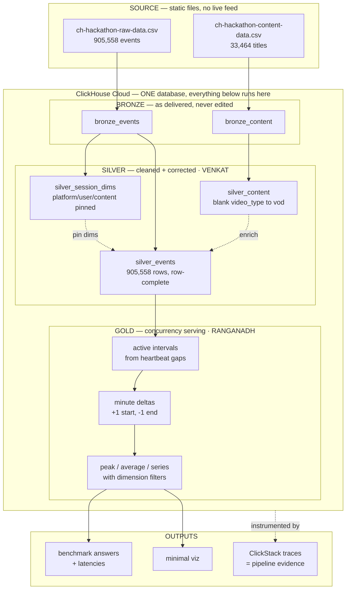

# TrueCCU — How the whole thing fits together

**Click-a-thon 2026 · SonyLIV track · foreground-only concurrency at streaming scale**

Read this to understand where your work sits. Written so a teammate joining cold, or an AI assistant with no repo access, gets the full picture.

> **Handing this to a teammate or an AI?** Start with
> [`HANDOVER_AND_JURY_PREP.md`](HANDOVER_AND_JURY_PREP.md) (what we did, what we
> did not, jury Q&A) and [`CLAUDE_RUNBOOK.md`](CLAUDE_RUNBOOK.md) (how to run
> everything, including local ClickStack). This file is the architecture view.

---

## The one-paragraph version

Sony gave us **two static CSV files**. We load them into **one ClickHouse Cloud database**. Inside that database the data moves through three layers — **bronze** (raw, untouched), **silver** (cleaned, corrected), **gold** (the concurrency serving layer). Venkat owns bronze→silver. Ranganadh owns silver→gold. The handoff between them is **a table, not a message**: Ranganadh runs `SELECT ... FROM silver_events`. There is no Kafka, no API, no file transfer between us.

---

## Clearing up three common misconceptions

### "How do we get the data in real time? From a DB? Which one?"

**There is no real-time source, and no upstream database.** We were given two files:

```
ch-hackathon-raw-data.csv        905,558 rows    232 MB
ch-hackathon-content-data.csv     33,464 rows    1.2 MB
```

They live as **Git LFS objects** in the organisers' GitHub repo. A normal `git clone` gives you 132-byte pointer stubs, not data — you need `git lfs pull` or the LFS batch API.

The problem statement talks about streaming and real-time because that is the *production* shape of the problem at SonyLIV. For the hackathon, **"real-time" is simulated**: we replay the CSV in event-time order and watch the concurrency curve build. The replayer is a demo prop for the judges, not a data source.

> If a teammate asks "which Kafka topic?" — there isn't one. If we want the live-replay demo, we build a small script that reads the CSV and inserts in timestamp order. That is the only "streaming" in this project.

### "Where do we run the SQL in `sql/`? Which database?"

**ClickHouse Cloud.** One service, provisioned on our event credits. The problem statement mandates it:

> *ClickHouse must be the primary datastore and analytical engine — ingestion, modeling, and all concurrency computation live in ClickHouse.*

The `.sql` files in this repo are **not** run locally. They are executed against that ClickHouse service, in order. The repo is version control for the SQL; ClickHouse is where it runs.

**Status: the service is not provisioned yet.** Nothing in `sql/` has executed. Every number quoted in this repo was computed in Python over the real CSVs, so the numbers are real — but the SQL syntax, dictionary layouts, and `topK`/window behaviour are unverified until it runs.

### "How do we send our data to Ranganadh? Through events?"

**We don't send anything.** Both layers live in the same ClickHouse database.

```
Venkat writes  ->  silver_events   <-  Ranganadh reads
                   (a table)
```

His concurrency code starts with:

```sql
SELECT ... FROM silver_events WHERE is_heartbeat = 1 AND is_duplicate = 0
```

That is the entire integration. No queue, no API, no export. The contract between us is the **column list of `silver_events`** — if that changes, we tell each other; otherwise we work independently.

---

## The full flow



---

## Who owns what

| Layer | Owner | Status |
|---|---|---|
| Load CSV → bronze | team | ⬜ blocked on provisioning |
| **bronze → silver** | **Venkat** | ✅ SQL written, ⬜ not executed |
| **silver → gold** | **Ranganadh** | 🟡 in progress |
| Benchmark queries | Ranganadh | ⬜ query set missing from package |
| ClickStack | team | ⬜ |
| Visualization | team | 🟡 brief written |

---

## What silver actually guarantees

`silver_events` is **one row per bronze row** — 905,558 in, 905,558 out. Nothing is deleted; corrections are applied in place and destructive judgements are exposed as flags, so both the corrected and the as-delivered reading stay available.

**Corrections applied:**

| # | Correction | Scale |
|---|---|---|
| 1 | Exact duplicates **flagged**, not dropped | 4,209 rows (0.465%) |
| 2 | Epoch-ms → `DateTime64(3)` | all rows |
| 3 | Languages → BCP 47 shortest subtag (`hin`→`hi`) | 41 variants → 15 |
| 4 | Content blank `video_type` → `vod` | 1,089 titles |
| 5 | Odd `content_id`s kept, surfaced not deleted | 1 |
| 6 | `platform`/`user_id`/`content_id` pinned per session | 95 / 120 / 1 |
| 7 | `player_version` left as-is incl. blanks (UI shows "unknown") | 1,534 blanks |

**Flags for downstream to act on:**

```sql
is_heartbeat         -- event_type = 'VideoHeartbeat'. THE liveness signal.
is_state_marker      -- pause/resume/bg/fg. Other analytics ONLY.
is_post_session_end  -- 802 events arriving after VideoSessionEnd.
is_duplicate         -- 1 = redelivery. Filter with = 0 for corrected counts.
```

---

## The rules that govern concurrency

**Jury ruling (binding).** Real-time CCU per minute uses **`event_type = 'VideoHeartbeat'` rows only**. `pause` / `resume` / `AppBackgrounded` / `AppForegrounded` must **not** gate concurrency — those events are known to go missing. They stay available for other analytics.

**The model, in full:**

> A minute counts for a session if that minute contains **at least one heartbeat**.
> `CCU(minute) = count of distinct sessions with >=1 heartbeat in that minute`

That is the whole rule. **No timeout, no grace period, no gap rule, no pause or background handling.** Heartbeats arrive every minute, so a minute with a heartbeat is a minute of viewing.

```sql
SELECT event_minute, uniqExact(video_session_id) AS ccu
FROM silver_events
WHERE is_heartbeat = 1 AND is_duplicate = 0
GROUP BY event_minute;
```

**The one assumption.** The model is correct only while the heartbeat interval stays **under 60 seconds**. On the provided day it is ~40s (p99 = 48.8s), so every active minute reliably contains a beat. If a future feed slowed to 90s, minutes of genuine viewing would contain no heartbeat and be counted inactive — CCU would be **understated, silently**. `scripts/profile_dataset.py` tests exactly this and prints a warning if p99 crosses 60s. It is the one check worth running on the unseen day.

**Reference numbers** (provided day):

| Definition | Peak CCU | Watch-minutes |
|---|---|---|
| Naive — any open session | 3,743 @ 10:59 | 189,429 |
| **Minute-presence ← the rule** | **2,882** @ 10:56 UTC | **135,929** |

**The trap that decides the scoring:** peak concurrency is **not additive across dimensions**. If Android peaks at 10:05 and Hindi peaks at 10:41, "Android AND Hindi" may peak at a third minute entirely. So we store the **per-minute series** and take `max()` *after* filtering — never a precomputed peak. Average is friendlier: total watch-time ÷ minutes, which does compose.

---

## Repo map

```
docs/
  problem/          organisers' problem statement + build guide
  dataset_details.md  data dictionary (NOTE: its 60s heartbeat claim is wrong)
  prd/              the PRD — §0.1 jury ruling, §4.3 full-dataset findings
  samples/          1000-row samples, for schema work without the 232 MB pull
  VISUALIZATION_BRIEF.md   self-contained brief for building visuals
scripts/
  profile_dataset.py     validates the model assumption + data hygiene. Not in the path.
sql/
  silver_layer.sql                     ← the deliverable
  dim_language_normalization.sql       BCP 47, two-stage, self-reporting
  checks_session_dimension_integrity.sql
```

---

## The unseen day

A **second, sealed dataset** — a different day from the same system, released to all teams simultaneously in the final hours. We run *our pipeline* on it and submit answers, latencies, and proof it ran.

Two hard rules: **hand-computed answers score zero**, and **"no pipeline evidence, no credit."**

**Run this first**, before any pipeline work:

```bash
python3 scripts/profile_dataset.py <unseen-raw.csv> <unseen-content.csv>
```

The line that matters is the model assumption. If it says `OK. p99 < 60s`, the minute-presence model holds and everything downstream is sound. If it warns, heartbeats have slowed and CCU will be understated — stop and review before submitting.

---

## Open items

**Blocking:**
1. **ClickHouse Cloud not provisioned.** Nothing has executed. Highest-value next hour.
2. **Benchmark query set absent** from the organisers' package — chase them.
3. `feature-venkat` is unpushed; Ranganadh needs `silver_events` to build against.

**Decisions outstanding:**
- Do the 802 post-`VideoSessionEnd` events extend a session? Flagged, not decided. (Ranganadh)
- Should a mid-session audio-track switch split interval attribution? 81% of sessions change `audio_language`.

**Known gap:** the provided data has **zero open sessions** and **zero missing background markers**. Both cases appear only on the unseen day, so incremental-update handling cannot be tested as-is — it needs a synthetic harness that truncates sessions at an artificial watermark.
