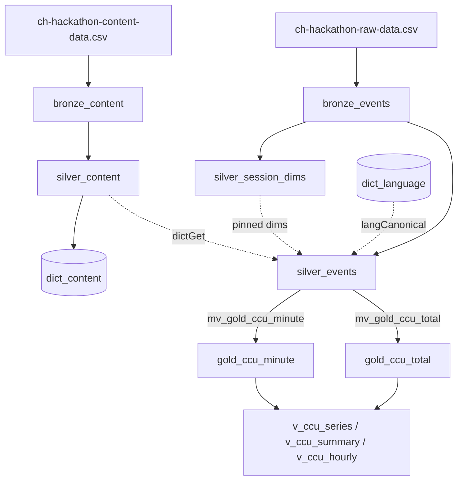

# true_ccu

Viewer Content Analytics for SonyLIV use case — foreground-only concurrency (CCU) at streaming scale, on ClickHouse.

> **New here? Four files, in this order.**
> 1. [`HANDOVER_AND_JURY_PREP.md`](HANDOVER_AND_JURY_PREP.md) — what was built, what deliberately was not, and twelve jury questions with answers.
> 2. [`CLAUDE_RUNBOOK.md`](CLAUDE_RUNBOOK.md) — get it running on a fresh machine, ClickStack included. Written to be handed to an AI assistant verbatim.
> 3. [`UNSEEN_DAY_RUNSHEET.md`](UNSEEN_DAY_RUNSHEET.md) — the exact sequence on submission day, load to answers.
> 4. [`PERFORMANCE.md`](PERFORMANCE.md) — why every sort/partition/group key is what it is, with the measurements behind each.
>
> **Result on the unseen day:** peak **22,498** concurrent sessions at 2026-07-31 11:16 UTC, 1,441,915 watch-minutes, from 7,000,000 events. All four verification checks pass.

---

## Contents

1. [Users & primary jobs](#users--primary-jobs)
2. [Assumptions](#assumptions)
3. [Data modelling](#data-modelling)
   - [The rules the model is built on](#the-rules-the-model-is-built-on)
   - [Bronze](#bronze--sql00_bronzesql) · [Language dimension](#language-dimension--sql10_languagesql) · [Silver](#silver--sql20_silversql) · [Gold](#gold--sql30_goldsql-sql40_gold_totalsql)
   - [Schema evolution](#schema-evolution--sql50_add_unseen_dimensionssql) · [Projections](#projections--sql60_projectionssql) · [Verification](#verification--sql90_verifysql)
4. [ClickHouse services used](#clickhouse-services-used)
5. [Tech stack](#tech-stack)
6. [Future enhancements](#future-enhancements)

---

## Users & primary jobs

| User | Job to be done | Requirement it drives |
|---|---|---|
| Live-ops engineer | "Is concurrency dropping because the match ended, or because we're breaking?" | Minute-grain freshness; decline detection |
| Ad ops / monetization | "How many foreground viewers on CTV in India right now?" | Multi-dimension filters at low latency |
| Content team | "What was peak concurrency for this title, and when?" | Peak **and its timestamp**, per content |
| Capacity / SRE | "What's the peak for today so far, by platform?" | Peak over arbitrary ranges + grains |

---

## Assumptions

- **Heartbeat every minute** — a minute with no heartbeat means the session was inactive for that minute.
- **State markers ignored** — foreground/background and pause/play do not gate CCU; they are kept for other analytics.
- **Data defaults** — blank `video_type` is `vod`, and language mappings are curated from the variants observed in the data.
- **Streaming in production** — events would arrive from Kafka or Kinesis; the CSV load is a stand-in.

---

## Data modelling

A medallion pipeline: **bronze** (as delivered) → **silver** (cleaned, conformed, enriched) → **gold** (the minute-grain serving layer). Each layer owns one job, so a correction never leaks into concurrency semantics and a semantics change never requires a reload.

SQL lives in [`sql/`](sql/) on `feature-venkat` and runs in file-number order —
`00_bronze` → `10_language` → `20_silver` → `30_gold`, with `40_gold_total`, `50_add_unseen_dimensions` and `90_verify` invoked by name.

### The rules the model is built on

- **Liveness = heartbeat presence.** A minute counts for a session if it contains at least one `event_type = 'VideoHeartbeat'` row. `pause` / `resume` / `AppBackgrounded` / `AppForegrounded` are preserved for other analytics but do **not** gate CCU — those markers are documented as best-effort and go missing.
- **Peak is never stored.** `max()` does not decompose across a filter predicate: Android may peak at 10:05 and Hindi at 10:41 while "Android AND Hindi" peaks at a third minute. Gold stores the per-minute **series**; peak is `max()` over the filtered series at query time.
- **Exact, not approximate.** `uniqExactState`, not `uniqState` (HyperLogLog). We are scored against a private ground-truth key, so an approximation error is a correctness risk for no benefit at this scale.
- **Nothing is deleted.** Destructive corrections are expressed as flag columns, so both the corrected and the as-delivered reading stay available from one table.

### Bronze — [`sql/00_bronze.sql`](sql/00_bronze.sql)

Exactly as delivered, never edited. `event_timestamp` stays epoch-ms `Int64` here and converts in silver, so bronze remains a faithful copy of the CSV.

| Table | Engine | Ordering key |
|---|---|---|
| `bronze_events` | `MergeTree` | `(video_session_id, event_timestamp)` |
| `bronze_content` | `MergeTree` | `content_id` |

### Language dimension — [`sql/10_language.sql`](sql/10_language.sql)

41 raw `audio_language` variants for ~15 real languages (`hin` / `HIN` / `hin-hindi`, plus `jap` and `jpn` both meaning Japanese, plus sentinels and one `-soundhandler`). Unnormalized, `audio_language = 'hin'` silently drops 92,635 Hindi rows — which reads as a concurrency bug, not a dimension bug.

Two stages, because neither alone suffices:

| Object | Type | Role |
|---|---|---|
| `langMechanical(raw)` | UDF | Deterministic: lower → trim → head token before `-` → `[a-z]` only. 41 variants → 18 groups, no maintenance |
| `dim_language_map` | `MergeTree` ORDER BY `token` | Curated map to BCP 47 / ISO 639-1 canonicals + display names. 18 → 15 |
| `dict_language` | `DICTIONARY` `COMPLEX_KEY_HASHED` | O(1) lookup, `LIFETIME(MIN 300 MAX 600)` |
| `langCanonical(raw)` / `langDisplay(raw)` | UDF | The call sites. Unknown tokens pass through **unchanged** rather than collapsing to `unknown` — a new language stays countable while we notice it |
| `dim_language_unmapped` | `SummingMergeTree(events)` | Safety net |
| `mv_language_unmapped` | **MV** → `dim_language_unmapped` | Records any variant the map doesn't recognise. A new value on the unseen day surfaces as a row to review, never as a silent extra category. Adding support is one `INSERT` |

Sentinels are kept distinct where they mean different things: `zxx` ("subtitles off" — a real user state) never folds into `und` ("we don't know").

### Silver — [`sql/20_silver.sql`](sql/20_silver.sql)

Data correction only; concurrency logic lives downstream. Silver exposes the signals that logic needs (`is_heartbeat`, `is_post_session_end`) without deciding how they are used.

| Table / object | Engine | Notes |
|---|---|---|
| `silver_content` | `MergeTree` ORDER BY `content_id` | 1,089 blank `video_type` → `vod` (99.4% of the non-blank population). Only unparseable ids rejected — the odd `-987654322` is kept, since the unseen day may reference it |
| `dict_content` | `DICTIONARY` `HASHED` | Enrichment at ingest, so the serving layer needs no runtime join |
| `silver_session_dims` | `MergeTree` ORDER BY `video_session_id` | Pins the dimensions that must not vary within a session |
| `silver_events` | `MergeTree`, `PARTITION BY toDate(event_minute)`, ORDER BY `(event_minute, platform, content_id, video_session_id)` | One row per bronze row, cleaned and enriched. `event_minute` is pre-bucketed for minute-grain serving |

Seven corrections, measured on the provided 905,558-row day:

1. 4,209 exact-duplicate rows **flagged**, not removed (0.465%, 862 sessions)
2. epoch-ms → `DateTime64(3)`
3. audio/subtitle language canonicalized (41 → 15)
4. content `video_type`: 1,089 blanks → `vod`
5. `content_id` values that cannot be an `Int64` rejected
6. `platform` / `user_id` / `content_id` pinned per session (95 / 120 / 1 ambiguous)
7. `player_version` left as-is including blanks (UI renders `unknown`)

Two decisions worth the detail:

- **Duplicates are flagged, not dropped, and not handled by `ReplacingMergeTree`.** Replacing collapses rows only during background merges, which are asynchronous and not guaranteed — a `SELECT` without `FINAL` can return duplicates indefinitely and the count *changes* as merges land, which makes results irreproducible. So duplicates are identified once, deterministically, on the way into silver, keyed on the **full row**: two rows differing only in `subtitle_language` are two events (the user toggled subtitles at that instant), not one sent twice. Duplication is 65× uneven across clients (5.103% on Mweb vs 0.078% on JIO_ANDROID_TV), so leaving it in distorts cross-platform comparison — but the judges' ground truth may have been computed on raw data, so deleting rows would make that reading unreproducible. One `UInt8` column keeps both: `WHERE is_duplicate = 0` is the recommended default.
- **Session-pinned vs event-level dimensions.** 95 sessions carry two platforms, 120 two `user_id`s, 1 two `content_id`s — Android form-factor detection is re-derived on every lifecycle transition and returns an inconsistent device class (94 of the 95 flip 2–13 times, which is classification noise, not a device handoff). Left unpinned under a delta model, a session's `+1` lands under one value and its `-1` under another and the filtered running sum never returns to zero. Pinned by majority vote (`topK(1)`), deterministic and idempotent under replay. **Not** pinned: `player_version` (14.7% vary), `audio_language` (81%), `subtitle_language` (99.96%) — those change legitimately mid-session when the user switches track, so they are event attributes.

### Gold — [`sql/30_gold.sql`](sql/30_gold.sql), [`sql/40_gold_total.sql`](sql/40_gold_total.sql)

The dashboard must never query `silver_events`: judges inspect what a query *reads*, not just how fast it returns, and aggregating 905,558 event rows on every filter change would look fast at this scale and still be the wrong design at 100×.

| Object | Type | Role |
|---|---|---|
| `gold_ccu_minute` | `AggregatingMergeTree`, `PARTITION BY toDate(minute)` | Minute × 10 dimensions. `sessions` / `users` are `AggregateFunction(uniqExact, String)` |
| `proj_platform_first` | `PROJECTION` | Dimension-first access path `(platform, minute)` for wide-range/selective-platform queries; ClickHouse picks whichever reads less |
| `gold_ccu_total` | `AggregatingMergeTree` ORDER BY `minute` | One row per minute, no dimensions — the unfiltered default view and the first question asked. `minute` uses `CODEC(DoubleDelta, ZSTD(1))` |
| `mv_gold_ccu_minute` | **MV** → `gold_ccu_minute` | Fires on every `silver_events` insert |
| `mv_gold_ccu_total` | **MV** → `gold_ccu_total` | Same source rows and same predicate, so the two tables are two aggregations of one set of rows rather than two pipelines that can drift |
| `v_ccu_series` | **VIEW** | The minute-grain series. Every other answer derives from it |
| `v_ccu_summary` | **VIEW** | `peak_ccu`, `peak_minute` (`argMax`), `avg_ccu`, `watch_minutes`, `minutes_covered` |
| `v_ccu_hourly` | **VIEW** | Hour grain: peak is the `max()` of the minutes inside each bucket, not an average of them and not a separately stored aggregate |

Both MVs read `WHERE is_heartbeat = 1 AND is_duplicate = 0`.

Ordering key is **time-first** — `(minute, platform, content_id, video_type, category, country, audio_language, subtitle_language, app_version, player_version)` — because every query carries a time range while only some carry a dimension filter, so leading on `minute` prunes granules on the one predicate that is always present. The projection covers the opposite pattern.

`subtitle_language`, `app_version` and `player_version` cost only 9% more rows (95,977 → 105,083) and are named in the PRD's filter-friendliness goal; leaving them out would mean a filter the dashboard simply cannot express, which is a worse failure than size.

**Why a distinct count at all, given pinned dimensions?** `platform`, `content_id`, `video_type` and `category` are pinned per session, so their session sets are disjoint and a plain `sum()` would be exact. `audio_language` is not pinned — 81% of sessions change it mid-session — so one session can split across two rows in the same minute and a sum would double-count it. `uniqExactMerge` is correct under *any* filter combination.

**Two tables, one truth.** The API routes to `gold_ccu_total` when no dimension filter is set (one row and one state per minute, instead of ~27) and falls back to `gold_ccu_minute` otherwise. `40_gold_total.sql` ends with a `PASS`/`FAIL` check that the two agree on peak and watch-minutes; if it ever fails, the fast path is lying and the API must not use it.

### Schema evolution — [`sql/50_add_unseen_dimensions.sql`](sql/50_add_unseen_dimensions.sql)

The unseen dataset adds `video_resolution` (raw) and `show_name` (content). Absorbed by `ALTER` alone — additive, idempotent, no rebuild, no change to derivation logic. Two constraints found the hard way and documented in the file:

- `ADD COLUMN` and `MODIFY ORDER BY` must be **one statement**; split in two, the ADD succeeds, the MODIFY fails with `BAD_ARGUMENTS`, and the column is permanently ineligible for the sort key.
- A declared `DEFAULT ''` disqualifies a column from the sort key entirely. Omitted deliberately — the implicit default for `LowCardinality(String)` is already `''`.

`video_resolution` is appended at the **end** of the sort key: a filter on a column that is not first after `minute` gets no granule pruning, so its remaining job is compression, and the highest-cardinality columns belong last. Note the cost is multiplicative, not additive — an Nth dimension with *k* values multiplies gold's row count by up to *k*, which is exactly why `gold_ccu_total` exists.

> **Run-order caveat:** `20_silver.sql` and `30_gold.sql` already reference `video_resolution` / `show_name`, so `50_add_unseen_dimensions.sql` must be applied against `bronze_*` before those stages run, and re-applied to `gold_ccu_minute` after `30_gold.sql` creates it.

### Verification — [`sql/90_verify.sql`](sql/90_verify.sql)

Read-only, safe to re-run, asserts **invariants rather than numbers** — hard-coding a peak of 2,882 would turn a correct run on different data into a failure.

1. **Row completeness** — silver is one row per bronze row by contract; drift means a correction deleted something it was only meant to flag.
2. **The model assumption** — is a beatless minute ever a *viewing* minute? A cadence percentile cannot answer this (one beat instant emits several rows, so row-to-row gaps are mostly 0s, and 47,008 beatless minutes exist anyway). Measured directly instead: on the provided day every one of the 5,701 gaps opens in a minute that also carries an explicit `pause` or `AppBackgrounded`. The user stopped watching; the pipeline is right to stop counting.
3. **Gold agrees with silver** — catches a broken MV, a stale backfill, or a double-inserted backfill: the failure modes that produce a plausible-looking wrong answer rather than an error.
4. **Pinned dimensions held** — no session spans two values for `platform` / `user_id` / `content_id`.
5. **The headline** — reported, not asserted. On the provided day: peak 2,882 CCU at 2026-07-26 10:56, 135,929 watch-minutes.

Incremental proof is `SELECT count() FROM system.mutations WHERE not is_done` staying empty: late heartbeats and still-open sessions land in gold via the MVs, and `AggregatingMergeTree` merges the new `uniqExact` states into the existing ones — no rebuild, no mutation.

[`sql/checks_session_dimension_integrity.sql`](sql/checks_session_dimension_integrity.sql) holds the per-dimension integrity analysis that produced the pinning rule. `sql/silver_layer.sql` and `sql/dim_language_normalization.sql` are the earlier standalone drafts, superseded by the numbered stages.

---

## ClickHouse services used

- **ClickHouse OLAP DB (ClickHouse Cloud)** — the primary datastore for all SonyLIV data.
- **ClickStack** — observability for the pipeline, API and dashboard.

---

## Tech stack

- **ClickHouse Cloud** — bronze/silver/gold tables, materialized views, dictionaries and SQL UDFs.
- **Node.js + Express** — read-only API in front of the gold serving layer ([`app/server`](app/server)).
- **React 19 + TypeScript + Vite** — dashboard SPA ([`app/web`](app/web)).
- **Hand-rolled SVG charts** — no chart library, nothing loaded from a CDN.
- **nginx** — serves the built bundle and proxies `/api`, so credentials never reach the browser.
- **Docker + Docker Compose** — the whole demo starts declaratively.
- **OpenTelemetry (Node SDK, OTLP/HTTP)** — traces and metrics from both the API and the pipeline runner.
- **HyperDX all-in-one (ClickStack)** — telemetry backend, on its own ClickHouse + Mongo.
- **Node scripts** — [`scripts/run_pipeline.mjs`](scripts/run_pipeline.mjs) runs the SQL stages and emits a trace per run as evidence.
- **Python** — [`scripts/profile_dataset.py`](scripts/profile_dataset.py) for the dataset profile behind the PRD's findings.
- **oxlint** — linting.

---

## Future enhancements

- **Live event integration** — ingest from Kafka or Kinesis instead of CSV upload.
- **Query profiling at scale** — profile against large data and optimise further.
- **Dashboard** — improve usability and surface more insights.
- **Natural language interface** — query the serving layer conversationally via AI agents.
