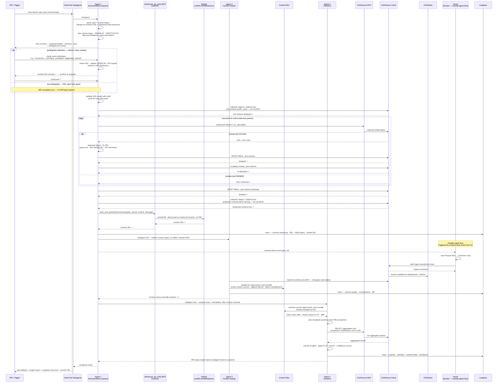
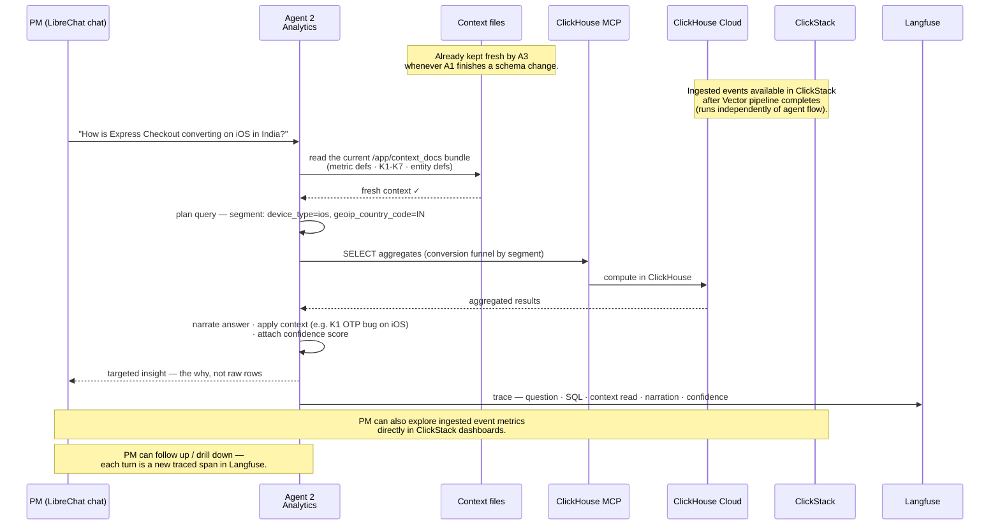

# Atlys Track — System Architecture

**Team:** till_the_last_row

An agentic analytics system that turns a feature spec into instrumented ClickHouse
tables and PM-ready insights, fully traced. Three agents orchestrated by LibreChat
**Subagents**, running on ClickHouse Cloud, observed through Langfuse.

The system runs in **two modes**:
- **Pipeline mode (automated):** a feature spec is dropped in and the **Instrumentation
  Agent orchestrates the full chain as its parent** — it designs + applies + pushes the
  schema, then calls the **Context Agent** as a subagent (refresh context), then the
  **Analytics Agent** as a subagent (produce insights), keeping conversation control and
  combining the result. One traced run produces tables + context update + insight report +
  `insights.json`. This is what the unseen 6th spec flows through.
- **Interactive mode (on-demand):** a PM chats with the **Analytics Agent** in
  LibreChat to ask ad-hoc questions ("how is Express Checkout converting on iOS in
  India?"). The agent reasons over the same fresh context, pushes aggregation SQL into
  ClickHouse via MCP, and narrates an answer — every turn traced in Langfuse.

---

## Stack at a glance

| Concern | Choice |
| --- | --- |
| Agent runtime + orchestration | **LibreChat** (Agents + **Subagents** — Instrumentation is the parent, calls Context then Analytics) |
| Datastore (mandated) | **ClickHouse Cloud** (`atlys` database, 8 base tables loaded) |
| Schema DDL (Agent 1) | Applied to **ClickHouse Cloud** via `clickhouse_write_tools` MCP (`run_query`); validated first (static lint + throwaway `__val` table) |
| DB read access for agents (SELECT) | **`clickhouse-cloud` MCP** (hosted, read-only — analysis queries + introspection; not DDL) |
| Schema version control | Custom **git MCP** (`clickhouse_git_write` → `write_and_push`) → `srinidhi-22/tillthelastrow`, `Atlys/schemas/` — **direct push to `master`** (no PR) |
| Observability (mandated) | **Langfuse** (native LibreChat integration — all three agents traced; the pipeline is one chain-wide trace) |
| Living context layer | **Markdown OKF bundle** on disk at `librechat/context_docs/` → `/app/context_docs`, read/written via the `filesystem` MCP (see "Where context is stored" below) |
| LLM | **Anthropic `opus-4.x` via a LiteLLM gateway** (both agents; authenticated by `LITELLM_API_KEY`) |

---

## Where the context layer is stored (and why)

The living context is an **Open Knowledge Format (OKF) bundle of Markdown files** at
`librechat/context_docs/` (mounted into LibreChat at `/app/context_docs`), maintained by the
Context Agent through the `filesystem` MCP. Layout:

```
context_docs/
  overview.md          # business summary + context_version (bumped every update)
  index.md             # generated index of all concepts
  log.md               # newest-first changelog (the context-freshness proof)
  entities/            # one file per entity concept
  metrics/             # one file per metric (formula, dimensions, serving MV)
  tables/              # one file per table concept
  relationships/       # entity/table relationships
  known-issues/        # k1..k7 documented issues (used for insight correlation)
  contradictions/      # explicit conflicts surfaced from the imperfect base context
```

**Why files (not a ClickHouse table or vector store):**
- **Legible + diffable** — every context update is a Git-style Markdown diff a judge can read;
  the `overview.md` `context_version` + `log.md` entry make freshness *provable* in the trace.
- **One source of truth, cheap handoff** — the Analytics Agent reads the same mounted bundle at
  query time, so it always reasons from the just-updated context. Subagent calls pass only file
  pointers, not payloads.
- **No embedding drift** — a small, curated concept set doesn't need semantic search; exact
  file reads avoid the staleness/ambiguity a vector store would add.
- A ClickHouse `context_registry` mirror is possible for queryable lineage but is intentionally
  optional — the files remain authoritative.

---

## High-level architecture

```mermaid
flowchart TB
    subgraph Input["Inputs / Triggers"]
        SPEC["Feature Spec<br/>(free-form — no fixed shape,<br/>incl. unseen 6th spec)<br/><i>pipeline mode</i>"]
        BASE["base_context.md<br/>(imperfect, planted contradictions)"]
        PM["PM question<br/>(chat)<br/><i>interactive mode</i>"]
    end

    subgraph LibreChat["LibreChat  —  Orchestration + Agent Runtime (Subagents)"]
        direction TB
        A1["Agent 1 — Instrumentation<br/>(pipeline PARENT / orchestrator)"]
        A3["Agent 3 — Context Keeper<br/>(subagent, isolated context)"]
        A2["Agent 2 — Analytics<br/>(subagent, isolated context)"]
        A1 -->|"① subagent call<br/>(after schema pushed)"| A3
        A1 -->|"② subagent call<br/>(after context vX)"| A2
    end

    subgraph GH["GitHub — Schema Version Control"]
        GHREPO["srinidhi-22/tillthelastrow<br/>Atlys/schemas/{spec_id}.sql<br/>direct push to master (no PR)"]
    end

    subgraph Tools["Tools (MCP)"]
        MCP["ClickHouse MCP Server<br/>(SELECT + smoke-test queries)"]
        GHMCP["clickhouse_git_write MCP<br/>(custom — write_and_push:<br/>commit + direct push to master, no branch/PR)"]
    end

    subgraph CHCloud["ClickHouse Cloud  (atlys db)"]
        EXIST["8 existing tables<br/>~2.5M rows (funnel + support)"]
        NEW["New instrumented tables<br/>+ materialized views<br/>(DDL applied directly by A1)"]
        CS["ClickStack<br/>event dashboards · metrics<br/>on top of ingested data"]
    end

    subgraph Context["Context Layer (markdown files)"]
        LIVE["/app/context_docs OKF bundle<br/>overview.md · log.md · metrics/ · tables/<br/>known-issues K1-K7 · contradictions/"]
    end

    subgraph Obs["Langfuse  —  Observability"]
        LFA1["A1 traces<br/>schema reasoning · DDL"]
        LFA3["A3 traces<br/>context update · diffs"]
        LFA2["A2 traces<br/>queries · narration"]
    end

    subgraph VEC["Vector Data Pipeline  ── separate Docker container ──"]
        direction LR
        PARQ["Parquet files<br/>Atlys/data/*.parquet"]
        VTRANSFORM["Vector<br/>read → transform → ingest"]
        PARQ --> VTRANSFORM
    end

    %% Inputs
    SPEC --> A1
    BASE --> LIVE
    PM -->|ad-hoc question| A2

    %% A1: DDL preview + optional PM clarification before applying
    A1 -->|"DDL preview + ambiguity list"| PMFB["PM review<br/>clarify metrics / keys<br/>if ambiguous"]
    PMFB -->|"confirmed ✓<br/>(or clarification provided)"| A1

    %% A1: test schema → smoke-test loop → promote to production
    A1 -->|"deploy _test schema"| TESTSCH["_test schema<br/>on ClickHouse Cloud"]
    TESTSCH -->|"smoke-test SELECT<br/>via MCP"| SMOKEOK{"pass?"}
    SMOKEOK -->|"❌ fail — fix recursively<br/>DROP · revise DDL · re-deploy"| TESTSCH
    SMOKEOK -->|"✅ pass<br/>DROP _test"| NEW

    A1 -->|"commit + direct push via clickhouse_git_write MCP"| GHMCP
    GHMCP -->|"write_and_push · direct push to master (no PR)"| GHREPO

    %% A1: smoke-test via MCP after DDL
    A1 -->|"smoke-test SELECT after DDL"| MCP
    MCP --> EXIST
    MCP --> NEW

    %% A2: analytics queries via MCP
    A2 -->|SELECT aggregates| MCP

    %% Context propagation via subagent orchestration
    A3 <-->|read / write| LIVE
    A2 -.->|"reads freshly-bumped bundle<br/>after A1 invokes it (post-Context)"| LIVE

    %% Output
    A2 --> OUT["PM-ready insight report<br/>(pipeline) or chat answer<br/>(interactive)"]

    %% All agents → Langfuse
    A1 -.-> LFA1
    A3 -.-> LFA3
    A2 -.-> LFA2

    %% Vector pipeline — outside agent flow, triggered after A1 finishes
    A1 -.->|"③ schema-done event<br/>outside agent flow"| VTRANSFORM
    VTRANSFORM -->|bulk ingest transformed rows| EXIST

    %% ClickStack on top of ClickHouse
    EXIST --> CS
    NEW --> CS

    classDef mandated fill:#1f6feb,stroke:#0d1117,color:#fff
    classDef store fill:#238636,stroke:#0d1117,color:#fff
    classDef vector fill:#6e40c9,stroke:#0d1117,color:#fff
    classDef gh fill:#30363d,stroke:#8b949e,color:#e6edf3
    classDef lftrace fill:#b45309,stroke:#0d1117,color:#fff
    classDef human fill:#9e6a03,stroke:#d29922,color:#fff
    classDef testnode fill:#6e3b00,stroke:#d29922,color:#fff
    classDef decision fill:#21262d,stroke:#8b949e,color:#e6edf3
    class CHCloud,Obs mandated
    class Context store
    class VEC vector
    class GH gh
    class LFA1,LFA2,LFA3 lftrace
    class PMFB human
    class TESTSCH testnode
    class SMOKEOK decision
```



---

## Agent pipeline — pipeline mode (automated, sequence)



---

## Interactive mode — PM asks the Analytics Agent (sequence)

The PM does not have to wait for a full pipeline run. They can chat directly with the
Analytics Agent for on-demand insights. It uses the **same** fresh context and the
**same** compute-in-ClickHouse discipline, and every turn is traced.



---

## Design principles (map to judging)

- **Compute in ClickHouse, narrate in LLM.** Agent 2 only ever pulls aggregates via
  MCP — never raw rows. Guards against token burn. MCP is for SELECT/analytics only;
  DDL goes direct from Agent 1 to ClickHouse Cloud.
- **Schema versioned in GitHub via git MCP.** Agent 1 uses the custom **clickhouse_git_write
  MCP** (`write_and_push(relative_path, content, message)`) to commit
  `Atlys/schemas/{spec_id}.sql` and **push directly to `master` (no branch, no PR)** —
  schema changes are auditable and reproducible, and no direct git CLI access is needed by
  the agent.
- **Subagent orchestration for context freshness.** Instrumentation (A1) is the parent:
  after pushing the schema it invokes Context (A3) as a subagent to update the
  /app/context_docs bundle, then — once Context returns — invokes Analytics (A2) as a
  subagent. A2 reads the freshly-bumped bundle, so it never reasons from stale context.
- **Vector pipeline is decoupled from agent flow.** The Vector Docker container is
  triggered by Agent 1's schema-done event but runs independently — it reads Parquet
  files, transforms and bulk-ingests rows into ClickHouse. Failure or latency in Vector
  does not block the agent orchestration.
- **ClickStack for event visibility.** Ingested events from Vector are immediately
  surfaced in ClickStack dashboards and metrics — PMs can explore raw event trends
  without waiting for Agent 2 to generate a report.
- **No trace, no credit.** All three agents (A1, A2, A3) push individual named spans
  to Langfuse — schema reasoning, DDL, context diffs, SQL queries, and narration are
  all observable.
- **Generality over hardcoding.** Agent 1 parses free-form specs — no assumption of
  a fixed `spec.md + events.ndjson` shape — so the unseen 6th spec, whatever format
  it arrives in, flows through the same path with no code changes.
- **Two modes, one agent.** The Analytics Agent serves both the automated pipeline
  (full insight report) and interactive PM chat (on-demand answers) using the same
  context + MCP query discipline. Every chat turn is traced ("no trace, no credit"
  holds for interactive answers too).

---

## Data flow summary

**Pipeline mode:**

1. **Spec in** → the Instrumentation Agent (A1, parent) kicks off orchestration via
   LibreChat Subagents. No assumed spec format/shape.
2. **Agent 1** parses the spec, validates DDL locally with chdb, applies `CREATE TABLE /
   MV` **directly to ClickHouse Cloud** (not via MCP), smoke-tests via MCP, then commits
   `Atlys/schemas/{spec_id}.sql` and **pushes directly to `master` (no PR)** via the
   clickhouse_git_write MCP.
3. **Agent 1 invokes Agent 3 (Context) as a subagent**, and separately emits a
   **schema-done event** outside the agent flow that starts the **Vector Docker container**.
4. **Vector pipeline** (separate Docker container, outside agent flow) reads
   `Atlys/data/*.parquet`, transforms rows, and bulk-ingests them into ClickHouse Cloud.
   **ClickStack** then makes the ingested events available as dashboards and metrics.
5. **Agent 3** (subagent) introspects the new tables and updates the **/app/context_docs
   bundle** (bump context_version, append log.md, new event defs, detected contradictions,
   diffs), then returns to Agent 1. Traces go to Langfuse.
6. **Agent 1 invokes Agent 2 (Analytics) as a subagent** after Context returns; Agent 2
   reads the freshly-bumped **/app/context_docs bundle**, pushes aggregation SQL into
   ClickHouse via MCP, and narrates PM-ready insights with confidence scores. Traces go to
   Langfuse.
7. **Out** → new table(s) + insight report + Langfuse trace link + GitHub commit URL.

**Interactive mode:**

1. **PM asks** → chats with Agent 2 directly in LibreChat, no pipeline run required.
2. **Agent 2** reads the current **/app/context_docs bundle** (already kept fresh by Agent 3
   from the last pipeline run), pushes aggregation SQL into ClickHouse via MCP, and narrates
   a targeted answer with confidence score.
3. **PM can also explore** ingested event metrics directly in **ClickStack** dashboards.
4. **Langfuse** traces every chat turn (question, SQL, context read, narration).
5. **Out** → chat answer, with the option to drill down in follow-up turns.
