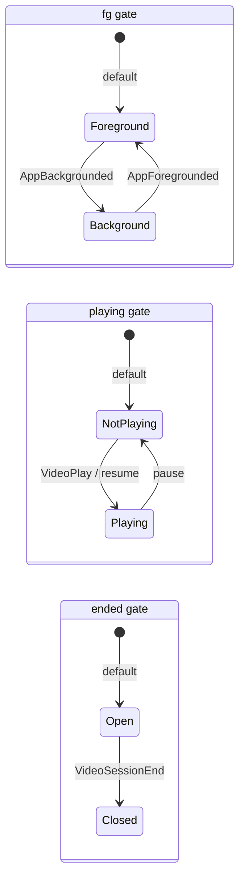
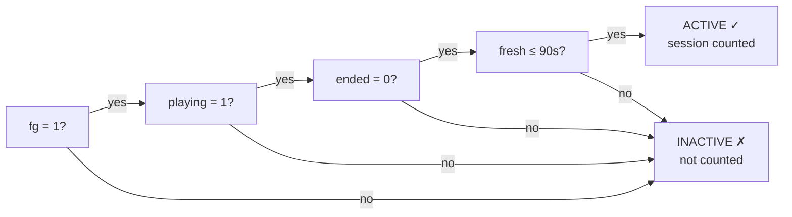
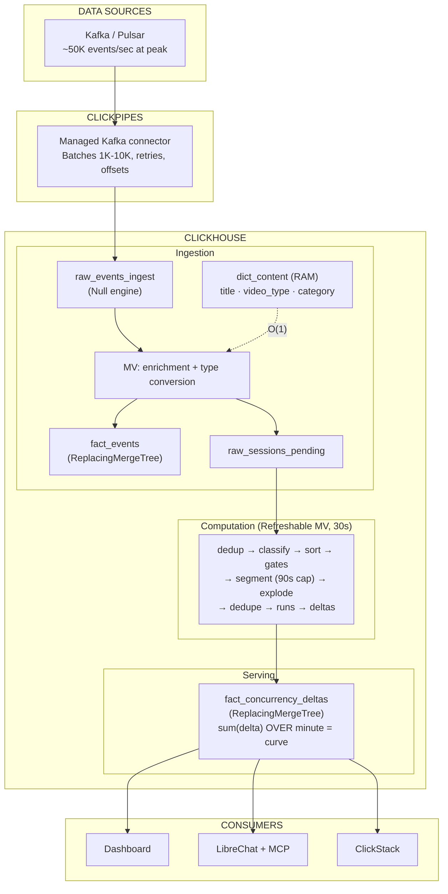
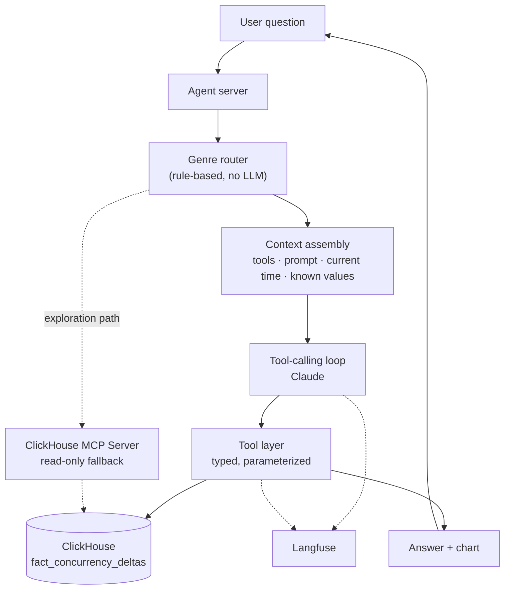
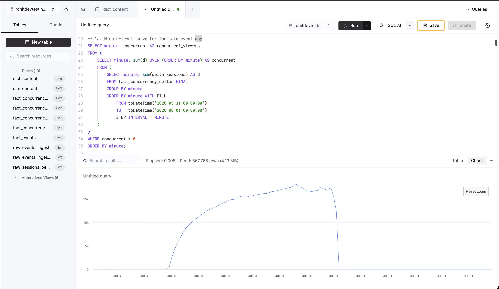

# Architecture: Foreground-Only Concurrency at Streaming Scale

Real-time concurrent viewer counting for SonyLIV, built entirely on ClickHouse. Excludes
backgrounded and paused sessions, which is the failure mode the whole problem exists to prevent.

## 01 · The problem

"How many people are watching right now?" sounds simple. In practice, not every open session is
actively watching. Users background the app, pause, or silently disconnect. Counting those
overstates the audience. The system must identify only truly active playback intervals and
compute concurrency over those, at a scale where per-minute row explosion is too large and
recomputing from raw history on every query is too slow.

## 02 · How we define "active"

Three independent gates, carried forward through the event stream:

| Gate | Signals | Default |
|------|---------|---------|
| fg | `AppForegrounded → 1`, `AppBackgrounded → 0` | 1 |
| playing | `VideoPlay / resume → 1`, `pause → 0` | 0 |
| ended | `VideoSessionEnd → 1` (absorbing) | 0 |

A session is counted at time `t` when all three hold simultaneously:

```
active(t) = fg=1 AND playing=1 AND ended=0 AND fresh (≤90s since last event)
```

The gates are independent, not collapsed into one state. This matters for the case
`PLAY → BG → FG`: playing stays 1 through the background/foreground cycle, so the session
is active again immediately after FG without needing a new PLAY. A collapsed machine would
undercount by ~3%.

The 90s cap auto-closes sessions that stop sending events. Measured on the data: 99.3% of
legitimate heartbeat gaps are under 90s.





## 03 · Architecture



## 04 · The computation pipeline (9 steps, one SQL query)

The entire state machine runs inside a single Refreshable MV. No external process, no cron,
no Python, no Spark, no Flink. All computation happens inside ClickHouse itself, using native
SQL with array functions. The only thing outside ClickHouse is the Kafka source, everything
from ingestion to enrichment to state machine execution to serving lives in the same cluster.

| Step | What | Why |
|------|------|-----|
| 1. DEDUP | Remove exact duplicate events | 4,210 dupes in training data; a duplicated boundary permanently skews every later minute |
| 2. CLASSIFY | 47 (event_type, event) pairs → 9 signals | Unknown values fall to "HB" (liveness only), can never inflate concurrency |
| 3. SORT | Per session, order by (event_ts, tie_break) | 161K same-ms ties need deterministic ordering; openers before closers |
| 4. GATES | Three forward-fills: fg, playing, ended | Independent carry-forward via `arrayFill`; no UDF needed |
| 5. SEGMENT | Each event → `[ts, min(next_ts, ts+90s)]` | The 90s cap bounds abandoned sessions |
| 6. EXPLODE | Active segments → list of minutes they touch | A segment touching a minute at all occupies it |
| 7. DEDUPE | Distinct (session, minute) | Fixes intra-minute flapping, 12.75% of session-minutes affected |
| 8. RUNS | Merge contiguous active minutes | 127K session-minutes → 16K runs; two deltas per run instead of per minute |
| 9. DELTAS | +1 at run start, -1 at run end, pre-aggregated | Required: ReplacingMergeTree drops unsummed duplicates at same key |

## 05 · Design choices and trade-offs

### Recompute vs incremental

We recompute the full session state every 30 seconds rather than maintaining incremental deltas
with checkpoints.

| | Recompute (chosen) | Incremental |
|---|---|---|
| Correctness | Always correct by construction | Accumulates drift; checkpoint races lose events |
| Late arrivals | Next refresh absorbs them | Needs retraction logic |
| Complexity | One query, no bookkeeping | Checkpoint table, session tracking, sweep, tombstones |
| Cost | O(changed sessions × events per session) | O(new events only) |
| Break-even | ~100K sessions at 30s cadence | Beyond 1M sessions |

At 106K sessions and 6.9M events, the recompute runs in 3-5 seconds, well inside the 30s window.

### ReplacingMergeTree vs SummingMergeTree

Each refresh replaces the previous computation for a session. SummingMergeTree would accumulate,
meaning a corrected recompute adds on top of the old wrong answer instead of replacing it.
Trade-off: queries must use `FINAL`, slightly more expensive at read time.

### Null engine ingestion

ClickPipes writes raw strings to a Null engine table. An MV handles type conversion and dictionary
enrichment. Zero storage cost for the landing table. Kafka format changes only touch the MV.

### 30-second refresh

Balances freshness vs compute cost. Worst-case latency from event arrival to dashboard: ~60s
(30s ClickPipes batch + 30s refresh).

### 90-second liveness cap

Each event's active segment extends at most 90 seconds into the future (until the next event
arrives or 90s passes, whichever is sooner). This is what closes sessions that silently die
without sending a VideoSessionEnd.

Why 90s specifically: heartbeats arrive every 30-40 seconds. A gap of 90s means two consecutive
heartbeats were missed. We measured on the training data: 99.3% of all legitimate inter-event
gaps within an active session are under 90s. Setting the cap lower (say 60s) would falsely close
sessions during normal network jitter. Setting it higher (say 120s) would keep phantom sessions
alive too long, inflating the count.

The trade-off: a session that genuinely disconnects at time T continues to be counted until
T+90s. At peak (18K concurrent), this means up to ~2 minutes of residual overcount for
disconnected sessions. In practice, since most sessions send an explicit VideoSessionEnd, the
90s cap only fires for crash/kill scenarios (~4% of sessions in the training data had no END
event).

### Tie-break priority

161K same-millisecond ties. Without deterministic ordering, same input gives different output.
Rule: openers before closers.

```
START=1, PLAY=2, FG=3, RESUME=4, PAUSE=5, BG=6, ERR=7, END=8, HB=9
```

## 06 · The AI layer (LibreChat)



Two paths reach the same concurrency data. Both use typed, parameterized tools.
The model never writes SQL on the primary path.

### Path 1: traced agent loop

A genre router (no LLM, rule-based) classifies questions into four shapes, each with its own
restricted toolset:

| Genre | Example | Restriction |
|---|---|---|
| Lookup | "Peak on Android last hour?" | One filtered rollup query |
| Billing | "Billable impressions for Advertiser X?" | Single pre-approved calculation, estimate disclaimer |
| Trend | "Is sports concurrency rising?" | Must report tool's calculated direction, not guess |
| Diagnostic | "Why did Content Y drop 40%?" | Fixed investigation order: confirm → check end → check technical |

Every question is traced end-to-end in Langfuse, the model call and every tool invocation,
per conversation and per user.

### Path 2: MCP fallback

LibreChat's own model can call the ClickHouse MCP server directly (read-only). This is the
exploration route, untraced, unrestricted, useful for ad-hoc investigation.

### Guardrails

The one rule underneath everything: the model never writes SQL on the primary path. It only
calls typed, parameterized tools. A new question shape needs a new tool, slower to extend, but
removes the entire class of "plausible but wrong" query bugs.

## 07 · Edge cases

| Case | How it's handled |
|------|------------------|
| Backgrounded sessions | fg gate, immediately excluded from count |
| Paused sessions | playing gate, immediately excluded |
| Pocket heartbeats (bg + HBs) | fg=0, not active despite ongoing heartbeats |
| 43-hour zombie sessions | 90s cap auto-closes; no explicit END needed |
| Duplicate events (4,210) | DISTINCT dedup in step 1 |
| Same-ms ties (161K) | Deterministic tie-break priority |
| Intra-minute flapping | Dedup to distinct (session, minute) |
| Mid-session platform drift (95 sessions) | Dims pinned at first event |
| Missing content metadata (1,089 sessions) | `dictGetOrDefault` returns 'unknown' |
| Late events / retries | Next 30s refresh picks them up (self-healing) |
| ClickPipes arbitrary batch sizes | Recompute handles any batch; no checkpoint races |

## 08 · Validation

### Training data (2026-07-26, 10K sessions)

| Metric | Value |
|--------|-------|
| Peak | 2,697 |
| Peak minute | 10:56 |
| Occupied minutes | 3,649 |
| Avg (occupied) | 34.87 |

### Unseen day (2026-07-31, 106K sessions)



| Metric | Value |
|--------|-------|
| Events processed | 6,911,299 |
| Sessions processed | 106,301 |
| Peak concurrent | 18,253 |
| Peak minute | 11:16 UTC |
| Occupied minutes | 556 |
| Avg concurrent (occupied) | 1,611.88 |
| Delta rows generated | 317,201 |
| Net balance (sum all deltas) | -1 (balanced) |

### Per-platform peaks (unseen day)

| Platform | Peak | Peak Minute |
|----------|------|-------------|
| ANDROID_PHONE | 5,905 | 11:16 |
| JIO_ANDROID_TV | 4,800 | 11:25 |
| SONY_ANDROID_TV | 2,595 | 11:25 |
| SAMSUNG_HTML_TV | 946 | 11:23 |
| Web | 873 | 11:13 |
| LG_HTML_TV | 723 | 11:16 |
| IPHONE | 680 | 11:16 |
| FIRE_TV | 632 | 11:26 |

Sum of platform peaks (19,499) > true peak (18,253) because platforms peak at different
minutes. The query computes the union peak, never the sum-of-peaks.

## 09 · Scaling

The system scales by narrowing what it recomputes, not by changing the model.

| Scale | What changes | Compute time |
|-------|-------------|-------------|
| 10K sessions | Full recompute all | 2-3s |
| 100K sessions | Only changed sessions (via pending table) | 3-5s |
| 1M sessions | Changed + session recency filter (7 days) | 15-20s |
| 10M sessions | Shard by session hash, parallel refresh | Distributed |

Properties that hold at any scale:
- Idempotent: recomputing always yields the same answer
- Self-healing: late arrivals resolved on next refresh
- No external deps: no cron, no checkpoint races, no consumer-lag tracking
