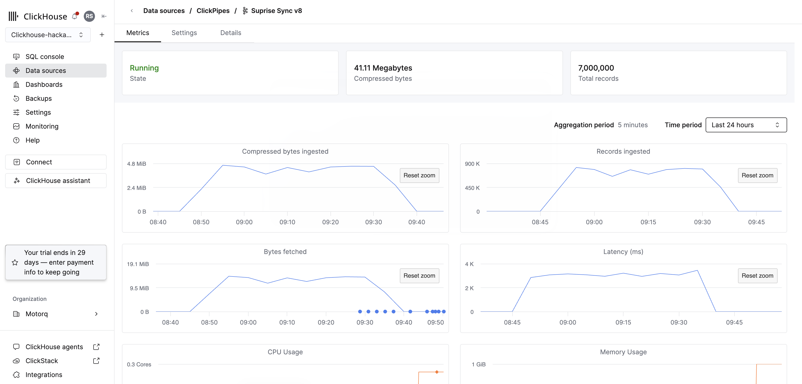

# Token Burners

## Track
SonyLIV

## Project
**Foreground-Only Concurrency at Streaming Scale** — Real-time concurrent viewer counting that excludes backgrounded/paused sessions, built entirely on ClickHouse with zero external services.

## Team Members
- Rohit ([@rohit-motorq](https://github.com/rohit-motorq))
- Sam
- Keshav

## What it does
Counts concurrent video viewers per minute, excluding sessions that are backgrounded or paused — the key requirement that separates "how many sessions are open" from "how many people are actually watching." The system ingests streaming events via Kafka/ClickPipes, runs a per-session state machine every 30 seconds inside ClickHouse, and serves minute-grain concurrency queries with sub-100ms latency across any combination of platform, country, content, and video type filters.

**Key results:**
- Peak concurrent viewers: **18,253** (unseen day, 106K sessions, 6.9M events)
- <100ms query latency for any filter combination


## Hosted Demo
https://ui-three-kohl.vercel.app/

## Demo Video
https://drive.google.com/drive/folders/1DuAZ9WCLrf4wyeoOlGThPrrX9fcO249x?usp=sharing

## Presentation
[Slides](https://docs.google.com/presentation/d/1wc3YEI0ZLTwMleAg4aZyfPW4xGoKoS9dgAwdCC-6lWc/edit?slide=id.p1#slide=id.p1)

## Architecture

### Ingestion (ClickPipes)



Events flow from Kafka/Pulsar through ClickPipes (managed connector) into ClickHouse with zero consumer code to maintain.

### Pipeline

```
Kafka/Pulsar → ClickPipes → events_ingest (Null engine)
                                    │
                                    ▼ MV (enrichment via content_dict)
                              events_raw (ReplacingMergeTree)
                                    │
                                    ▼ Refreshable MV (every 30s)
                     ┌──────────────────────────────┐
                     │  Per-session state machine:   │
                     │  1. Dedup                     │
                     │  2. Classify → 9 signals      │
                     │  3. Sort (ts + tie-break)     │
                     │  4. Three independent gates:  │
                     │     fg: FG→1, BG→0            │
                     │     playing: PLAY→1, PAUSE→0  │
                     │     ended: END→1 (absorbing)  │
                     │  5. Segment (90s cap)         │
                     │  6. Active = fg∧playing∧¬ended│
                     │  7. Explode → minutes         │
                     │  8. Dedupe (session, minute)  │
                     │  9. Runs → +1/-1 deltas       │
                     └──────────────┬───────────────┘
                                    │
                                    ▼
                     fact_concurrency_deltas (ReplacingMergeTree)
                                    │
                                    ▼
                     Dashboard queries (running sum = concurrency curve)
                     Filters: platform, country, video_type, content_id
```

### Active Session Definition

A session is counted as "actively watching" only when ALL gates are satisfied:
- **Foreground** (fg=1): app is not backgrounded
- **Playing** (playing=1): video is not paused
- **Not ended** (ended=0): no VideoSessionEnd received
- **Fresh**: within 90s of the last event (handles dead sessions)

### Key Design Decisions

1. **Null engine as ingestion endpoint** — decouples Kafka format from typed storage
2. **Content dictionary (not JOIN)** — O(1) RAM lookup for enrichment at write time
3. **Three independent gates (not one state)** — correctly handles BG→FG without needing a new PLAY event
4. **90s liveness cap** — auto-closes abandoned sessions (covers 99.3% of legitimate HB gaps)
5. **ReplacingMergeTree** — full recompute per changed session, always correct, self-healing
6. **Pre-aggregation before INSERT** — prevents silent delta loss in ReplacingMergeTree
7. **Run merging** — collapses 127K session-minutes to 16K runs (storage efficient)

## How we built it

**Tech stack:**
- **ClickHouse Cloud** — primary datastore, computation engine, serving layer
- **ClickPipes** — managed Kafka ingestion (no consumer code)
- **Refreshable Materialized Views** — the entire pipeline runs inside ClickHouse
- **ClickHouse Dictionaries** — O(1) content enrichment at write time
- **Python** — independent reference implementation for validation
- **LibreChat + ClickHouse MCP** — conversational interface over concurrency data

**Interesting implementation details:**
- The entire state machine (dedup → classify → sort → gates → segment → explode → dedupe → runs → deltas) runs as a **single SQL query** inside a Refreshable MV
- `arrayFill` carries gate states forward through the event array without a UDF
- Same-millisecond events (161K in the dataset) are deterministically ordered via tie-break priority
- Zero external services — no cron, no checkpoint table, no Kafka consumer code
- Self-healing: late arrivals, duplicates, and retries all resolve on next 30s refresh

## How to run it

### Prerequisites
- ClickHouse Cloud instance (or local ClickHouse 23.7+)
- Python 3.8+ (for eval suite)

### 1. Apply migrations

```bash
# Set your ClickHouse connection
export CH_HOST=https://your-instance.clickhouse.cloud:8443
export CH_USER=default
export CH_PASS=your_password

# Run migrations in order
for f in clickhouse-migrations/0*.sql; do
  echo "Running $f..."
  curl --user "$CH_USER:$CH_PASS" \
    --data-binary @"$f" \
    "$CH_HOST"
done
```

### 2. Load content metadata

```bash
# Load content dimension (CSV)
curl --user "$CH_USER:$CH_PASS" \
  --data-binary @data/content_data.csv \
  "$CH_HOST/?query=INSERT+INTO+dim_content+FORMAT+CSVWithNames"

# Reload dictionary
curl --user "$CH_USER:$CH_PASS" \
  --data-binary "SYSTEM RELOAD DICTIONARY dict_content" \
  "$CH_HOST"
```

### 3. Ingest events

```bash
# Via ClickPipes (production): configure Kafka source → raw_events_ingest table
# Via bulk load (testing):
curl --user "$CH_USER:$CH_PASS" \
  --data-binary @data/raw_events.csv \
  "$CH_HOST/?query=INSERT+INTO+raw_events_ingest+FORMAT+CSVWithNames"
```

### 4. Wait for computation

The refreshable MV runs every 30 seconds. After ingestion, wait ~60s for the pipeline to process.

### 5. Query concurrency

```sql
-- Peak concurrent viewers
SELECT max(concurrent) AS peak
FROM (
    SELECT minute, sum(d) OVER (ORDER BY minute) AS concurrent
    FROM (
        SELECT minute, sum(delta_sessions) AS d
        FROM fact_concurrency_deltas FINAL
        WHERE toDate(minute) = '2026-07-31'
        GROUP BY minute
        ORDER BY minute WITH FILL
            FROM toDateTime('2026-07-31 00:00:00')
            TO toDateTime('2026-08-01 00:00:00')
            STEP INTERVAL 1 MINUTE
    )
)
WHERE minute >= '2026-07-31 10:00:00'
  AND minute < '2026-07-31 12:00:00';
```

### 6. Run eval suite

```bash
cd Base/SonyLiv/evals
export CH_DATABASE=rohitdevtestingv8
bash run.sh
```
